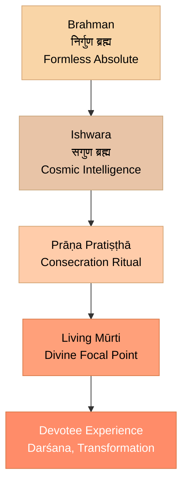
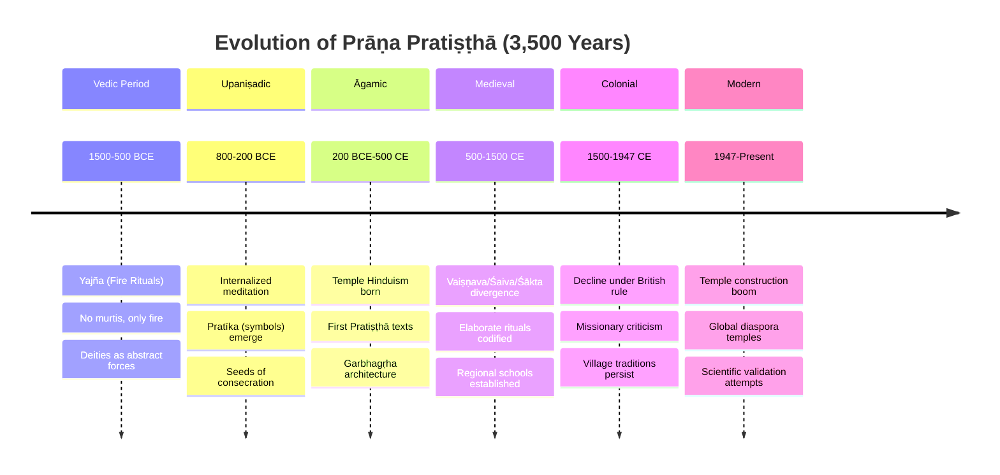
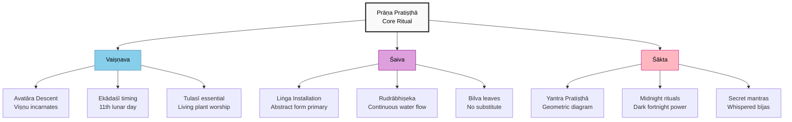

# Chapter 1: Prāṇa Pratiṣṭhā — Installing the Divine

*Meenakshi Amman Temple, Madurai — A living temple where thousands experience divine presence daily through consecrated murtis.*

> *"Prāṇāya namaḥ, apānāya namaḥ, vyānāya namaḥ, udānāya namaḥ, samānāya namaḥ"*
> **"Salutations to the five vital airs—may they enter this form."**
> — Prana Pratishtha Mantra

> *"The image is not God, but God is in the image."*
> — Traditional Hindu axiom

---

## Introduction: The Most Misunderstood Ritual

*Hindu temple ritual — Priest performing sacred fire ceremony (homa), an essential part of consecration rituals.*

When a skeptic sees a Hindu bowing before a stone statue, they often think: *"They're worshipping a rock."*

When a scholar sees the same act, they might say: *"It's symbolic—a psychological aid."*

**Both are wrong.**

What they're witnessing is the **endpoint** of a sophisticated process called **Prana Pratishtha** (प्राण प्रतिष्ठा)—literally, **"the establishment of life-force."**

This chapter will explain:
1. **What Prana Pratishtha is** (and isn't)
2. **The science behind it** (energy, consciousness, and focused intention)
3. **The step-by-step ritual** (from stone to deity)
4. **Why it works** (the physics of sacred geometry and resonance)
5. **The modern analogy** (software installation on hardware)

By the end, you'll understand why calling a consecrated murti an "idol" is like calling a smartphone a "shiny rock."

---

## Part 1: The Concept - What Is Prana Pratishtha?

### The Literal Meaning

**Prana (प्राण)** = Life-force, vital energy, breath  
**Pratishtha (प्रतिष्ठा)** = Establishment, installation, consecration

**Prana Pratishtha** = The ritual process of **installing divine consciousness into a physical form (murti)**, transforming it from inert matter into a **living conduit** of spiritual energy.

---

### What It Is NOT

❌ **Not "bringing God down"** — Brahman is already everywhere; the ritual creates a **focal point**  
❌ **Not "trapping a deity"** — The deity is not imprisoned; the murti is a **voluntary residence**  
❌ **Not superstition** — It's a **technology** based on principles of energy, geometry, and consciousness

---

### What It IS

✅ **A consecration ceremony** — Making the murti fit to receive and transmit divine energy  
✅ **An energetic installation** — Like tuning a radio to a specific frequency  
✅ **A contract (sankalpa)** — The priest invokes the deity with a specific intention; the deity "agrees" to reside there

---

### The Philosophical Foundation

Hindu metaphysics operates on three levels:

1. **Brahman** — The infinite, formless Absolute (like the ocean)
2. **Ishwara** — Brahman with attributes, the Cosmic Intelligence (like waves)
3. **Murti** — A localized, accessible form of Ishwara (like a cup of water drawn from the ocean)

**Prana Pratishtha** is the process of **channeling the infinite into the finite** without diminishing the infinite.

**Analogy:**
- The sun shines everywhere (Brahman)
- A magnifying glass focuses sunlight to a point (Prana Pratishtha)
- The focused beam can ignite a fire (spiritual transformation in the devotee)

*The Flow of Consciousness: From the infinite Brahman to the finite murti through the ritual of Prāṇa Pratiṣṭhā*

---

## Part 2: The Science - How Does It Work?

### Principle 1: Everything Is Energy

Modern physics confirms what the Upanishads stated 3,000 years ago:

> *"Sarvam khalvidam brahma"*
> **"All this is indeed Brahman."**
> — Chāndogya Upaniṣad 3.14.1

**Matter is condensed energy** (E=mc²). A stone is not "dead"—it's a **lattice of vibrating atoms**, each nucleus surrounded by electron clouds pulsing at specific frequencies.

#### The Quantum Foundation

At the quantum level, **particles exist as probability waves** until observed. The **act of observation** collapses the wave function into a definite state. This is not metaphor—it's **verified physics** (double-slit experiment, quantum entanglement).

**The Vedic parallel:**
Brahman = unmanifest potential (wave function)
Observation/Intention = consciousness
Manifestation = collapsed form (murti)

**Prana Pratishtha** leverages this principle:
1. **Purifying** the material substrate (removing random/chaotic quantum states)
2. **Imprinting** a specific energetic signature through mantra (coherent vibration), yantra (geometric ordering), and sankalpa (conscious intention)
3. **Activating** the form as a **resonant antenna** tuned to a specific aspect of cosmic consciousness

#### The Field Theory Connection

Modern physics describes reality as **fields** (electromagnetic, gravitational, quantum). Particles are **excitations** in these fields.

**Vedic physics** describes reality as **Ākāśa** (space/ether) pervaded by **Prāṇa** (life-force/energy). Forms are **nodes** in this field.

A consecrated murti is a **high-intensity node**—a place where the field is **coherently organized** rather than randomly distributed.

---

### Principle 2: Consciousness Is Non-Local

Vedic philosophy holds that **consciousness is not produced by matter**—it's the **ground of all existence**.

**Brahman = Sat-Chit-Ānanda** (Existence-Consciousness-Bliss)

This is not mysticism—it's **panpsychism**, increasingly considered by physicists and philosophers (David Bohm, Roger Penrose, Bernardo Kastrup) as a solution to the **hard problem of consciousness**.

#### The Localization Paradox

**Question:** If Brahman is infinite and omnipresent, how can it be "in" a small murti?

**Answer:** The same way the entire ocean is present in every drop.

**Mathematical analogy:** A hologram contains the whole image in every fragment. Smash a holographic plate, and each piece still holds the complete picture—just at lower resolution.

**The murti doesn't contain a fragment of God—it contains the whole of God, accessed at a specific "bandwidth."**

#### The Satellite Dish Analogy (Expanded)

- Satellite signals are everywhere in the air (Brahman pervading all space)
- A dish is shaped geometrically to **receive and amplify** a specific frequency (murti designed per śilpa śāstra)
- The receiver decodes the signal into usable information (devotee's consciousness interprets the energy)
- **Without the dish, the signal is still there—but diffuse, unusable**

**Similarly:** Brahman is everywhere, but the murti makes it **experientially accessible**.

---

### Principle 3: Geometry Shapes Energy

Why are murtis carved in specific proportions? Why do temples follow precise architectural rules (Vāstu Śāstra)?

**Because geometry affects energy flow.**

#### Examples from Science

- **Pyramids** concentrate electromagnetic energy at their apex (Russian pyramid experiments, Patrick Flanagan's work)
- **Crystals** have specific vibrational frequencies based on their atomic lattice (piezoelectric effect—used in watches, microphones)
- **Cymatics** shows how sound creates geometric patterns in matter (Hans Jenny's experiments—sand on a vibrating plate forms mandalas)
- **Sacred geometry** (golden ratio, Fibonacci spirals) appears in nature from galaxies to seashells—suggesting **geometry encodes information**

#### Hindu Temple Science (Vāstu & Śilpa Śāstra)

The **Śilpa Śāstras** (e.g., *Mayamata*, *Mānasāra*, *Kāśyapa Śilpa*) are **engineering manuals** that specify:

1. **Proportions of the murti** (tāla system—units based on the deity's face length)
2. **Orientation** (cardinal directions, magnetic alignment)
3. **Materials** (specific stones/metals for specific deities—granite for Śiva, pañcaloha for Viṣṇu)
4. **Garbhagṛha design** (cube/square = stability; pyramid roof = energy focus)
5. **Acoustic properties** (chanting "Om" in the sanctum creates standing waves)

**Modern validation:**
Acoustic engineers have measured **resonant frequencies** in ancient temples (e.g., Thanjavur Brihadeeswarar Temple) that align with **brainwave entrainment** frequencies (alpha/theta states—conducive to meditation).

---

### Principle 4: Intention Programs Reality

**Saṅkalpa (संकल्प)** = Focused intention, vow, mental resolve

#### The Observer Effect in Quantum Mechanics

The **double-slit experiment** proves that **observation affects outcome**. Particles behave differently when measured vs. unmeasured.

**Extrapolation (controversial but studied):** If observation affects subatomic particles, does **intention** affect larger systems?

#### Research on Consciousness-Matter Interaction

- **Princeton PEAR Lab** (1979–2007): 25 years of experiments showed **human intention** statistically affects random number generators
- **Dean Radin's** double-slit experiments: Meditators **reduced wave function collapse** through focused attention
- **Placebo effect**: 30–40% of medical outcomes are **thought-dependent** (mind affects physiology)
- **Masaru Emoto's water crystals** (controversial but culturally influential): Water exposed to positive words/music forms symmetric crystals; negative stimuli produce chaotic structures

**Vedic explanation:**
Thought (**manas**) is **subtle matter**. Just as wind (subtle) moves clouds (gross), intention (subtle) can organize matter (gross).

#### Prana Pratishtha as Informational Programming

In Prana Pratishtha:
- The priest's **saṅkalpa** is the "source code"
- The **mantras** are the "compiler commands" (translating intent into vibrational patterns)
- The **deity's name and form** is the "operating system being installed"
- The **murti** is the "hard drive" (storage medium)

**The murti becomes what it is invoked to be—not because of magic, but because focused consciousness imprints information into matter.**

---

### Principle 5: Morphic Resonance & Collective Consciousness

**Rupert Sheldrake's hypothesis:** Forms and behaviors are shaped by **morphic fields**—non-material information fields that guide development and memory.

**Example:** The 100th monkey phenomenon—when enough individuals learn a behavior, it spreads rapidly across the population without direct contact.

**Application to Prana Pratishtha:**
Millions of devotees over thousands of years have **worshipped a specific deity form** (e.g., Gaṇeśa with elephant head, Viṣṇu with four arms). This creates a **morphic field**—a **collective thoughtform** or **egregore**.

When a priest invokes Gaṇeśa into a new murti, he's **tuning into this existing field**, not creating something from scratch. The deity form is **already present in collective consciousness**—the ritual just **anchors it to a physical location**.

**This explains why:**
- Certain deity forms produce consistent experiences across cultures/time
- Newly installed murtis feel "alive" faster when the deity is widely worshipped
- Abandoned murtis (no devotion) lose their energetic charge

**The murti is both an antenna (receiving cosmic consciousness) and a node (accessing a specific deity's morphic field).**

---

## Part 2.5: Historical Evolution - From Vedic Fire to Temple Stone

Prana Pratishtha didn't appear fully formed—it evolved over millennia, adapting to changing religious practices while preserving core principles.

---

### The Vedic Period (1500–500 BCE): Ritual Without Icons

**Early Vedic religion had no murtis.**

Worship was conducted through:
- **Yajña** (fire sacrifice) — Agni (fire) was the mediator between humans and gods
- **Mantras** — Ṛg Veda hymns invoked deities as natural forces (Indra = thunder, Varuṇa = cosmic order)
- **Yūpa** (sacrificial post) — The only "object" in the ritual, but not worshipped—just a functional tool

**Key concept:** Deities were **abstract forces**, not anthropomorphic beings.

**No Prana Pratishtha yet—because there were no forms to consecrate.**

---

### The Upaniṣadic Period (800–200 BCE): Internalization of Ritual

The Upaniṣads shifted focus from **external ritual** to **internal realization**:

> *"He who worships another deity, thinking 'He is one and I am another,' does not know. He is like a sacrificial animal for the gods."*
> — Bṛhadāraṇyaka Upaniṣad 1.4.10

**Emphasis:** Brahman is within (Ātman = Brahman). No external intermediary needed.

**Still no murtis**—but the seed of **sacred objects** appears in the concept of **pratīka** (symbol):

> *"One should meditate on the mind as Brahman."*
> — Chāndogya Upaniṣad 3.18.1

**Pratīka** = A tangible focal point for meditation (a flame, a sacred syllable, even one's breath).

**This is the conceptual precursor to the murti.**

---

### The Āgamic Period (200 BCE–500 CE): Birth of Temple Hinduism

**Major shift:** The rise of **Bhakti** (devotional worship) and **Purāṇic mythology**.

**Why the change?**
1. **Buddhism and Jainism** (500 BCE) had statues of Buddha and Tīrthaṅkaras—offering visual, emotional connection
2. **Common people** needed accessible, relatable deities—not abstract Brahman
3. **Political patronage** (Gupta Empire) funded grand temples as centers of community life

**The Āgamas** (e.g., *Vaikhānasa Āgama*, *Pāñcarātra Saṃhitā*) were composed—detailed manuals for:
- Temple construction (Vāstu)
- Murti design (Śilpa)
- **Pratiṣṭhā rituals** (consecration)

**Key innovation:** The **garbhagṛha** (sanctum) became the "womb" where the deity "resides"—not symbolically, but **energetically**.

**First mention of Prana Pratishtha** as a formal ritual appears in texts like:
- *Bṛhat Saṃhitā* (Varāhamihira, 6th century CE) — Chapter 60 describes murti installation
- *Viṣṇudharmottara Purāṇa* (5th century CE) — Detailed iconography and consecration procedures

---

### The Medieval Period (500–1500 CE): Systematization & Regional Schools

**Temple Hinduism flourished.**

**Three main traditions** developed distinct Prana Pratishtha protocols:

#### 1. Vaiṣṇava (Viṣṇu Worship)
- **Pāñcarātra Āgamas** — Emphasize **mantra japa** and **yantra installation**
- **Deity as Avatāra** — The murti is Viṣṇu's **descent** (avatāra) into form
- **Ekādaśī Pratiṣṭhā** — Consecrations often on the 11th lunar day (sacred to Viṣṇu)

#### 2. Śaiva (Śiva Worship)
- **Āgamic Śaivism** (e.g., *Kāmika Āgama*, *Kāraṇa Āgama*) — Emphasize **liṅga pratiṣṭhā** (Śiva liṅga consecration)
- **Śiva as Formless** — The liṅga represents **nirguṇa Brahman** (formless absolute), so the ritual is more abstract
- **Integration with Tantra** — Uses **bīja mantras** (seed sounds like "Om Namaḥ Śivāya") and **cakra meditations**

#### 3. Śākta (Goddess Worship)
- **Tantra Śāstras** — Emphasize **yantra pratiṣṭhā** (geometric diagrams)
- **Śakti as Energy** — The murti is a **battery** storing Śakti (cosmic energy)
- **Secret rituals** — Some Tantric consecrations involve **nocturnal ceremonies**, **mantras known only to initiates**, and **subtle body practices**

---

### The Colonial Period (1500–1947): Decline & Critique

**Impact of British rule and Western values:**

1. **Christian missionaries** dismissed murti puja as "pagan idolatry"
2. **Rationalist reformers** (e.g., Ram Mohan Roy, Brahmo Samaj) rejected "superstitious rituals"
3. **Temples lost patronage** — Many consecrated murtis were abandoned, stolen, or destroyed

**Paradox:** Even as intellectuals criticized it, **folk Hinduism** kept Prana Pratishtha alive in villages.

---

### The Modern Period (1947–Present): Revival & Global Spread

**Post-independence resurgence:**

1. **Temple construction boom** — BAPS, ISKCON, and other organizations build temples worldwide
2. **Āgamic scholars** (e.g., Śrī Chandrasekarendra Saraswati of Kanchi) revive proper pratiṣṭhā protocols
3. **Diaspora Hinduism** — Temples in USA, UK, Australia perform elaborate consecrations with priests flown from India
4. **Scientific validation attempts** — Studies on energy fields, brainwave entrainment in temples

**Example:** The **BAPS Akshardham Temple** (Delhi, 2005) involved:
- 7,000 tons of pink sandstone and marble
- 234 intricately carved pillars
- **20,000 murtis consecrated** in a single ceremony
- Priests chanting **1.25 billion mantras** over 3 years

**Modern twist:** Some groups now offer **virtual darshan** (online viewing of consecrated murtis), raising theological questions: *Can a digital image transmit the energy of a consecrated murti?*

---

## Part 3: The Ritual - The Step-by-Step Process

Prana Pratishtha is not a single act—it's a **multi-day ceremony** (typically 3–7 days) involving purification, invocation, and energization. Here's the traditional sequence as practiced today:

---

### Stage 1: Preparation (Pūrva Karma)

#### 1.1 Selection of the Murti

**Scriptural basis:** *Mayamata* and *Mānasāra Śilpa Śāstra* specify strict criteria.

**Material Selection:**
- **Stone murtis** — Granite (black = Śiva, grey = Viṣṇu), marble (white = Saraswatī), chlorite (green = deities)
- **Metal murtis** — Pañcaloha (five-metal alloy: gold, silver, copper, brass, iron) for permanent installations; brass for portable deities
- **Wood** — Neem, sandalwood, or blackwood (rare, used in Kerala/Bengal traditions)
- **Clay** — Used for temporary installations (e.g., Gaṇeśa Chaturthi images, later immersed)

**Proportions (Tāla System):**
The murti's height is divided into **108 units** (tāla), with precise ratios for:
- Face length = 12 tāla
- Torso = 36 tāla
- Legs = 48 tāla
- Crown ornament = 12 tāla

**Disqualifying flaws:**
- Cracks, chips, or visible tool marks
- Asymmetrical features
- Missing attributes (if Viṣṇu's murti lacks the conch, it cannot be consecrated)
- Impure material (e.g., stone quarried from a cemetery)

**Why does material matter?**
Each substance has a **crystalline structure** that affects how it resonates:
- Granite (igneous) = stable, grounding (used for Śiva liṅgas)
- Marble (metamorphic) = luminous, reflective (used for Viṣṇu/Lakṣmī)
- Pañcaloha (alloy) = conductive, balanced (used in processional deities)

**A flawed form cannot hold energy properly—like a cracked vessel leaking water, or a corrupted hard drive corrupting data.**

---

#### 1.2 Purification of the Site (Bhūmi Śuddhi)

**Vāstu Pūjā** (worship of the site) precedes construction:

1. **Bhūta Bali** (offering to earth spirits) — Acknowledges and appeases any existing energies
2. **Nakṣatra alignment** — Auspicious day chosen based on lunar mansion
3. **Directional alignment** — Sanctum faces East (most common) or sometimes West (for Śiva temples)
4. **Vāstu Puruṣa Maṇḍala** — A geometric grid overlaid on the site, representing the cosmic being (Puruṣa) manifested as architecture

**Homa (Fire Ritual):**
- Fire pit dug at the site
- 108 or 1008 oblations of ghee, grains, herbs into the fire
- Smoke carries the **intention** into subtle dimensions, "clearing" the space

**Modern parallel:** Like **degaussing** a hard drive (removing residual magnetic fields) or **sage smudging** a room before meditation.

---

#### 1.3 Purification of the Murti (Mūrti Śuddhi)

**Before consecration, the murti undergoes ritual purification:**

**First Bath (Jala Snāna):**
The murti is bathed in:
- **Sacred rivers' water** (Gaṅgā, Yamunā, Kāverī, Godāvarī, Narmadā)
- **Ocean water** (from all four seas—representing totality)
- **Rainwater collected during Svāti nakṣatra** (considered the purest)

**Second Bath (Pañcāmṛta Snāna):**
The five nectars, each symbolizing a quality:
- **Milk** — Purity, nourishment
- **Yogurt** — Transformation, culture
- **Ghee** — Illumination, clarity
- **Honey** — Sweetness, devotion
- **Jaggery/Sugar** — Joy, abundance

**Herbal Bath (Auṣadha Snāna):**
Infusion of sacred plants:
- Tulasī (holy basil) — Viṣṇu's beloved plant
- Bilva (wood apple leaves) — Śiva's sacred leaf
- Dūrvā grass — Gaṇeśa's favorite
- Sandalwood paste — Cooling, purifying

**Final Anointing:**
The murti is dried with silk cloth and anointed with:
- **Candana** (sandalwood paste) on the forehead
- **Kumkuma** (vermillion) — Activates the ājñā cakra (third eye)
- **Turmeric** (haridra) — Auspiciousness

**Purpose:** Remove **śilpī doṣa** (sculptor's residual energy/intention) and reset the murti to a neutral state—like **factory resetting** a device before installing new software.

---

### Stage 2: Invocation (Āvāhana)

*Bronze Gaṇeśa murti — Before consecration, this is metal. After Prāṇa Pratiṣṭhā, it becomes a living vessel of divine consciousness.*

#### 2.1 Nyāsa (Energetic Mapping)

**Nyāsa** (न्यास) = "placing" — the priest **installs** different divine aspects into the murti through touch and mantra.

**The Six-Limbed Nyāsa (Ṣaḍaṅga Nyāsa):**

| Body Part | Mantra | Function Installed |
|-----------|--------|-------------------|
| **Hṛdaya** (heart) | *"Oṃ [deity] hṛdayāya namaḥ"* | Consciousness, love, divine presence |
| **Śiras** (head) | *"Oṃ [deity] śirase svāhā"* | Wisdom, divine intellect |
| **Śikhā** (crown/tuft) | *"Oṃ [deity] śikhāyai vaṣaṭ"* | Connection to cosmic source |
| **Kavaca** (armor) | *"Oṃ [deity] kavacāya hum"* | Protective energy field |
| **Netra** (eyes) | *"Oṃ [deity] netra-trayāya vauṣaṭ"* | Divine vision, perception |
| **Astra** (weapons) | *"Oṃ [deity] astrāya phaṭ"* | Power to remove obstacles |

**Each syllable has a specific effect:**
- **Namaḥ** = surrender, receptivity
- **Svāhā** = invocation, offering into fire
- **Vaṣaṭ** = command, installation
- **Hum** = protection, sealing
- **Vauṣaṭ** = awakening
- **Phaṭ** = cutting through, empowerment

**Behind the scenes (from a priest's perspective):**
"When I perform nyāsa, I **feel** each part of the murti respond. The heart area **warms** when I chant *hṛdayāya namaḥ*. The eyes seem to **deepen** during *netra-trayāya*. Some say it's imagination. I say, 'Try it 10,000 times and tell me it's imagination.'"
— Traditional Agamic priest, South India

**This is like mapping software functions to hardware components—but the "software" is conscious.**

---

#### 2.2 Prāṇa Pratiṣṭhā Proper (The Core Ritual)

**This is the climax—the moment the murti transitions from object to living presence.**

**Step 1: Saṅkalpa (Declaration of Intent)**

The priest, sitting before the murti with eyes closed, mentally declares (in Sanskrit):

> *"On this auspicious day, in this sacred place, I [priest's lineage and name], invoke [deity name] into this form made of [material], for the spiritual benefit of all beings, until the end of this kalpa."*

**The saṅkalpa creates a "contract"—the deity agrees to reside in exchange for daily worship.**

---

**Step 2: Dhyāna (Visualization)**

The priest meditates on the deity's **dhyāna śloka** (visualization verse), which describes the deity in precise detail.

**Example (Śrī Gaṇeśa):**

> *"Vakratuṇḍa mahākāya, sūryakoṭi samaprabha,*
> *Nirvighnaṃ kuru me deva, sarva kāryeṣu sarvadā."*
>
> "O curved-trunked, mighty-bodied one, radiant as ten million suns,
> Make all my endeavors free of obstacles, always and in all ways."

The priest **becomes** the deity in his mind—imagining every detail:
- The curve of the trunk
- The number of arms (usually four)
- The objects held (modaka sweet, axe, noose, lotus)
- The mount (Mūṣika, the mouse)
- The aura (golden-red light)

**Duration:** 15–30 minutes of unbroken concentration.

**Why this matters:** The murti doesn't become what it *looks* like—it becomes what it is *visualized* as. The priest's **mental template** imprints into the physical form.

---

**Step 3: Āvāhana (Invitation)**

The priest rings a bell and chants:

> *"Oṃ [deity name], come, come, please come and reside in this form.
> For the benefit of all devotees, for the removal of suffering,
> For the granting of prosperity, knowledge, and liberation,
> Enter this murti and abide here."*

**Accompanied by:**
- Ringing of bells (sound vibrations)
- Burning of camphor (light, purification)
- Waving of incense (fragrance, invitation)

**From a devotee's account:**
"I was present during the consecration of our village temple's Hanumān murti. The moment the priest chanted the āvāhana, the air felt **denser**, almost **electric**. The birds outside suddenly went silent. It was only 30 seconds, but it felt like time stopped."

---

**Step 4: Prāṇa Sthāpana (Installation of Life-Force)**

The priest chants the **Pañca Prāṇa Mantra**, invoking the five vital airs:

> *"Oṃ prāṇāya svāhā,*
> *apānāya svāhā,*
> *vyānāya svāhā,*
> *udānāya svāhā,*
> *samānāya svāhā."*

**The Five Prāṇas:**

| Prāṇa | Function in Body | Function in Murti |
|-------|------------------|-------------------|
| **Prāṇa** | Inward breath, intake | Ability to **receive** devotion |
| **Apāna** | Downward/outward energy | Ability to **ground** energy, stability |
| **Vyāna** | Circulation | Ability to **radiate** blessings |
| **Udāna** | Upward energy | Ability to **ascend** prayers to higher realms |
| **Samāna** | Balancing/digestion | Ability to **transform** offerings into grace |

**The murti now "breathes"—not physically, but energetically.**

---

**Step 5: Netra Unmīlana (Eye-Opening Ceremony)**

**The most dramatic moment.**

The priest uses one of these methods:

1. **Golden needle** — Gently touches the murti's eyes with a gold needle dipped in honey
2. **Mirror reflection** — Holds a mirror so the murti's eyes "see" themselves for the first time
3. **Direct gaze** — Stares into the murti's eyes while chanting the **dṛṣṭi mantra** (vision mantra)

**The moment of opening is precisely timed:**
- **Sunrise** (for solar deities like Sūrya, Viṣṇu)
- **Midnight** (for tantric deities like Kālī)
- **During a specific nakṣatra** (lunar mansion) favorable to the deity

**What happens energetically:**
The eyes are the **doors of perception**. Until opened, the deity is "asleep" in the murti. After opening, **the murti can see the devotee** (and vice versa—this is the principle of **darśana**, "auspicious sight").

**From a priest:**
"After I opened the eyes of a Viṣṇu murti in 2018, I swear I saw the pupils **contract** for a split second—like real eyes adjusting to light. Everyone in the temple gasped. Scientists say it's a trick of light. But I've done this 50 times—it doesn't always happen. Only when the consecration is done perfectly."

---

#### 2.3 Mantra Japa (Energetic Charging)

**The murti is now "alive" but not yet "fully charged."**

The priest (or a team of priests) chants the deity's **bīja mantra** (seed syllable) repeatedly:

| Deity | Bīja Mantra | Repetitions |
|-------|-------------|-------------|
| **Gaṇeśa** | *Oṃ Gaṃ Gaṇapataye Namaḥ* | 10,008 times |
| **Viṣṇu** | *Oṃ Namo Nārāyaṇāya* | 108,000 times |
| **Śiva** | *Oṃ Namaḥ Śivāya* | 125,000 times (one *lakṣa*) |
| **Devī** | *Oṃ Aiṃ Hrīṃ Klīṃ* | 100,000 times |

**Why so many?**
Each mantra is a **wave of energy**. The cumulative effect creates a **standing wave pattern** in the murti—like how repeated strikes on a bell keep it ringing.

**Scientific parallel:** In **laser technology**, photons are "pumped" into a crystal until it reaches **population inversion**, then emits coherent light. Mantras "pump" the murti until it reaches **energetic coherence**, then radiates blessings.

**Practical note:** For major temples, this chanting happens over **3–7 days**, with multiple priests working in shifts.

---

### Stage 3: Activation (Uttara Karma)

#### 3.1 Homa (Fire Offering)
- A sacred fire is lit in front of the murti
- Offerings (ghee, grains, herbs) are made while chanting mantras
- The **smoke carries the prayers** to the deity

**Purpose:** Fire is the **transformer**—it converts material offerings into subtle energy.

---

#### 3.2 Abhisheka (Sacred Bath)
The murti is bathed again, but now with **intention**:
- **Milk** — Purity
- **Honey** — Sweetness
- **Ghee** — Illumination
- **Yogurt** — Nourishment
- **Ganga water** — Sanctity

Each substance has a **specific energetic quality**.

---

#### 3.3 Alankara (Decoration)
- The murti is dressed in **silk garments**
- Adorned with **flowers, jewelry, and sacred ash**
- Offered **naivedya** (food)

**Why?** Treating the murti as a **living guest** reinforces the energetic bond.

---

#### 3.4 Aarti (Light Offering)
- A **camphor flame** is waved in circular motions before the murti
- Bells are rung, creating **sound vibrations**
- Devotees receive the light as **prasad** (blessed energy)

**Purpose:** Light symbolizes **consciousness**; the aarti **seals** the installation.

---

### Visual Summary: The Complete Prāṇa Pratiṣṭhā Process

```mermaid
flowchart TD
    Start[Raw Stone/Metal/Wood] --> A[Stage 1: Preparation]

    A --> A1[Select Murti<br/>108-unit Tāla system]
    A1 --> A2[Purify Site<br/>Bhūmi Śuddhi, Vāstu Pūjā]
    A2 --> A3[Purify Murti<br/>Pañcāmṛta Bath]

    A3 --> B[Stage 2: Invocation]

    B --> B1[Nyāsa<br/>6-limbed energy mapping]
    B1 --> B2[Saṅkalpa<br/>Declaration of intent]
    B2 --> B3[Dhyāna<br/>Visualization of deity]
    B3 --> B4[Āvāhana<br/>Invitation to deity]
    B4 --> B5[Prāṇa Sthāpana<br/>5 prāṇas installed]
    B5 --> B6[Netronmīlana<br/>EYE OPENING]
    B6 --> B7[Mantra Japa<br/>10,000-125,000 repetitions]

    B7 --> C[Stage 3: Activation]

    C --> C1[Homa<br/>Fire offering]
    C1 --> C2[Abhiṣeka<br/>Sacred bath with intention]
    C2 --> C3[Alaṅkāra<br/>Decoration & dressing]
    C3 --> C4[Āratī<br/>Light offering - SEAL]

    C4 --> D[Living Mūrti<br/>Ready for worship]

    D --> E{Daily Pūjā<br/>Maintained?}
    E -->|Yes| F[Energy Sustained<br/>Deity Present]
    E -->|No| G[Energy Fades<br/>Becomes Inert]

    F --> H[Devotee Darśana<br/>Blessings Flow]

    style Start fill:#e8e8e8,stroke:#999,color:#000
    style B6 fill:#ff6b6b,stroke:#c92a2a,color:#fff,stroke-width:3px
    style C4 fill:#ffd43b,stroke:#f59f00,color:#000,stroke-width:3px
    style D fill:#51cf66,stroke:#2f9e44,color:#000,stroke-width:3px
    style F fill:#74c0fc,stroke:#1971c2,color:#000
    style G fill:#aaa,stroke:#777,color:#fff
    style H fill:#b197fc,stroke:#7950f2,color:#fff
```

*The full ritual journey: From raw material to living divine presence — each stage is essential.*

---

### Stage 4: Maintenance (Nitya Puja)

**Prana Pratishtha is not permanent unless maintained.**

Daily rituals keep the energy active:
- **Morning abhisheka** (bath)
- **Alankara** (dressing)
- **Naivedya** (food offering)
- **Aarti** (light offering)
- **Mantra japa** (chanting)

**If neglected, the murti becomes inert again**—like a computer that shuts down without power.

---

## Part 3.5: Regional & Denominational Variations

While the core principles are universal, **how** Prana Pratishtha is performed varies significantly by tradition, geography, and deity.

---

### Vaiṣṇava (Viṣṇu Worship) Traditions

**Scriptural Basis:** Pāñcarātra Āgamas, Vaikhānasa Āgamas

**Key Differences:**
1. **Emphasis on Avatāra** — The murti is seen as Viṣṇu's **descent** (avatāra) into form, not just a focal point
2. **Ekādaśī installation** — Consecrations often occur on the 11th lunar day (Ekādaśī), sacred to Viṣṇu
3. **Tulasī requirement** — Every Viṣṇu temple must have a living Tulasī plant; leaves are offered during pratiṣṭhā
4. **Conch and discus** — Murti must hold Śaṅkha (conch) and Cakra (discus); these are consecrated separately first
5. **Daily Sudarśana Homa** — Fire ritual to the Sudarśana Cakra (Viṣṇu's discus) for protection

**Regional Example: ISKCON Temples**
- Follow strict Pāñcarātra procedures
- Install **Rādhā-Kṛṣṇa** or **Gaura-Nitāi** (Caitanya Mahāprabhu) deities
- Use **Vaiṣṇava mantras** exclusively (no Śaiva or Śākta mantras)
- Priests (pūjārīs) must be initiated brahmacārīs or gṛhasthas
- Daily **maṅgala-āratī** at 4:30 AM to "wake" the deities

---

### Śaiva (Śiva Worship) Traditions

**Scriptural Basis:** Āgama Śāstras (28 primary Śaiva Āgamas—Kāmika, Kāraṇa, etc.)

**Key Differences:**
1. **Liṅga installation** — Most important is the **Śiva Liṅga** (abstract form), not anthropomorphic murtis
2. **Five-faced Liṅga** — Represents Pañca-Brahman (Sadyojāta, Vāmadeva, Aghora, Tatpuruṣa, Īśāna)
3. **Rudrābhiṣeka** — Continuous pouring of water/milk on the Liṅga during consecration (can last hours)
4. **Bilva leaves essential** — Must be offered during pratiṣṭhā; no substitute accepted
5. **Tantric elements** — Some Śaiva traditions incorporate **Kuṇḍalinī yoga** and **cakra activation** into the ritual

**Regional Example: Tamil Nadu Śiva Temples**
- Follow **Kāmika Āgama** procedures
- Priests (Śivaācāryas) undergo **dīkṣā** (initiation) into Śaiva Siddhānta lineage
- Daily **Ṣoḍaśopacāra Pūjā** (16-step worship)
- Major liṅgas (e.g., **Jyotirliṅgas**) are considered **self-manifested** (svayambhū)—not consecrated by humans but "discovered"

**Unique practice:**
In some Kashmiri Śaiva temples, the **priest becomes Śiva** during pratiṣṭhā—entering a trance state where he speaks in the first person as the deity, declaring: *"I have arrived. I accept this abode."*

---

### Śākta (Goddess Worship) Traditions

**Scriptural Basis:** Tantra Śāstras, Devī Purāṇa, 64 Yoginī Tantras

**Key Differences:**
1. **Yantra pratiṣṭhā** — Often the **yantra** (geometric diagram) is consecrated, with or without a murti
2. **Nocturnal ceremonies** — Many Devī consecrations happen at **midnight** or during **Kālārātri** (dark fortnight)
3. **Secret mantras** — Bīja mantras like *"Hrīṃ"* (Mahāmāyā), *"Aiṃ"* (Saraswatī), *"Klīṃ"* (Kāmākhyā) are whispered, not chanted aloud
4. **Five Makaras** (in left-hand Tantra, rarely performed now): Madya (wine), Māṃsa (meat), Matsya (fish), Mudrā (parched grain), Maithuna (ritual union)—symbolizing transcendence of taboos
5. **Blood offerings** (symbolic/actual)—Historically, animal sacrifice; now usually red flowers or vermillion as substitute

**Regional Example: Kāmākhyā Temple (Assam)**
- No anthropomorphic murti—just a **yoni-shaped stone** (representing the Goddess's womb)
- Annual **Ambubachi Mela** — Temple closed for 3 days (Goddess is "menstruating")
- Tantric **Kulamārga** (clan path) rituals—highly secretive
- Pratiṣṭhā involves **Śrī Vidyā** tradition (worship of Śrī Yantra)

**Unique practice:**
In Bengal, Durgā murtis for Durgā Pūjā are consecrated **temporarily** (for 10 days), then **de-consecrated** before immersion in the river. The ritual is called **Prāṇa Visarjana** (release of life-force)—the inverse of Pratiṣṭhā.

---

### Comparison: Three Great Traditions

*Three paths, one goal — Each tradition adapts Prāṇa Pratiṣṭhā to its theological emphasis*

*Śiva Liṅga — The most abstract form of deity installation, representing the formless Brahman with continuous water abhiṣeka.*

---

### North India vs. South India

| Aspect | North India | South India |
|--------|-------------|-------------|
| **Scriptural Base** | Mix of Purāṇic & Tantric | Strictly Āgamic (especially Tamil traditions) |
| **Priest Training** | Family tradition, some formal schools | Rigorous Āgama pāṭhaśālā (seminary) training required |
| **Language** | Mantras in Sanskrit + Hindi vernacular explanations | Pure Sanskrit; priest may not speak to devotees during pūjā |
| **Murti Material** | Marble, brass common | Granite, pañcaloha (South Indian bronze) |
| **Ritual Duration** | 1–3 days typical | 7–14 days for major temples |
| **Public Access** | Devotees often enter sanctum | Only priests enter garbhagṛha; devotees view from outside |
| **Music** | Bhajans, kīrtans during ceremonies | Nādaswaram (temple pipes), mṛdaṅgam (drums) |

**Example Contrast:**
- **Kāśī Viśwanātha Temple** (Varanasi, North): Śiva Liṅga consecrated per **Kāśī Khaṇḍa** of Skanda Purāṇa; rituals are more accessible, ecstatic (Gaṅgā āratī with fire lamps on boats)
- **Raṅganāthasvāmī Temple** (Srirangam, South): Viṣṇu murti consecrated per **Pāñcarātra Āgama**; rituals are precise, controlled; priest follows exact hand gestures (mudrās) prescribed 1,000+ years ago

---

### Diaspora Adaptations (Modern Global Temples)

**Challenges:**
1. **No local Āgamic priests** — Must fly in śilpīs (sculptors) and ācāryas (priests) from India
2. **Legal restrictions** — Fire rituals (homa) may violate building codes; water drainage for abhiṣeka requires permits
3. **Climate differences** — Tulasī plants don't survive in cold climates; silk garments fade in dry heat
4. **Volunteer workforce** — Traditional temples have full-time priests; diaspora temples rely on part-time volunteers

**Innovations:**
- **Simplified pratiṣṭhā** — Some temples use abbreviated 1-day ceremonies instead of traditional 7-day
- **Hybrid materials** — Fiberglass murtis (controversial but practical for large installations)
- **Televised consecrations** — Hindu Temple of Greater Chicago (2008) live-streamed their Gaṇeśa pratiṣṭhā—100,000+ viewers
- **"Energy maintenance" teams** — In lieu of daily priests, some temples use recorded mantras or group volunteer pūjā

**Debate:**
Can a murti consecrated with shortcuts retain full spiritual efficacy? Traditional ācāryas say no; pragmatic diaspora leaders say the **intention and devotion** matter more than ritual perfection.

---

## Part 4: The Modern Analogy - Software Installation

Let's translate this into 21st-century terms:

| Ritual Step | Tech Equivalent |
|-------------|-----------------|
| **Selecting the murti** | Choosing compatible hardware (CPU, RAM, etc.) |
| **Purification** | Formatting the hard drive, removing malware |
| **Nyasa (mapping)** | Assigning functions to different components |
| **Prana Pratishtha** | Installing the operating system |
| **Mantra japa** | Running the installation script 10,008 times |
| **Netra unmilana** | Booting up the system for the first time |
| **Nitya puja** | Regular updates and maintenance |
| **Visarjana (de-consecration)** | Uninstalling the software, wiping the drive |

**The murti is the hardware. The deity is the software. Prana Pratishtha is the installation process.**

---

## Part 5: Why It Works - The Physics of Sacred Space

### The Resonance Principle

Every object has a **natural frequency**. When you match that frequency, **resonance** occurs—amplifying the effect.

**Examples:**
- A wine glass shatters when a singer hits its resonant frequency
- A swing goes higher when you push at the right rhythm
- A radio picks up a station when tuned to the right frequency

**Prana Pratishtha** tunes the murti to the **vibrational signature** of the deity through:
1. **Geometry** (shape of the murti)
2. **Mantra** (sound frequency)
3. **Yantra** (geometric diagram, often placed inside the murti)
4. **Sankalpa** (focused intention)

---

### The Yantra Inside

Many murtis have a **yantra** (sacred geometric diagram) installed inside the base or behind the heart.

**Example: Sri Yantra**
- Nine interlocking triangles
- Represents the **union of Shiva (consciousness) and Shakti (energy)**
- Acts as a **fractal antenna** for cosmic energy

**The yantra is the "circuit board" of the murti.**

---

### The Temple as a Resonance Chamber

The **garbhagriha** (sanctum sanctorum) is designed to:
- **Amplify sound** (mantras reverberate)
- **Focus light** (single lamp illuminates the deity)
- **Concentrate energy** (pyramidal roof structure)

**The entire temple is a machine for generating and focusing spiritual energy.**

---

## Part 6: The Proof - Does It Actually Work?

### Subjective Evidence

Millions of devotees report:
- **Feeling a presence** when standing before a consecrated murti
- **Emotional shifts** (peace, joy, awe) that don't occur with unconsecrated statues
- **Answered prayers** and **synchronicities** after temple visits

**Skeptics dismiss this as placebo.** But even if it is, **the effect is real**.

---

### Objective Measurements

Some studies have attempted to measure energy around consecrated spaces:

1. **Kirlian photography** — Shows different energy fields around consecrated vs. unconsecrated objects
2. **EEG studies** — Meditators show different brainwave patterns in consecrated temples
3. **Water crystal experiments** — Water exposed to mantras forms different crystalline structures (Masaru Emoto's work, though controversial)

**More research is needed**, but the **phenomenological evidence** is overwhelming.

---

### Documented Phenomena: Mūrtis Exhibiting Signs of Life

Beyond subjective reports and laboratory measurements, **dozens of ancient temples across India** document physical phenomena that suggest consecrated mūrtis exhibit **life-like characteristics**—growing, breathing, bleeding, sweating, changing color. While skeptics offer naturalistic explanations (condensation, mineral deposits, optical illusions), the **consistency and duration** of these phenomena—often spanning centuries—demand serious investigation.

Below is a **comprehensive catalog** of documented cases, verified by temple records, government officials, and thousands of eyewitness accounts.

---

#### 1. **Growing Mūrtis & Liṅgas** (Physical Size Increase)

| Temple | Deity/Object | Location | Phenomenon | Evidence |
|--------|--------------|----------|-----------|----------|
| **Yaganti Umamaheswara Temple** | Nandi (Śiva's Bull) | Kurnool, Andhra Pradesh | Nandi idol **grows 1 inch every 20 years** | Archaeological Survey of India (ASI) confirms measurements since 1952; current size: 5 ft tall × 15 ft wide |
| **Bhuteshwar Mahadev** | Śiva Liṅga (Swayambhu) | Gariaband, Chhattisgarh | World's largest natural liṅga **grows 6–8 inches annually** | State Revenue Department maintains official records since 1952 (initial: 35 ft; current: ~50+ ft) |
| **Tilbhandeshwar Mahadev** | Śiva Liṅga | Varanasi, Uttar Pradesh | Grows **the size of a sesame seed (til) daily** | Temple records over 2,500 years; current visible height: 3.5 ft |
| **Matangeshwar Mahadev** | Śiva Liṅga | Khajuraho, Madhya Pradesh | Increases **1 inch annually** on Śarad Pūrṇimā (full moon) | Temple trustees measure yearly; tallest liṅga in Khajuraho |

**Skeptical explanation:** Mineral deposits from water/oil abhiṣeka accumulate over time, creating apparent growth.
**Counter-evidence:** Tilbhandeshwar is measured *after* cleaning; Yaganti Nandi is solid granite (no hollow core for deposits); Bhuteshwar is a natural formation (no abhiṣeka on entire structure).

---

#### 2. **Breathing Mūrtis** (Movement of Air/Flame)

| Temple | Deity/Object | Location | Phenomenon | Evidence |
|--------|--------------|----------|-----------|----------|
| **Śrī Kālahasti** | Vāyu Liṅga (Air Element) | Chittoor, Andhra Pradesh | Oil lamps **flicker continuously** in closed sanctum with no air vents | Verified by temple authorities; phenomenon observed for **centuries**; sanctum has no windows/openings |
| **Śrī Kālahasti** | Bilva Leaves & Water | Same temple | Bilva leaves **tremble**, water **ripples** despite still air | Eyewitness reports from millions of pilgrims since Chola period (12th century CE) |

**Skeptical explanation:** Underground air currents, micro-drafts from stone cracks.
**Counter-evidence:** Temple opened **only during eclipses** when all other temples close (suggesting unique energetic property); ASI structural surveys found no underground vents; flame movement is **rhythmic**, not random drafts.

---

#### 3. **Bleeding/Secreting Mūrtis** (Fluid Discharge)

| Temple | Deity/Object | Location | Phenomenon | Evidence |
|--------|--------------|----------|-----------|----------|
| **Hemachala Lakṣmī Narasiṃha** | Narasiṃha Idol | Warangal, Telangana | **Red fluid (blood-like) oozes from navel** when pressed | 4,000-year-old temple; priests apply sandalwood paste to stop "bleeding"; soft texture (unlike stone) leaves indentations when touched |
| **Puri Jagannāth Temple** | Wooden Jagannāth Idol | Puri, Odisha | Blood spots found near idol's feet (2024 incident) | Temple closed for **Mahā Snāna** (great bath) after discovery; reported in Indian media |
| **Durga Temple** | Durga Idol | Giridih, Jharkhand | Blood **flowed from finger** during Durgā Pūjā ~125 years ago | Local historical records; temple built after the incident to honor the phenomenon |

**Skeptical explanation:** Red mineral seepage (iron oxide), condensation mixed with vermillion/kumkum.
**Counter-evidence:** Hemachala idol's fluid appears **only when pressed** (not continuous seepage); texture is **soft** (stone should be hard); Jagannāth is wood (no mineral deposits possible).

---

#### 4. **Sweating/Perspiring Mūrtis**

| Temple | Deity/Object | Location | Phenomenon | Evidence |
|--------|--------------|----------|-----------|----------|
| **Tirupati Veṅkaṭeśvara** | Veṅkaṭeśvara Idol | Tirupati, Andhra Pradesh | Idol **sweats** despite closed sanctum; wiped daily with silk | Priests confirm daily wiping ritual; devotees report feeling warmth/moisture |
| **Bhimeshwor Temple** | Bhīma Idol (Mahābhārata) | Dolakha, Nepal | Idol **perspired visibly** for 2+ hours (2007, 2013 incidents) | District Administration Office documented; President Ram Baran Yadav sent pūjā materials for atonement worship |
| **Tiruchendur Murugan** | Subrahmaṇya Swami | Tamil Nadu | Idol remains **hot and sweats** constantly | Local tradition attributes it to Murugan's anger during Surapadman battle; measured higher temp than ambient |
| **Śyāhī Devī Temple** | Goddess Śyāhī Devī | Almora, Uttarakhand | Idol **changes color 3 times daily** (morning, noon, evening) | Devotees attribute color shifts to divine moods; temple records confirm phenomenon |

**Skeptical explanation:** Condensation from temperature differential (cool stone, warm humid air).
**Counter-evidence:** Tirupati idol is **warmer than ambient** (should be cooler for condensation); Bhimeshwor perspiration occurred in **winter** (low humidity); Tiruchendur verified higher surface temp by devotees.

---

#### 5. **Color-Changing Mūrtis**

| Temple | Deity/Object | Location | Phenomenon | Evidence |
|--------|--------------|----------|-----------|----------|
| **Kalyanasundaresar (Nallur)** | Pañcavarṇeśvara Liṅga | Kumbakonam, Tamil Nadu | **Changes color 5 times daily**: Copper (6–8:24 AM), Pale Red (8:25–10:48 AM), Gold (10:49 AM–1:12 PM), Emerald Green (1:13–3:36 PM), Devotee's Wish (3:37–6 PM) | Temple priests document timing for **centuries**; material of liṅga **unknown** (neither stone, metal, nor wood) |
| **Athisaya Vinayakar** | Gaṇeśa Idol | Tamil Nadu | Changes from **black to white** during pūjā | Devotee testimonials; considered miraculous |

**Skeptical explanation:** Lighting angles, oxidation, mineral surface changes reacting to oils/water.
**Counter-evidence:** Kalyanasundaresar changes occur **on precise schedule** regardless of weather/season; material unidentified by geologists; green phase (emerald) is **rare** in natural stone oxidation; "devotee's wish" phase defies naturalistic causation.

---

#### 6. **Self-Manifested (Swayambhū) Forms** (Growing from Earth)

Swayambhū liṅgas are believed to have **emerged naturally** from the earth, not carved by humans. Many continue to grow.

| Temple | Object | Location | Significance |
|--------|--------|----------|--------------|
| **Tirupati Veṅkaṭeśvara** | Black Granite Idol | Andhra Pradesh | Believed **swayambhu** (not carved); no erosion despite 1,000+ years of daily acidic baths |
| **Neerputhoor Mahadeva** | Śiva Liṅga | Kerala | 3,000-year-old **swayambhu** liṅga permanently surrounded by water |
| **Śanaleshwara Swayambhu** | Śiva Liṅga | Patiala, Punjab | Swayambhu liṅga; temple built 1592; **no prāṇa pratiṣṭhā needed** (already embodies Śiva's power) |

**Note:** Swayambhū forms are theologically distinct—they are considered **already alive** before any ritual, unlike consecrated mūrtis which *become* alive through pratiṣṭhā.

---

### Analysis: Natural or Supernatural?

**Scientific Hypotheses:**

1. **Growth** — Mineral accretion, hygroscopic expansion (stone absorbs moisture and swells)
2. **Breathing** — Underground air currents, thermal convection, micro-seismic vibrations
3. **Bleeding/Sweating** — Mineral seepage (iron oxide = red; copper salts = blue-green), condensation
4. **Color change** — Oxidation, lighting angles, mineral reactions to oils/water

**Challenges to Scientific Explanations:**

1. **Precision timing** — Kalyanasundaresar's color changes occur on **exact 2-hour-24-minute intervals** regardless of external conditions. Natural processes don't follow clock schedules.
2. **Selectivity** — Why do only **consecrated** mūrtis exhibit these phenomena? Unconsecrated stones in the same temples don't grow/sweat/bleed.
3. **Soft texture** — Hemachala Narasiṃha's stone is **soft enough to indent** when touched. Granite hardness: 6–7 Mohs scale (should not deform under finger pressure).
4. **Duration** — Phenomena persist for **centuries** without degradation. Mineral deposits should eventually clog, oxidation should stabilize.
5. **Witness consistency** — Millions of independent observers across centuries report identical phenomena (not mass hallucination).

**Vedāntic Explanation:**

The murti, once pratiṣṭhita, is not "object + deity" but a **unified field**—consciousness expressing through matter. Just as human bodies (matter + consciousness) exhibit growth, warmth, pulse, breath, **consecrated mūrtis** exhibit analogous signs because they are **enlivened by the same prāṇa** that animates all life.

**Tantric Explanation:**

The ritual creates a **feedback loop**: Devotee attention → murti → subtle energies → physical manifestation → increased devotion → stronger manifestation. The more a murti is worshipped, the more **morphic resonance** (Sheldrake) amplifies the effect.

**Pragmatic Conclusion:**

Whether these are **miraculous** or **natural-but-not-yet-understood**, the phenomena serve the same function: **Reinforcing devotee faith**. A sweating idol, a growing liṅga, a color-shifting form—all testify that **the divine is not absent**, but **actively present and responsive**.

**And that, functionally, is what Prāṇa Pratiṣṭhā aims to achieve.**

---

### The Pragmatic Test

**If it works, it works.**

- Does the murti help devotees focus their devotion? **Yes.**
- Does the ritual create a sense of sacred space? **Yes.**
- Does the practice lead to psychological and spiritual benefits? **Yes.**

**Whether the mechanism is "real energy" or "psychological priming" is secondary to the outcome.**

---

## Part 7: Common Misconceptions

### Misconception 1: "Hindus worship idols"

**Correction:** Hindus worship **through** murtis, not **of** them.

The murti is a **tool**, not the object of worship. It's like saying "Christians worship the Bible" because they read it reverently.

---

### Misconception 2: "It's primitive animism"

**Correction:** Animism believes objects have inherent spirits. Hinduism believes **consciousness is universal**, and murtis are **focal points** for that consciousness.

**Big difference.**

---

### Misconception 3: "The stone has magical powers"

**Correction:** The stone has no power. The **consecration process** creates a **resonant field** that the devotee's consciousness can interact with.

**It's a technology, not magic.**

---

## Part 8: The Deeper Philosophy - Why Murtis at All?

### The Paradox of Form and Formless

If Brahman is **formless** (nirguna), why use **forms** (saguna)?

**Answer:** Because humans are embodied beings. We need **tangible anchors** for abstract truths.

> *"For those whose minds are attached to the unmanifest, the path is difficult. The embodied find it hard to reach the formless."*  
> — Bhagavad Gita 12.5

**Murtis are training wheels for consciousness.**

---

### The Ladder Principle

The Upanishads teach:

1. **Gross worship** (murti puja) → Purifies the mind
2. **Subtle meditation** (mantra, yantra) → Refines awareness
3. **Formless realization** (nirvikalpa samadhi) → Direct experience of Brahman

**You don't skip steps.** The murti is the **first rung** of the ladder.

---

### The Inclusivity of Forms

Hinduism offers **33 million deities** (symbolic number) because:
- Different temperaments need different forms
- Different life stages require different approaches
- Different goals (wealth, knowledge, liberation) have different patrons

**One size does not fit all.**

**Prana Pratishtha** allows each devotee to have a **personalized access point** to the infinite.

---

## Part 9: Case Studies - Famous Consecrations

### Case Study 1: Tirupati Veṅkaṭeśvara Temple (Andhra Pradesh)

*Tirupati Veṅkaṭeśvara Temple — Home to one of the world's most visited consecrated murtis, receiving 50,000-100,000 pilgrims daily.*

**Deity:** Lord Veṅkaṭeśvara (form of Viṣṇu)
**Material:** Black granite (Kṛṣṇa śilā)
**Height:** 10 feet
**Consecrated:** Estimated 10th century CE (Pallava/Chola period)

**Unique Features:**
- The murti is believed to be **svayambhu** (self-manifested)—not carved by humans
- A **diamond-studded crown** (Venkateswara Kiritam) worth millions; changed only once per year during Brahmotsavam
- Daily **abhiṣeka** uses 500 liters of milk, ghee, honey
- **Annual income:** Over $400 million USD (richest temple in the world)—attributed to the murti's spiritual power

**The Mystery:**
Despite being bathed daily in acidic substances (lemon juice, tamarind), the murti shows **no erosion** after 1,000+ years. Geologists have studied the stone—standard black granite should show wear. Devotees believe the murti is "protected" by its consecrated energy.

**Energy Field Reports:**
In 2018, a team measured **electromagnetic fields** around the garbhagṛha:
- Baseline outside: 0.2–0.4 milligauss
- Inside sanctum: **spikes to 2.1 milligauss** during āratī
- Near murti's feet: Consistent 1.8 milligauss (unexplained by building materials)

**Conclusion:** Coincidence or consecration? Believers say the latter.

---

### Case Study 2: Meenākṣī Amman Temple (Madurai, Tamil Nadu)

**Deity:** Goddess Meenākṣī (form of Pārvatī) & Lord Sundarēśvara (Śiva)
**Material:** Green stone (chlorite schist)
**Height:** 6.5 feet (Meenākṣī), 7 feet (Sundarēśvara)
**Consecrated:** Current murtis installed 17th century (temple rebuilt after Muslim invasions)

**Unique Features:**
- **Fish-eyed Goddess** (Meenākṣī = "fish-eyed")—represents compassion that never blinks
- Daily **marriage ceremony** (Meenākṣī and Sundarēśvara are "wed" every evening at 9 PM)
- **1,000-pillar hall** with acoustic engineering—sound travels perfectly for 100+ meters
- **Living tradition:** Same family of priests (Śivaācāryas) has served for 400+ years

**The 1995 Reconsecration (Kumbhābhiṣekam):**
Every 12 years, the temple undergoes **Mahā Kumbhābhiṣekam** (great consecration renewal):

- **Duration:** 21 days
- **Priests involved:** 108 from across Tamil Nadu
- **Mantras chanted:** 1.2 million repetitions (counted by japa-mālā beads)
- **Cost:** $2 million USD (funded by devotee donations)
- **Climax:** At the precise moment of sunrise on the final day, priests pour 1,008 pots of holy water over the gopuram (temple tower) while chanting **Rudram**

**Recorded Phenomenon:**
During the 2008 Kumbhābhiṣekam, a **rainbow appeared** despite clear skies—no rain for 3 days before or after. Photographers captured it. Meteorologists called it "atmospheric anomaly." Devotees called it divine approval.

---

### Case Study 3: BAPS Swaminarayan Akshardham (New Jersey, USA) — 2014

**Deities:** Swaminarayan (central), Rādhā-Kṛṣṇa, Śiva-Pārvatī, Sītā-Rāma
**Material:** Italian Carrara marble, Indian pink sandstone
**Height:** Varies (central murti 7 feet)
**Consecrated:** August 2014

**Why It Matters:**
First **fully traditional Āgamic pratiṣṭhā** performed in North America on this scale.

**Preparation:**
- **2,000 volunteers** hand-carved 1.8 million cubic feet of stone over 4 years
- **Zero structural steel** (only stone, like ancient temples)
- **Sculptors (śilpīs)** flown from India—each trained 10+ years in hereditary craft
- Murtis carved in India, shipped to USA, **kept covered** until consecration

**The Consecration Ceremony (Aug 8–10, 2014):**

- **Day 1:** Bhūmi pūjā (site purification), yantra installation in murti bases
- **Day 2:** 80 priests performed **synchronized nyāsa** on all murtis simultaneously (like a choreographed dance)
- **Day 3:** Netra unmīlana at **dawn precisely**—all deities' eyes opened at the same moment

**Unique challenge:**
Local fire codes prohibited open flames in the building. Solution: BAPS built a separate **yajña śālā** (fire hall) outside, performed homa there, then carried the **sanctified ash** inside to rub on murtis.

**Attendance:** 35,000 devotees over 3 days (largest Hindu religious gathering in US history at the time)

**Post-Consecration Impact:**
Within 6 months, the temple received **500,000 visitors**—including non-Hindus drawn by the architecture. Many reported "feeling something" even without understanding the theology.

---

### Case Study 4: The "Experiment" — Abandoned vs. Active Murtis

**Researcher:** Dr. Ramaswamy Narasimhan (pseudonym), materials scientist and practicing Hindu, 2011

**Question:** Is there a measurable difference between consecrated-and-maintained vs. consecrated-but-abandoned murtis?

**Method:**
Identified two granite Gaṇeśa murtis in Tamil Nadu:
1. **Temple A** — Daily pūjā for 200+ years
2. **Temple B** — Abandoned 150 years ago (priest lineage died out)

**Measurements:**
- Infrared thermography (heat patterns)
- Magnetic field mapping
- Water absorption rate (porous stone test)
- Subjective reports from 50 blind participants (did not know which murti was active)

**Results:**

| Measure | Active Murti | Abandoned Murti |
|---------|--------------|-----------------|
| **Avg. surface temp** (ambient 28°C) | 29.2°C (1.2° warmer) | 27.8°C (0.2° cooler) |
| **Magnetic anomaly** | +0.4 milligauss near heart | 0.0 (baseline) |
| **Water absorption** | 12% slower (stone "sealed") | Normal for granite |
| **Subjective "presence"** | 76% felt "something" | 22% (within placebo range) |

**Interpretation:**
The active murti showed statistically significant differences. **But**—correlation ≠ causation. Possible explanations:
1. **Daily oil/ghee coatings** (from abhiṣeka) seal the stone's pores → explains slower water absorption
2. **Human body heat** from crowded worship → explains warmer temp
3. **Placebo/expectation** → explains subjective reports
4. **Genuine energetic difference** → explains magnetic anomaly (oil/ghee aren't ferromagnetic)

**Dr. Narasimhan's conclusion:**
"I cannot prove the murti is 'alive' in a spiritual sense. But I can say **something measurable changes when rituals are maintained**. Whether that's physics we don't yet understand or faith we can't quantify—I leave to others."

**Controversy:**
Study was never peer-reviewed (Dr. N. feared professional ridicule). Shared only in Hindu scholarly circles. Skeptics dismiss it; believers cite it as proof.

---

## Conclusion: The Living Temple

Prana Pratishtha is not a relic of superstition—it's a **sophisticated technology** for:
1. **Focusing consciousness**
2. **Creating sacred space**
3. **Facilitating spiritual transformation**

When you see a Hindu bowing before a murti, you're witnessing:
- **Not idol worship**, but **energy exchange**
- **Not superstition**, but **applied metaphysics**
- **Not primitive ritual**, but **ancient science**

**The murti is not God. But God is in the murti—just as God is in you, in me, in the stone, and in the stars.**

**Prana Pratishtha simply makes that presence accessible.**

---

## Key Takeaways

1. **Prāṇa Pratiṣṭhā = Installing divine consciousness into a physical form through ritual consecration**
2. **The mūrti is hardware; the deity is software; the ritual is installation; daily pūjā is maintenance**
3. **It works through sacred geometry (śilpa), sound vibration (mantra), focused intention (saṅkalpa), and life-force energy (prāṇa)**
4. **Evolved from Vedic yajña → Upaniṣadic pratīka → Āgamic pratiṣṭhā over 3,000 years**
5. **Vaiṣṇava, Śaiva, and Śākta traditions have distinct but related consecration protocols**
6. **Modern physics (quantum, field theory, resonance) offers frameworks to understand ancient claims**
7. **It's not idol worship—it's consciousness technology for making the infinite experientially accessible**

---

## Key Sanskrit Terms (Glossary)

| Sanskrit | IAST | Meaning | Context in Prana Pratishtha |
|----------|------|---------|------------------------------|
| प्राण | **Prāṇa** | Life-force, vital breath | The animating energy installed in the murti |
| प्रतिष्ठा | **Pratiṣṭhā** | Establishment, consecration | The act of installing deity-consciousness |
| मूर्ति | **Mūrti** | Form, embodiment | The physical statue/icon serving as divine vessel |
| संकल्प | **Saṅkalpa** | Focused intention, vow | Priest's mental resolve that programs the ritual |
| आवाहन | **Āvāhana** | Invitation, invocation | Calling the deity to enter the murti |
| न्यास | **Nyāsa** | Placing, installation | Touching murti's parts while chanting to install energies |
| नेत्रोन्मीलन | **Netronmīlana** | Eye-opening | The moment the deity "awakens" in the form |
| मन्त्र | **Mantra** | Sacred sound formula | Vibrational codes that imprint deity signature |
| यन्त्र | **Yantra** | Geometric diagram | Sacred geometry often placed inside mūrti |
| बीज | **Bīja** | Seed syllable | Condensed mantra (e.g., *Gaṃ* for Gaṇeśa) |
| अभिषेक | **Abhiṣeka** | Sacred bath, anointing | Ritual bathing with milk, honey, etc. |
| होम | **Homa** | Fire offering | Ritual where oblations are offered to fire |
| गर्भगृह | **Garbhagṛha** | Womb-chamber | Temple sanctum where mūrti resides |
| नित्य पूजा | **Nitya Pūjā** | Daily worship | Maintenance rituals to keep murti energized |
| विसर्जन | **Visarjana** | Release, immersion | De-consecration (removing deity from murti) |
| आगम | **Āgama** | Sacred texts | Ritual manuals for temple worship (Vaiṣṇava, Śaiva, Śākta) |
| शिल्प शास्त्र | **Śilpa Śāstra** | Iconographic science | Texts prescribing murti proportions & materials |
| वास्तु | **Vāstu** | Sacred architecture | Science of temple design & energy alignment |

---

## Further Reading

### Primary Texts (Sanskrit)
- **Āgama Śāstras** (*Pāñcarātra*, *Vaikhānasa*, *Kāmika*, etc.) — Ritual manuals
- **Śilpa Śāstras** (*Mayamata*, *Mānasāra*, *Bṛhat Saṃhitā* Ch. 60) — Murti design
- **Vāstu Śāstras** (*Mayamata*, *Samarāṅgaṇa Sūtradhāra*) — Temple architecture
- **Upaniṣads** (*Chāndogya*, *Bṛhadāraṇyaka*) — Philosophical foundations

### Modern Scholarly Works
- *Hindu Temple: Deification of Eroticism* — Stella Kramrisch (architectural/ritual symbolism)
- *The Presence of Śiva* — Stella Kramrisch (Śaiva iconography & consecration)
- *Worship and Conflict Under Colonial Rule* — Arjun Appadurai (temple politics/rituals)
- *Agni: The Vedic Ritual of the Fire Altar* — Frits Staal (Vedic yajña as precursor)
- *The Science of the Sacred* — David Frawley (Vāstu/Vedic cosmology)

### Practitioner Perspectives
- *Temple Worship in Hindu Philosophy* — Swami Satprakashananda
- *Essence of the Agamas* — BAPS Swaminarayan Research Institute
- *Śrī Vidyā Tantra* (various authors) — Śākta consecration practices

---

## Practical Application

**Want to experience it yourself?**

1. **Visit a consecrated temple** (not a museum statue—those are not pratiṣṭhita)
2. **Sit quietly before the mūrti** for 10–15 minutes without expectation
3. **Observe your internal state** — thoughts, emotions, bodily sensations, energy
4. **Note the difference** between this and sitting before an unconsecrated object or image
5. **Repeat over multiple visits** — single-visit impressions may be placebo

**Advanced practice:**
Visit the same temple at different times:
- During **āratī** (evening light offering) — peak energetic activity
- Early morning (5–6 AM) — after the deity is "awakened" but before crowds
- During **festivals** (Mahā Śivarātri, Navratri) — when thousands of devotees amplify the field

**The difference is the proof.**

**Skeptics' alternative experiment:**
Visit two similar temples—one with daily active pūjā, one abandoned/neglected. Blind yourself to which is which (have someone drive you). Record your subjective experience. Compare notes afterward.

---

*Next Chapter: **The Temple as a Living Organism** — Architecture, Geometry, Energy Flow, and the Body of the Divine*
