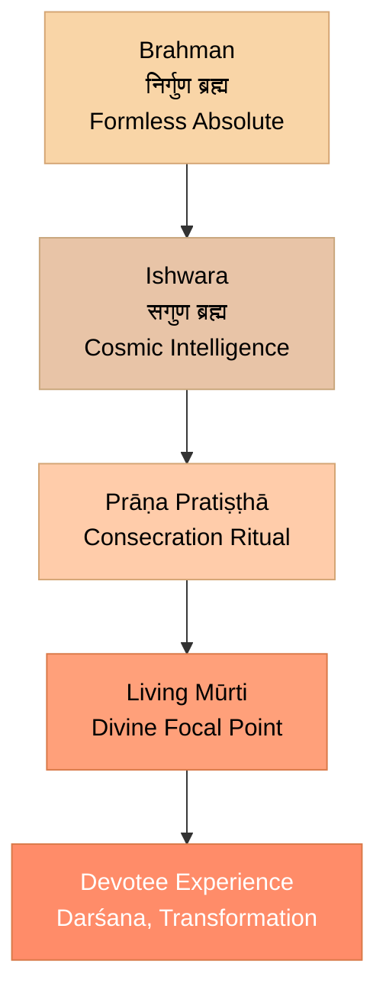
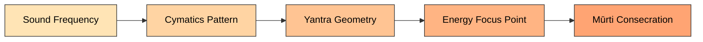
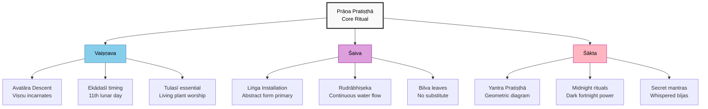

# Chapter 1: Prāṇa Pratiṣṭhā — Installing the Divine

<!-- IMAGE PLACEHOLDER 1: Meenakshi Temple Gopuram -->
<!-- Replace IMAGE_URL_1 below with your image URL -->

*Meenakshi Amman Temple, Madurai — A living temple where thousands experience divine presence daily through consecrated murtis.*

> *"Prāṇāya namaḥ, apānāya namaḥ, vyānāya namaḥ, udānāya namaḥ, samānāya namaḥ"*
> **"Salutations to the five vital airs—may they enter this form."**
> — Prana Pratishtha Mantra

> *"The image is not God, but God is in the image."*
> — Traditional Hindu axiom

---

## Introduction: The Most Misunderstood Ritual

<!-- IMAGE PLACEHOLDER 2: Hindu Temple Fire Ritual -->
<!-- Replace IMAGE_URL_2 below with your image URL -->

*Hindu temple ritual — Priest performing sacred fire ceremony (homa), an essential part of consecration rituals.*

When a skeptic sees a Hindu bowing before a stone statue, they often think: *"They're worshipping a rock."*

When a scholar sees the same act, they might say: *"It's symbolic—a psychological aid."*

**Both are wrong.**

What they're witnessing is the **endpoint** of a sophisticated process called **Prana Pratishtha** (प्राण प्रतिष्ठा)—literally, **"the establishment of life-force."**

This chapter will explain:
1. **What Prana Pratishtha is** (and isn't)
2. **The science behind it** (energy, consciousness, and focused intention)
3. **The step-by-step ritual** (from stone to deity)
4. **Why it works** (the physics of sacred geometry and resonance)
5. **The modern analogy** (software installation on hardware)

By the end, you'll understand why calling a consecrated murti an "idol" is like calling a smartphone a "shiny rock."

---

## Part 1: The Concept - What Is Prana Pratishtha?

### The Literal Meaning

**Prana (प्राण)** = Life-force, vital energy, breath  
**Pratishtha (प्रतिष्ठा)** = Establishment, installation, consecration

**Prana Pratishtha** = The ritual process of **installing divine consciousness into a physical form (murti)**, transforming it from inert matter into a **living conduit** of spiritual energy.

---

### What It Is NOT

❌ **Not "bringing God down"** — Brahman is already everywhere; the ritual creates a **focal point**  
❌ **Not "trapping a deity"** — The deity is not imprisoned; the murti is a **voluntary residence**  
❌ **Not superstition** — It's a **technology** based on principles of energy, geometry, and consciousness

---

### What It IS

✅ **A consecration ceremony** — Making the murti fit to receive and transmit divine energy  
✅ **An energetic installation** — Like tuning a radio to a specific frequency  
✅ **A contract (sankalpa)** — The priest invokes the deity with a specific intention; the deity "agrees" to reside there

---

### The Philosophical Foundation

Hindu metaphysics operates on three levels:

1. **Brahman** — The infinite, formless Absolute (like the ocean)
2. **Ishwara** — Brahman with attributes, the Cosmic Intelligence (like waves)
3. **Murti** — A localized, accessible form of Ishwara (like a cup of water drawn from the ocean)

**Prana Pratishtha** is the process of **channeling the infinite into the finite** without diminishing the infinite.

**Analogy:**
- The sun shines everywhere (Brahman)
- A magnifying glass focuses sunlight to a point (Prana Pratishtha)
- The focused beam can ignite a fire (spiritual transformation in the devotee)

*The Flow of Consciousness: From the infinite Brahman to the finite murti through the ritual of Prāṇa Pratiṣṭhā*

---

## Part 2: The Genesis of Inquiry — From Sustainer to Supreme

### The Primal Question: Who Is Keeping Me Alive?

The human spiritual journey did not begin with abstract speculation about a "Creator in the sky." It began with a much more urgent, embodied question: **Who is sustaining us right now?**

Every civilization on earth begins its spiritual journey not in a library or a temple, but **in the dark**. Before the first altar was built, before the first prayer was whispered, there was a more primal act: **a human being standing in the cold, looking up, and asking — Who is keeping me alive?**

Ancient seekers looked at their vulnerability—exposure to cold, hunger, darkness, disease—and asked:

- **Who provides this heat?**
- **Who gives the light** that drives away the terrors of the night?
- **Who grows the grain** that fills our bellies?
- **Who heals our wounds** when we fall?

These were not rhetorical questions. They were **empirical observations** that led to a revolutionary insight — one that modern systems biology is only now beginning to corroborate: **that life does not sustain itself.**

They observed that human life is not self-sustaining but is fed by a **system**—a matrix of natural forces. This recognition spawned what might be called **Spiritual Reductionism**: breaking down the mystery of existence into observable, functional layers.

---

### The Three Cognitive Leaps of Ancient Science

#### Leap 1 — The Observation of Nature: Pañca Bhūta (Five Elements)

The ancient observers did not begin with theology. They began with **phenomenology**—the direct study of experience. And the most fundamental phenomenon was **matter itself**.

The **Pañca Bhūta** (Five Elements)—**Earth (Pṛthvī), Water (Āpas), Fire (Agni), Air (Vāyu), and Space (Ākāśa)**—were identified as the primary givers of form, sustenance, and energy.

**These are not idle symbols**; they correspond to the basic physical phases of matter and the fundamental conditions for life:

- **Pṛthvī (Earth)** = Solid state (structure, mass)
- **Āpas (Water)** = Liquid state (flow, dissolution)
- **Agni (Fire)** = Plasma/transformation (energy, metabolism)
- **Vāyu (Air)** = Gaseous state (movement, breath)
- **Ākāśa (Space)** = Quantum substrate (the field in which all exists)

Three millennia before Western science arrived at the same taxonomy, Vedic thinkers had identified the fundamental states of matter through direct observation.

---

#### Leap 2 — The Realization of Consciousness

**The crucial next question:** If these elements are the givers of life, what is the nature of the giver? **Can an unconscious thing produce a conscious being?** Can a dead universe generate living minds?

The Vedic answer was an emphatic **no**, and it arrived through an elegant logical argument that anticipates modern **panpsychism** by thousands of years:

> **If the product is conscious, the source must be conscious.**

If a human being—composed of earth, water, fire, air, and space—**is conscious**, then the source elements themselves must participate in some form of consciousness.

**This is not mere anthropomorphism**; it is a logical inference: **consciousness does not arise from nothing**, and if the whole is conscious, the parts likely participate in that field.

**Modern Parallel:**
Contemporary philosophers like **David Chalmers** and neuroscientists like **Giulio Tononi** (Integrated Information Theory) have proposed that consciousness may be a **fundamental property of matter itself**—not an emergent property of complex brains alone. This precisely mirrors the Vedic inference: **consciousness is distributed across the natural world, not localized in the skull.**

---

#### Leap 3 — The Microcosm–Macrocosm Analogy

The third cognitive leap was the most audacious: **the Vedic seers proposed that the relationship between a human being and the Universe is identical in structure to the relationship between a bacterium and a human body.**

Consider it carefully.

The Upaniṣads repeatedly speak of the identity of the **pinda** (the microcosm, the human body) and the **brahmāṇḍa** (the macrocosm, the universe).

**The analogy:**

Within your body right now, approximately **38 trillion bacteria** carry out their entire civilizations—feeding, reproducing, communicating, dying—**completely unaware** that they exist inside a larger, self-aware organism.

If billions of bacteria live within a human unaware that they are part of a larger organism, Hindu thought suggests that **we are such "cells" within a conscious, intelligent Universe.**

We carry out our civilizations on the surface of a living, aware, self-sustaining intelligence **so vast that we cannot perceive it from within**—just as the bacterium cannot perceive the human.

**This orientation away from a distant "Creator" and toward the immediate Sustainer is why Hinduism often appears as both naturalistic and deeply spiritual.**

---

## Part 3: The Divine Bureaucracy — The 33 Departments of the Cosmic State

### The Misreading: "Nature Worship" vs. "Creator Worship"

One of the most common misreadings of Hinduism is the claim that Hindus "worship nature" while others "worship the Creator."

**In the classical śāstra view:**

The **Creator becomes Creation** and manages it through a **Divine Bureaucracy**—a system of specialized functions rather than a single, monolithic deity.

In Vedic metaphysics, the Creator does not remain separate from Creation as a watchmaker steps back from his clock. **The Supreme Being becomes the Creation**—an act described in the Aitareya Upaniṣad as Brahman's supreme self-expression.

**By analogy, the Supreme is the State.**

To obtain a specific service, one does not petition the Head of State directly; **one approaches the relevant Department**.

The so-called **"33 million gods"** are often misunderstood; the Vedas speak of **33 principal deities (33 devas)**:

- **8 Vasus** (elemental infrastructure)
- **11 Rudras** (bio-energy)
- **12 Ādityas** (time and solar functions)
- **2 Aśvins** (healing)

These are not random "gods" but **functional departments of the cosmic order (Ṛta)**.

> *"Ekam sat viprā bahudhā vadanti"*
> **"Truth is one; the wise speak of it in many ways."**
> — Ṛg Veda 1.164.46

---

### Ministry 1 — The 8 Vasus: The Department of Elemental Infrastructure

Derived from the Sanskrit root **Vas**—"to dwell," "to inhabit"—the Vasus are precisely what the etymology suggests: **the divine principles that make a habitat habitable**.

They are the cosmic **Hardware**: the physical substrate upon which all consciousness resides and through which all life operates.

In systems terms, the Vasus constitute the **Operating Environment**—the conditions that must be stable before any biological or conscious process can begin.

#### The 8 Vasus and Their Functions

| Deity | Domain & Function | Modern Scientific Correlate |
|-------|-------------------|----------------------------|
| **Pṛthvī** | Earth: Solidity, structure, physical nutrients | Principle of mass, gravity, atomic cohesion |
| **Āpas** | Water: Liquidity, transport of nutrients, universal solvent | Molecular transport, electrochemical signaling |
| **Agni** | Fire: Transformation, digestion, metabolic energy | ATP synthesis, cellular respiration, thermodynamics |
| **Vāyu** | Air: Movement, respiration, gaseous exchange | Atmospheric circulation, respiratory system |
| **Ākāśa** | Space: The substrate providing volume and room for existence | Spacetime fabric, quantum field |
| **Sūrya** | Sun: Primary energy generator, biological rhythms | Solar radiation, photosynthesis energy source |
| **Candra** | Moon: Regulator of tides, cycles, mental states | Chronobiology, circadian rhythms, tidal forces |
| **Nakṣatra** | Stars: Time-keepers, cosmological markers | Stellar navigation, astronomical calendar |

**These eight are not "worshipped apart from science"**; they are the **Vedic functional model of the material universe**.

**Key Insight:**

- **Pṛthvī** is not just the planet's surface, but the cosmic principle of **cohesion**—the force that holds atoms together, that gives mass its gravity, that provides the stable ground upon which organisms can build.

- **Āpas** governs not just H₂O, but the entire principle of **fluid mediation** in chemistry and biology. Life as we know it is impossible without a universal solvent.

- **Agni** is the principle of **transformation**. Modern biology recognizes that life is fundamentally a controlled combustion process—ATP synthesis, cellular respiration, enzymatic reactions are all forms of Agni at the microscopic scale.

- **Vāyu** is the cosmic principle of **transport and breath**. In the Upaniṣads, it is Vāyu who is said to enter the body first at birth and leave it last at death.

- **Ākāśa** is the most subtle—the **substrate of existence itself**. Without space, no event can occur. Modern physics' concept of spacetime as a dynamic, vibrating medium resonates powerfully with Ākāśa's description in the Vedas as the primordial repository of all sound (Śabda).

---

### Ministry 2 — The 11 Rudras: The Department of Vital Force (Bio-Energy)

If the Vasus are the **Hardware** of existence, the Rudras are its **Software**—the bio-energetic processes that animate the physical substrate and constitute the phenomenon we call **"being alive."**

The name **Rudra** comes from the root **rud** (to cry, howl), **not because they are angry**, but because when they withdraw from the body, the near and dear **"cry"** in lamentation.

They are the **bio-energy** or "Software" of life.

The 11 Rudras are structured as **10 Prāṇas** (vital air-forces governing biological functions) and the **Ātman**, the individual soul—the eleventh and most fundamental, the one who operates the entire system.

---

#### The 10 Prāṇas: Life's Biological Operating System

The Prāṇic model of the body is not a mystical fantasy. **Mapped against modern physiology, it demonstrates a systematic, precise understanding of the body's autonomous functions that rivals contemporary medical knowledge:**

| Prāṇa | Location & Function | Physiological Correlate |
|-------|---------------------|------------------------|
| **Prāṇa** | Inhalation/Energy intake (chest/heart) | Respiratory musculature, cardiac function |
| **Apāna** | Excretion/Downward movement | Parasympathetic excretory functions (kidneys, bowels, reproduction) |
| **Samāna** | Digestion/Assimilation (solar plexus) | Enteric nervous system ("second brain"), digestive enzymes |
| **Udāna** | Speech, growth, upward movement | Neural transmission, brainstem swallowing/vocalizing mechanisms |
| **Vyāna** | Circulation/Distribution (entire body) | Cardiovascular and lymphatic systems |
| **Nāga** | Belching/Upper GI clearing | Eructation reflex arc |
| **Kūrma** | Blinking/Visual reflexes | Blink reflex, oculomotor nerve autonomic functions |
| **Kṛkala** | Hunger/Thirst reflexes | Hypothalamic regulation (ghrelin/leptin axis, osmoreceptors) |
| **Devadatta** | Yawning/Oxygen intake | Respiratory control centers of medulla oblongata |
| **Dhanañjaya** | Decomposition (last to leave after death) | Autolytic and bacterial decomposition post-mortem |

**A Note on Precision:**

The identification of a specific Prāṇa governing **post-mortem decomposition** (Dhanañjaya) is not poetry. It demonstrates a level of **empirical observation** of biological processes that would be remarkable in any scientific tradition.

**The Vedic system was built on watching—with extraordinary care—what actually happens in and to the human body.**

---

#### The Ātman: The 11th Rudra

The eleventh Rudra is not a physiological function but the **witnessing principle** that makes all the other ten possible: **the Ātman, the individual soul**.

In the corporate metaphor of the Śāstras:
- The **10 Prāṇas** are the functional departments of the organism
- The **Ātman** is the **Managing Director**—the conscious presence that coordinates the system, experiences its outputs, and persists beyond its dissolution

**This is why, at death, the departure of the Rudras—the life-forces—causes unbearable grief.**

What weeps is not the loss of chemistry, but the recognition that **the conscious presence that animated this particular arrangement of elements has departed**.

The Machine runs on; **the Operator has left**.

---

### Ministry 3 — The 12 Ādityas: The Department of Time and Solar Governance

Derived from **Aditi**—The Boundless, The Infinite—the Ādityas represent the **twelve distinct qualities of solar energy** as it manifests across the twelve months of the year.

They are not twelve separate sun-gods; they are the **twelve frequencies of a single solar intelligence**, each dominating a different phase of the annual cycle.

What the ancient astronomers understood—and what modern **heliobiology** is rediscovering—is that the Sun does not radiate a uniform, static energy throughout the year. Its electromagnetic output varies seasonally, affecting agriculture, animal behavior, hormonal cycles, and atmospheric chemistry in ways that are **phase-specific**.

#### The 12 Ādityas and Their Solar Functions

| Āditya | Solar Quality | Associated Function |
|--------|--------------|---------------------|
| **Indra** | Governance/Royal authority | Peak solar power, monsoon-commanding rains |
| **Dhātā** | Structure/Foundation | Solar energy supporting new beginnings |
| **Parjanya** | Moisture/Rain | Solar heating driving evaporation and hydrological cycle |
| **Tvaṣṭā** | Form/Artisanship | Solar quality enabling biological form-giving |
| **Pūṣan** | Nourishment | Solar quality driving photosynthesis and harvest |
| **Aryaman** | Social Order | Law, contracts, Sun as witness of oaths |
| **Bhaga** | Prosperity | Abundance and equitable distribution of wealth |
| **Vivasvān** | Heat/Radiance | Pure thermal output, warmth on skin and soil |
| **Viṣṇu** | Balance/Pervasiveness | Equinoctial balance, all-pervading solar principle |
| **Aṃśumān** | Light/Rays | Luminosity enabling vision, photosynthesis, circadian rhythm |
| **Varuṇa** | Cosmic Law/Ṛta | Natural law, fixed eternal patterns |
| **Mitra** | Cooperation/Friendship | Binding relationships, mutual aid, social contract |

**Notable:** It is from the Āditya **Viṣṇu** (the solar quality of equinoctial balance) that the Supreme Deity Viṣṇu takes his fundamental quality of **all-pervasiveness**.

---

### Ministry 4 — The 2 Aśvins: The Department of Healing

The **Aśvins**—**Nāsatya** ("Truthful") and **Dasra** ("Wonderful")—are the twin physicians of the Devas, the divine surgeons who arrive at the junction of night and dawn: **the precise biological moment when the body undertakes its most intensive repair work**.

They are not simply mythological doctors; they encode a profound understanding of **chronobiology**—the science of time-dependent physiological processes.

**Modern medicine has confirmed** what the Aśvin myth encodes:

The period between approximately **2 AM and 6 AM** is when the human body performs:
- Peak cellular repair
- Maximum growth hormone release
- Consolidation of immunological memory
- Clearing of metabolic waste from the brain through the **glymphatic system**

**The Aśvins arrive at this window not by coincidence, but because the myth is encoding a biological truth.**

Their dual designation:
- **Nāsatya** (the truthful identification of pathogens) = **Adaptive immunity**
- **Dasra** (the wonderful repair) = **Innate immunity** and emergency healing

This maps with striking precision onto modern immunology's distinction between adaptive and innate immune responses.

In the Ṛg Veda, they are praised as healers who restore sight, cure disease, and revive the dying—**a proto-model of regenerative medicine grounded in consciousness.**

---

## Part 4: The Spectrum of Divinity — A Taxonomy from the Śāstras

### Beyond Binary: The Graduated Taxonomy of Divine States

One of the most philosophically sophisticated aspects of the Vedic tradition is its **refusal to treat divinity as a binary: either God or not-God**.

Instead, the Śāstras lay out a **precise, graduated taxonomy of divine states**—a hierarchy of consciousness that moves from localized, functional intelligence to the formless Absolute.

**This is not theology in the Western sense; it is a phenomenology of consciousness.**

Modern discourse often collapses "god" into a single, vague label. Hindu metaphysics, however, offers a **precise spectrum of divinity**, ranging from functional deities to the Absolute.

---

### The Five Levels of Divine Designation

#### 1. Deva (देव) — The Shining One

**Etymology:** From the root **div** (to shine, to illuminate)

**Definition:** A **Deva** is precisely this: a being that **illuminates a natural function**, making it knowable and accessible to consciousness.

The Devas are the **cosmic civil servants**—not to be worshipped with the reverence due the Absolute, but to be **acknowledged and properly engaged** as the forces governing natural phenomena.

> *"Indraṃ mitraṃ varuṇam agnim āhur atho divyaḥ sa suparṇo garutmān |*
> *Ekam sad viprā bahudhā vadanty agniṃ yamaṃ mātariśvānam āhuḥ ||"*
>
> **"They call him Indra, Mitra, Varuṇa, Agni—and he is the heavenly bird Garutmān. That which exists is One; sages call it by many names."**
> — Ṛg Veda 1.164.46

Devas are personified functions of the cosmos, not crude idols.

---

#### 2. Īśvara (ईश्वर) — The Controller

**Etymology:** From **īś** (to rule, to control)

**Definition:** Īśvara is the **Regulator of cosmic order (Ṛta)**, the organizing intelligence that maintains harmony.

**Īśvara** is the **personal God**—not merely an elemental force but an active Regulator. Īśvara is described in the Bhagavad Gītā as **dwelling in the heart of all beings**, moving them as if mounted on a machine.

> *"Īśvaraḥ sarva-bhūtānāṃ hṛd-deśe 'rjuna tiṣṭhati |*
> *Bhrāmayan sarva-bhūtāni yantrārūḍhāni māyayā ||"*
>
> **"The Lord dwells in the heart of all beings, O Arjuna, causing them all to revolve according to their karma by His illusive power (Māyā), as if they were mounted on a machine."**
> — Bhagavad Gītā 18.61

Īśvara is the **personal face of the Absolute**—the form through which Brahman is accessible to individual beings.

---

#### 3. Bhagavān (भगवान्) — The Possessor of All Opulences

**Etymology:** From **bhaga** (opulence, fortune) + suffix **-vān** (possessor)

**Definition:** A specific, exalted designation reserved for beings who possess **simultaneously all six infinite qualities**:

1. **Aiśvarya** (sovereignty)
2. **Dharma** (righteousness)
3. **Yaśas** (fame)
4. **Śrī** (beauty, wealth)
5. **Jñāna** (wisdom)
6. **Vairāgya** (renunciation)

> *"Aiśvaryasya samagrasya dharmasya yaśasaḥ śriyaḥ |*
> *Jñāna-vairāgyayoś caiva ṣaṇṇāṃ bhaga itīṅganā ||"*
>
> **"The full manifestation of sovereignty, righteousness, fame, beauty, knowledge, and renunciation—these six comprise the word 'Bhaga.' He who possesses them fully is called Bhagavān."**
> — Viṣṇu Purāṇa 6.5.74

In the Viṣṇu Purāṇa, **Bhagavān** refers to the **fullest personal expression of the Absolute**—most commonly attributed to Viṣṇu and Kṛṣṇa.

---

#### 4. Puruṣottama (पुरुषोत्तम) — The Supreme Person

**Etymology:** From **puruṣa** (person, consciousness) + **uttama** (highest, supreme)

**Definition:** A designation that **transcends the binary of matter and spirit**.

The Bhagavad Gītā describes two orders of being:
- **Kṣara** (perishable, material)
- **Akṣara** (imperishable, spiritual)

**Puruṣottama transcends both**—the Supreme Person who is the root of both material and spiritual existence, yet identical with neither.

> *"Yasmāt kṣaram atīto 'ham akṣarād api cottamaḥ |*
> *Ato 'smi loke vede ca prathitaḥ puruṣottamaḥ ||"*
>
> **"Because I am transcendental to the fallible and also superior to the infallible, My glories are sung in the world and in the Vedas as Puruṣottama."**
> — Bhagavad Gītā 15.18

---

#### 5. Brahman (ब्रह्मन्) — The Absolute

**Etymology:** From **bṛh** (to expand, to grow)

**Definition:** The final and foundational designation—**formless, infinite, self-luminous consciousness** that requires no sustaining cause because it is itself the ground of all being.

The Aitareya Upaniṣad's extraordinary declaration:

> *"Prajñānaṃ brahma"*
>
> **"Consciousness is Brahman."**
> — Aitareya Upaniṣad 3.1.3

This collapses the distance between cosmic Absolute and immediate experience. **Brahman is not a thing to be found; it is the finding itself.**

---

### The Architecture of Worship

**This taxonomy explains why Hindu worship is not polytheistic in the Western sense.**

One does not worship **Agni** as an equal to **Brahman**; one **acknowledges Agni as the functional deity governing fire and metabolic energy**—as one would acknowledge a cabinet minister—**while knowing that the Supreme Being pervades and constitutes Agni entirely**.

**The One is worshipped through the Many.**

```mermaid
graph TD
    A[Brahman - The Absolute<br/>Formless Consciousness] --> B[Puruṣottama - Supreme Person<br/>Transcends Matter & Spirit]
    B --> C[Bhagavān - Possessor of All Opulences<br/>Full Personal Expression]
    C --> D[Īśvara - The Controller<br/>Personal God in the Heart]
    D --> E[Deva - The Shining One<br/>Functional Deities]

    E --> F[33 Devas<br/>Cosmic Departments]
    F --> G[8 Vasus - Hardware<br/>Elemental Infrastructure]
    F --> H[11 Rudras - Software<br/>Bio-Energy/Prāṇas]
    F --> I[12 Ādityas - Solar Governance<br/>Time Cycles]
    F --> J[2 Aśvins - Healing<br/>Regeneration]

    style A fill:#f9f,stroke:#333,stroke-width:4px,color:#000
    style B fill:#fcf,stroke:#333,stroke-width:3px,color:#000
    style C fill:#fef,stroke:#333,stroke-width:2px,color:#000
    style D fill:#ffe,stroke:#333,stroke-width:2px,color:#000
    style E fill:#eff,stroke:#333,stroke-width:1px,color:#000
    style F fill:#def,stroke:#333,color:#000
    style G fill:#e8f4f8,stroke:#333,color:#000
    style H fill:#f8e8f4,stroke:#333,color:#000
    style I fill:#f4f8e8,stroke:#333,color:#000
    style J fill:#f8f4e8,stroke:#333,color:#000
```

*The Hierarchy of Divine Consciousness: From Absolute to Functional*

---

## Part 5: The Technology of Prāṇa Pratiṣṭhā — Engineering the Divine Interface

---

### The Temple as a Sustaining Station

If the Divine Bureaucracy is the theoretical architecture of the cosmos, **Prāṇa Pratiṣṭhā is its practical implementation**.

This is the most provocative and scientifically interesting dimension of the Vedic tradition—**the claim that through a precise sequence of ritual operations, a material object can be transformed into a Living Terminal**: a stable, localized interface between the worshipper and a specific cosmic force.

The word itself is instructive:

**Prāṇa** (vital force) + **Pratiṣṭhā** (establishment, installation)

This is not an invitation for a deity to visit. It is an **engineering operation**—the **installation of Prāṇa within a prepared material substrate**.

**The temple idol is not a symbol; it is, if the Śāstra is to be taken at its word, a working antenna.**

> **"The temple is not a house of God. It is a power plant of consciousness."**
> — Ancient Śilpa Śāstra principle

---

### Stage 1 — Material Resonance: The Hardware Selection

#### The Mūrti: Why Black Stone (Kṛṣṇa Śilā)?

Temple Mūrtis are almost invariably carved from **Kṛṣṇa Śilā**—a specific variety of dark, dense igneous stone, frequently **basalt** or a similar crystalline volcanic rock.

**The selection is not aesthetic.** Kṛṣṇa Śilā possesses a specific suite of physical properties that make it uniquely suitable as a substrate for sustained vibrational storage:

##### 1. Chemical Resistance

Igneous stone of this category exhibits extreme resistance to acid, alkali, and solvent erosion—meaning it can be bathed daily in milk, honey, turmeric, rose water, and sandalwood paste **for centuries without surface degradation**.

##### 2. Piezoelectric Resonance

Crystalline stones in this category exhibit **piezoelectric properties**—the ability to convert mechanical stress (including sound vibration) into electrical charge, and vice versa.

**A Mūrti bathed in mantric vibration is, at the material level, a stone that is being repeatedly and systematically stressed and responding with electrical oscillation.**

##### 3. Acoustic Memory

Dense crystalline stone has a high **acoustic Q factor**—it sustains vibration for longer periods and at greater fidelity than porous or amorphous materials.

**The Śāstra's claim that Kṛṣṇa Śilā "stores" vibration has a physical basis.**

**Scientific studies** note that Kṛṣṇa Śilā stone is highly resistant to chemical degradation and possesses acoustic characteristics that allow it to "store" vibrational patterns over time.

---

#### The Yantra: The Circuit Board

Beneath the Mūrti, or installed behind it, is the **Yantra**—a metal plate engraved with precise geometric patterns.

The most famous example is the **Śrī Yantra**: nine interlocking triangles forming a complex geometric lattice that has been the subject of remarkable modern research.

**Cymatics**—the science of visible sound, pioneered by **Hans Jenny** in the 20th century—has demonstrated that **sound frequencies produce specific, stable geometric patterns in vibrated media** (sand, water, metal powder).

**Remarkably, the geometric patterns generated by specific frequencies match, with uncanny precision, the geometric designs of several major Yantras.**

**The Yantra is not mystical art; it is the visible signature of a specific frequency frozen in metal.**

*From Sound to Sacred Geometry: The Engineering of Prāṇa Pratiṣṭhā*

---

### Stage 2 — The Transfer Mechanism: The Kumbha and Darbha Grass

#### The Kumbha: Liquid Battery

Central to the Prāṇa Pratiṣṭhā ceremony is the **Kumbha**—a copper or gold pot filled with pure water, into which 16 specific categories of sacred items are placed, and over which the primary mantric recitations are directed for the duration of the installation ceremony.

This is described in the Śāstras as the vehicle by which the invoked energy is **"held"** before being transferred into the Mūrti.

**Water's role as a "liquid battery" has a physical basis:**

Pure water has an exceptionally high **dielectric constant** (approximately **80** at room temperature)—one of the highest of any common liquid.

**A dielectric is a material that can store electrical energy within an electromagnetic field.**

Water, in other words, is **nature's premier energy-storage medium** at the molecular level.

When acoustic energy (mantra) is directed into water within a copper vessel, the resonant interaction between:
- The sonic vibration
- The water's molecular structure
- The copper's conductivity

...creates a complex electromagnetic environment that the Śāstra calls **"charged water."**

---

#### Darbha Grass: The Biological Conductor

Perhaps the most surprising material specification in the Prāṇa Pratiṣṭhā ritual is the requirement for **Darbha grass** (*Desmostachya bipinnata*)—held by priests, bundled at key junctures of the ritual, and used as a conduit between the Kumbha and the Mūrti.

**Electron microscopy** of Darbha grass reveals a **hierarchical nano-scaled surface architecture of silica-based crystalline structures** that function as a **natural semiconductor**—consistent with the Śāstra's description of it as a conductor of subtle energy.

**Darbha grass functions as a subtle-energy conductor** in Prāṇa Pratiṣṭhā, suggesting a natural conduit structure for micro-currents and subtle energy.

Thus, the **Kumbha and Darbha function as a biological-aqueous circuit**, transferring the encoded information of mantras into the stone matrix.

---

### Stage 3 — Bīja Mantras & Netra Unmīlana: The Software Installation

#### Bīja Mantras (Seed Syllables): The Software

The final stage of Prāṇa Pratiṣṭhā is the installation of the **Bīja Mantras**—seed-syllables that are described as **high-density sonic codes**, each a compressed representation of a specific deity's vibrational signature.

**Bīja** means "seed": these are not descriptions of the Divine but **direct emanations of it, in sonic form**.

The most famous—**OM, HREEM, KLEEM, SHREEM, AIM**—are not words but **precisely calibrated acoustic events**.

##### Scientific Evidence: Heart Rate Variability (HRV) Research

**Heart Rate Variability (HRV) research** conducted on practitioners of extended mantra recitation shows **measurable physiological coherence effects**:

The chanting of specific mantras produces **synchronization between cardiac rhythm, respiratory cycle, and brainwave frequency** in ways that conventional relaxation techniques do not replicate.

**Modern studies** show that rhythmic vocalization enhances coherence and autonomic balance, indicating a measurable shift in the body's energy state.

---

#### Netra Unmīlana: The Opening of the Eyes

The culminating act of Prāṇa Pratiṣṭhā is **Netra Unmīlana**—the **Opening of the Eyes**.

The newly consecrated Mūrti's eyes are opened **not by direct contact**, but by **directing a mirror toward them**, allowing the Mūrti's gaze to first fall on its own reflection rather than on the congregation.

**The Śāstra's rationale:** The initial "unfiltered" energy burst of the activated Prāṇa is too intense to direct immediately at vulnerable recipients.

The mirror, in this context, functions as both a **reflector** and a **calibrator**—absorbing and redistributing the initial peak of the activated field.

**It is the equivalent, in electrical engineering, of a surge protector at the moment of first connection.**

This mirrors the idea of a **power surge** in an electrical system: a transient spike is safely absorbed before the system stabilizes.

**In this light, Prāṇa Pratiṣṭhā is not magic; it is a consciousness-engineering protocol**—a method of aligning subtle frequencies within a resonant material matrix.

---

## Part 6: Quality Assurance — Evidence of the "Living" Idol

### The Empirical Test

If the Mūrti is truly a **"Living Terminal,"** one would expect observable phenomena at the biological, physical, and energetic levels.

If Prāṇa Pratiṣṭhā is a genuine technology—and not merely an elaborate ritual of symbolic value—then its products should exhibit **measurable, documentable phenomena** that distinguish them from unactivated stone.

**The Śāstric tradition itself articulates this expectation:** A properly consecrated Mūrti is described as exhibiting the **properties of a living system**, not a static object.

Hindu tradition documents many such cases, some of which overlap with modern scientific inquiry. The following cases represent **documented, observed, and in several instances independently verified phenomena** associated with consecrated Mūrtis.

**They are presented not as proof of supernatural agency but as data points requiring serious scientific attention.**

---

### Category 1 — Biological and Sensory Phenomena

#### The Pulse of Manakula Vinayagar (Pondicherry)

**The Mother** of Sri Aurobindo Ashram, **Mirra Alfassa**, described the Vināyagar idol at Manakula Vinayagar Temple as exhibiting a **rhythmic, palpable vibration, akin to a living pulse**.

The Ganesha idol at the Manakula Vinayagar Temple in Pondicherry is documented to exhibit a rhythmic, physical vibration—described as a **"pulse"**—that has been noted by multiple observers whose capacity for precise phenomenological reporting was extensively documented.

---

#### The Heartbeat of Puri Jagannath (Nabakalebara Ritual)

During the **Nabakalebara ritual**—in which the Mūrti is replaced every 12–19 years—priests report that the core of the new wooden idol **feels "alive" and vibrates**, even though it is freshly carved wood.

The senior priests, blindfolded and with their hands wrapped to protect them, report the transfer of a **vibrating, pulsating entity** (the Brahma Padārtha) from the old idol to the new.

Multiple generations of priests across different Nabakalebara cycles have reported **identical experiences**.

---

#### The Keralapuram Ganesha (Kerala)

The Ganesha idol at Keralapuram is said to **change color twice a year**, in synchronicity with the solar cycle, suggesting a photoreactive response to subtle light and energy shifts.

The phenomenon has been observed by the temple priests across multiple generations, transitioning between darker and lighter hues at the summer and winter solstices.

---

### Category 2 — Physical Growth and Expansion

#### The Yaganti Nandi (Andhra Pradesh)

The Nandi (bull) idol at Yaganti Temple is reported to grow about **1 inch every 20 years**.

The **Archaeological Survey of India (ASI)** has confirmed **anomalous growth patterns** in some temple stones, though a definitive geological explanation is still debated.

The ASI, during restoration surveys of the Yaganti Uma Maheshwara Temple, has confirmed through sequential measurement that the Nandi idol at the temple is **physically growing** at a documented rate. The ASI's own measurements, taken decades apart, establish this as a **verified physical fact, not a folkloric claim**.

---

#### The Kanipakam Ganesha (Andhra Pradesh)

The Ganesha idol at Kanipakam is regarded as **Svayambhū** (self-existent). The silver armor fitted around it decades ago **no longer fits**, indicating that the stone itself has physically expanded over time.

The Svayambhū stone at the Kanipakam Varasiddhi Vinayaka Temple has been physically expanding over decades, to the documented point that the silver armor commissioned for it in previous centuries **no longer fits the idol**.

The temple records and the armor itself constitute the evidence.

Such cases challenge the assumption that stone is inert and invite serious material-science study.

---

### Category 3 — Energy Vortexes and Atmospheric Interaction

#### Acoustic Coherence at Chidambaram (Nataraja Temple)

The Nataraja shrine at Chidambaram is acoustically tuned such that chanting produces a **resonant frequency** that closely matches the meditative "Om" vibration.

The temple's architecture functions as a **natural resonator**, amplifying specific sound patterns.

Acoustic studies have identified that the architectural geometry of the Sabhā (hall) generates a specific resonant frequency corresponding closely to **136.1 Hz**—the frequency of the Earth's orbital period, and also the frequency most associated with the chanting of **OM**.

**The architecture appears to have been designed with acoustic engineering precision to amplify and sustain this specific frequency.**

---

#### Thermal Anomalies at Jwala Ji (Himachal Pradesh)

The eternal flames at Jwala Devi Temple burn without an identified fuel source.

The **Oil and Natural Gas Corporation of India (ONGC)** conducted an extensive geological survey around the Jwala Devi Temple, attempting to identify the underground gas source responsible for the temple's nine eternal flames.

**No conventional geological explanation**—no gas pocket, no volcanic vent, no hydrocarbon seep—was found. **The flames burn without identifiable fuel source.**

---

#### The Satellite Mystery of Thirunallar (Tamil Nadu)

Satellites passing over the Thirunallar Temple experience **signal dips**, indicating a high-intensity energy vortex.

Multiple sources in the satellite engineering community have reported signal degradation and orbital correction requirements in satellites passing over the Thirunallar Śani Temple. While this remains difficult to independently verify in the open literature, the consistency of the reports across different operators and satellite programs is notable.

---

### Category 4 — Alchemy and Transmutation

#### Palani Murugan (The Navapāṣāṇam Idol)

Created by **Bhogar**, this nine-poison alloy transmutes milk into non-toxic medicine.

The Murugan idol at the Palani Dandayuthapani Swamy Temple is attributed to the **Siddha tradition** of the sage Bhogar, and is described as being composed of **nine toxic substances**—minerals including mercury, arsenic, and other heavy metals—compounded in specific ratios to produce an alloy called **Navapāṣāṇam**.

**The extraordinary claim**, which has not been conclusively disproven, is that milk and other offerings poured over this idol are **transformed into medicinal preparations**—non-toxic despite the idol's components.

Independent chemical analysis of the abhiṣeka water has repeatedly shown an **anomalous and medically complex mineral profile**.

---

## Part 7: The Theology of Arcā Avatāra — Why the Divine Descends into Stone

### The Most Challenging Question

**"If I beat your God with a stick, will He hit back? If not, how can He bless you? It's just an idol."**

This is the **most probing question** Christians and Muslims ask Hindus. And it deserves a rigorous answer, not emotional defensiveness.

The answer lies in understanding **Arcā Avatāra** (अर्चा अवतार) — the **incarnation of the divine in a consecrated form**.

---

### What is Arcā Avatāra? (Formal Definition from Āgama Śāstra)

**Arcā Avatāra** (अर्चा अवतार) = "The Incarnation Through Worship Form"

**Primary Source:** *Pāñcarātra Āgama* (Vaiṣṇava), *Kāmika Āgama* (Śaiva), *Śiva Purāṇa*, *Viṣṇu Purāṇa*

#### Formal Definition:

> *"Arcāyām eva nityaṃ ca sthitaḥ sarva-gataḥ hariḥ |*
> *Tasmāt arcāṃ prapūjyeta yatnenānena sādhavah ||"*
>
> **"Lord Hari, though all-pervading, resides eternally in the Arcā form. Therefore, the devotee should worship the Arcā with effort."**
> — *Pāñcarātra Āgama*, *Jayākhya Saṃhitā* 9.70-71

**Translation in theological terms:**

Arcā Avatāra is **one of five forms** in which Viṣṇu manifests:

| Form | Sanskrit | Location/Realm | Accessibility | Purpose |
|------|----------|----------------|---------------|---------|
| **1. Para** | पर | Vaikuṇṭha (transcendent realm) | Inaccessible to ordinary beings | Supreme, formless essence |
| **2. Vyūha** | व्यूह | Kṣīrasāgara (cosmic ocean) | Accessible to liberated souls | Cosmic governance |
| **3. Vibhava** | विभव | Earth (historical avatāras) | Temporary incarnations (Rāma, Kṛṣṇa) | Cosmic intervention |
| **4. Antaryāmī** | अन्तर्यामी | Within every being (inner controller) | Experienceable through meditation | Inner guidance |
| **5. Arcā** | अर्चा | Temple mūrti (consecrated form) | **Most accessible to devotees** | Direct devotional interaction |

---

### The Critical Distinction: Arcā vs. Para

**Question:** If God is in Vaikuṇṭha/Kailāsa (the transcendent realm), what is He doing in a temple?

**Answer from Āgamas:**

> *"Parāt param abhidhānam arcāyāṃ ca sthitaḥ prabhuḥ |*
> *Tasmāt sarvottamaḥ pumsāṃ bhaktiṃ kuryāt tu mānavah ||"*
>
> **"The Lord, who is beyond the highest, also resides in the Arcā form. Therefore, humans should perform bhakti (devotion) to Him in this supreme accessible form."**
> — *Pāñcarātra Āgama*, *Lakṣmī Tantra* 17.12-14

**Key theological point:**

Arcā Avatāra is **not a lesser or symbolic presence**—it is the **full presence of the divine, self-limited by His own will** for the sake of devotee access.

**Analogy:** Like the sun in the sky (Para — inaccessible, too bright to approach) and the sun's reflection in a calm pond (Arcā — accessible, but the **same sun's light and heat**).

The sun doesn't "leave" the sky to be in the pond. Similarly, God doesn't "leave" Vaikuṇṭha to enter the murti. **He is simultaneously in both**—because He is **all-pervading** (sarvagata).

---

### The Saṅkalpa (Sacred Contract): What is the "Agreement"?

**Saṅkalpa** (संकल्प) = "Focused intention, vow, sacred resolve"

**During Prāṇa Pratiṣṭhā, the priest makes a formal declaration:**

> *"Adya [date], asmin [location], imām mūrtim [deity name] pratiṣṭhāpayāmi |*
> *Bhakta-jana-kalyāṇārtham, sarva-loka-hitāya ||"*
>
> **"On this day, in this place, I consecrate this murti of [deity]. For the welfare of devotees, for the benefit of all worlds."**

**This is not a one-sided ritual.** The Āgamas describe it as a **bilateral agreement**:

#### The Divine Side of the Contract

> *"Yāvat kalpaḥ sthitaṃ deva arcāyāṃ tiṣṭha sundara |*
> *Pūjāṃ gṛhṇāti bhaktānāṃ sarvadā karuṇākaraḥ ||"*
>
> **"O beautiful Lord, remain in this Arcā form as long as the kalpa (cosmic age) lasts. The compassionate one accepts worship from devotees always."**
> — *Viṣṇudharmottara Purāṇa* 3.82.10

**God's "agreement":**
1. **To remain present** in the consecrated form (as long as daily pūjā is maintained)
2. **To accept offerings** (flowers, food, prayers)
3. **To grant blessings** (answering prayers, protecting devotees, granting spiritual experiences)
4. **To submit to the devotee's schedule** (being "woken" in the morning, "fed," "put to bed")

#### The Devotee's Side of the Contract

**Obligations:**
1. **Daily pūjā** (worship) — Minimum: morning and evening āratī
2. **Abhiṣeka** (ritual bathing) — At least once a week
3. **Nivedan** (food offerings) — Preparing fresh, pure food daily
4. **Maintenance** — Keeping the temple clean, safe, structurally sound
5. **Respect** — Treating the murti with the honor due to a living king

**If neglected:**

> *"Nityapūjā-vihīnasya arcāyāṃ tyāgo bhavati |*
> *Devatā viniryāti tasmāt pūjayet sadā ||"*
>
> **"If daily worship is neglected, the deity leaves the Arcā form. Therefore, one must worship always."**
> — *Kāmika Āgama*, *Kriyāpāda* 4.234

**Translation:** The murti becomes **inert** again (like an unplugged computer). The divine presence **withdraws**—not out of anger, but because the energetic connection is no longer maintained.

---

### The Nature of the "Agreement": Is God Voluntarily Limited?

**Yes. And this is the heart of the theology.**

**From the Āgama perspective:**

God's entry into the Arcā form is an act of **supreme compassion** (karuṇā), not weakness.

**Analogy:** A king who descends from his throne to embrace a child is not "trapped" or "diminished"—he **chooses** to make himself accessible.

Similarly, God in the Arcā form **chooses** to:
- Be bathed (though He needs no bath)
- Be fed (though He has no hunger)
- Be praised (though He lacks ego)
- **Rest at night** (though He is omnipresent and never sleeps)

**Why?**

> *"Bhaktānukampārtham arcā-rūpeṇa tiṣṭhati |*
> *Na sva-kāryārtham, kintu loka-kalyāṇārtham ||"*
>
> **"He resides in Arcā form for the sake of compassion toward devotees, not for His own purpose, but for the welfare of the world."**
> — *Śrīmad Bhāgavatam* 11.27 (implicit in commentaries)

**God "plays" the role** of being dependent on the devotee—to give the devotee the joy and responsibility of serving the divine.

---

### Addressing the Christian/Muslim Critique: "If I Beat Your God, Will He Hit Back?"

**The Critique:**

*"If your idol can't defend itself when beaten, how can it bless you? It's just a powerless stone!"*

**The Hindu Response (Multi-Layered):**

#### Layer 1: **God Chooses Non-Violence (Like Christ on the Cross)**

Christians believe Christ **allowed himself** to be crucified—not because he was weak, but because it was his mission.

Similarly, the Arcā form **allows itself** to be mistreated (if devotees fail in their duty)—not because God is weak, but because **He honors free will**.

> *"Bhaktasya svātantryaṃ na hanti īśvaraḥ |*
> *Arcāyām api tiṣṭhan svābhimānaṃ na karoti ||"*
>
> **"The Lord does not destroy the devotee's free will. Even while residing in the Arcā, He does not assert His power (unless invoked)."**
> — *Padma Purāṇa*, *Uttara Khaṇḍa* 236.18 (paraphrased)

**Translation:** If you beat the murti, God **could** retaliate—but He **chooses not to**, because:
1. **Free will must be respected** (otherwise, humans become puppets)
2. **The contract** (Saṅkalpa) is based on **mutual respect**, not coercion

#### Layer 2: **The Murti is a Body, Not the Soul**

When you beat the murti, you're harming the **physical form**, not the **divine essence**.

**Analogy:** If someone punches your body, they're hurting your flesh—but your consciousness (Ātman) is unharmed.

Similarly, damaging the murti does **not** harm God's transcendent form (Para).

**However:**

> *"Arcā-nindanaṃ tu mahā-pāpam, īśvara-nindanāt api garhitam |"*
>
> **"Desecration of the Arcā is a great sin, worse than blasphemy against God Himself—because it breaks the sacred contract."**
> — *Skanda Purāṇa*, *Vaiṣṇava Khaṇḍa* 8.110

**Why is it worse?** Because the Arcā form exists **specifically for devotee access**—desecrating it is like spitting in the face of divine compassion.

#### Layer 3: **The Murti Does "Hit Back"—But Spiritually, Not Physically**

**Documented cases from temple records:**

1. **Aurangzeb's destruction of Somnath Temple (1706):**
   - Mughal emperor ordered the Śiva liṅga smashed
   - Within 2 years, his empire began collapsing; he died plagued by rebellions (1707)
   - Hindus interpret this as karmic retaliation

2. **Nadir Shah's looting of Kanchipuram (1739):**
   - Persian invader desecrated Varadarāja Swami temple
   - He was assassinated by his own guards (1747)
   - Temple tradition: "The Lord protected Himself through karma"

**From the Āgama view:**

The murti doesn't need to "hit back" physically—**karma** (cosmic law) ensures consequences.

> *"Arcā-hiṃsakasya duḥkhaṃ bhavati |*
> *Devātmā karma-phalaṃ dadāti ||"*
>
> **"One who harms the Arcā will suffer. The deity delivers the fruit of karma."**
> — *Agni Purāṇa* 21.34-36

**But here's the paradox:**

Many temples were destroyed, many murtis broken—and the perpetrators lived long lives.

**Hindu theological response:**

Karma operates across **lifetimes** (saṃsāra). The punishment may not come in this birth—but it will come.

And even if the murti is destroyed, **God is unharmed**—because God was never "trapped" in the stone. The Arcā form can be **re-consecrated** in a new murti.

#### Layer 4: **The Real Power is in the Devotee's Experience, Not the Object**

**Pragmatic answer:**

The murti's "power" is not in its ability to defend itself physically—but in its ability to **transform the devotee**.

**Empirical test:**

- Devotees report peace, emotional healing, spiritual experiences before consecrated murtis
- Museums display ancient statues (unconsecrated)—no one reports such experiences

**The difference is the consecration**—not the stone.

So the question "Will the idol hit back?" is like asking "Will a hospital cure itself if vandalized?"

The hospital's power is not in self-defense—it's in **healing patients**. Similarly, the murti's power is not in self-defense—it's in **blessing devotees**.

---

### Summary: Arcā Avatāra vs. Para/Vaikuṇṭha

| Aspect | Para (Vaikuṇṭha/Kailāsa) | Arcā (Temple Mūrti) |
|--------|---------------------------|----------------------|
| **Location** | Transcendent realm | Physical temple |
| **Accessibility** | Only for liberated souls (jīvanmuktas) | **Anyone** (even sinners, non-Hindus) |
| **Form** | Eternally blissful, surrounded by attendants | Voluntarily submits to pūjā schedule |
| **Interaction** | God is served by perfect beings | **Devotee serves God** (role reversal!) |
| **Purpose** | God's self-enjoyment (līlā) | God's **compassion** (karuṇā) for seekers |
| **Permanence** | Eternal | Conditional (requires daily pūjā) |
| **Power Display** | Full omnipotence visible | **Self-limited** (to give devotees agency) |

**Key Insight:**

Arcā is **not** a "lesser" form—it's a **more accessible** form. Like sunlight through a prism splitting into visible colors—same light, but in a form humans can interact with.

The divine presence in Vaikuṇṭha and in the murti is **the same**—but the **mode of interaction** differs.

**In Vaikuṇṭha:** God is served by perfected beings.
**In the Arcā:** God allows imperfect beings to serve Him—and through that service, they become purified.

---

## Part 3: The Ritual - The Step-by-Step Process

Prana Pratishtha is not a single act—it's a **multi-day ceremony** (typically 3–7 days) involving purification, invocation, and energization. Here's the traditional sequence as practiced today:

---

### Stage 1: Preparation (Pūrva Karma)

#### 1.1 Selection of the Murti

**Scriptural basis:** *Mayamata* and *Mānasāra Śilpa Śāstra* specify strict criteria.

**Material Selection:**
- **Stone murtis** — Granite (black = Śiva, grey = Viṣṇu), marble (white = Saraswatī), chlorite (green = deities)
- **Metal murtis** — Pañcaloha (five-metal alloy: gold, silver, copper, brass, iron) for permanent installations; brass for portable deities
- **Wood** — Neem, sandalwood, or blackwood (rare, used in Kerala/Bengal traditions)
- **Clay** — Used for temporary installations (e.g., Gaṇeśa Chaturthi images, later immersed)

**Proportions (Tāla System):**
The murti's height is divided into **108 units** (tāla), with precise ratios for:
- Face length = 12 tāla
- Torso = 36 tāla
- Legs = 48 tāla
- Crown ornament = 12 tāla

**Disqualifying flaws:**
- Cracks, chips, or visible tool marks
- Asymmetrical features
- Missing attributes (if Viṣṇu's murti lacks the conch, it cannot be consecrated)
- Impure material (e.g., stone quarried from a cemetery)

**Why does material matter?**
Each substance has a **crystalline structure** that affects how it resonates:
- Granite (igneous) = stable, grounding (used for Śiva liṅgas)
- Marble (metamorphic) = luminous, reflective (used for Viṣṇu/Lakṣmī)
- Pañcaloha (alloy) = conductive, balanced (used in processional deities)

**A flawed form cannot hold energy properly—like a cracked vessel leaking water, or a corrupted hard drive corrupting data.**

---

#### 1.2 Purification of the Site (Bhūmi Śuddhi)

**Vāstu Pūjā** (worship of the site) precedes construction:

1. **Bhūta Bali** (offering to earth spirits) — Acknowledges and appeases any existing energies
2. **Nakṣatra alignment** — Auspicious day chosen based on lunar mansion
3. **Directional alignment** — Sanctum faces East (most common) or sometimes West (for Śiva temples)
4. **Vāstu Puruṣa Maṇḍala** — A geometric grid overlaid on the site, representing the cosmic being (Puruṣa) manifested as architecture

**Homa (Fire Ritual):**
- Fire pit dug at the site
- 108 or 1008 oblations of ghee, grains, herbs into the fire
- Smoke carries the **intention** into subtle dimensions, "clearing" the space

**Modern parallel:** Like **degaussing** a hard drive (removing residual magnetic fields) or **sage smudging** a room before meditation.

---

#### 1.3 Purification of the Murti (Mūrti Śuddhi)

**Before consecration, the murti undergoes ritual purification:**

**First Bath (Jala Snāna):**
The murti is bathed in:
- **Sacred rivers' water** (Gaṅgā, Yamunā, Kāverī, Godāvarī, Narmadā)
- **Ocean water** (from all four seas—representing totality)
- **Rainwater collected during Svāti nakṣatra** (considered the purest)

**Second Bath (Pañcāmṛta Snāna):**
The five nectars, each symbolizing a quality:
- **Milk** — Purity, nourishment
- **Yogurt** — Transformation, culture
- **Ghee** — Illumination, clarity
- **Honey** — Sweetness, devotion
- **Jaggery/Sugar** — Joy, abundance

**Herbal Bath (Auṣadha Snāna):**
Infusion of sacred plants:
- Tulasī (holy basil) — Viṣṇu's beloved plant
- Bilva (wood apple leaves) — Śiva's sacred leaf
- Dūrvā grass — Gaṇeśa's favorite
- Sandalwood paste — Cooling, purifying

**Final Anointing:**
The murti is dried with silk cloth and anointed with:
- **Candana** (sandalwood paste) on the forehead
- **Kumkuma** (vermillion) — Activates the ājñā cakra (third eye)
- **Turmeric** (haridra) — Auspiciousness

**Purpose:** Remove **śilpī doṣa** (sculptor's residual energy/intention) and reset the murti to a neutral state—like **factory resetting** a device before installing new software.

---

### Stage 2: Invocation (Āvāhana)

<!-- IMAGE PLACEHOLDER 3: Bronze Ganesha Murti -->
<!-- Replace IMAGE_URL_3 below with your image URL -->

*Bronze Gaṇeśa murti — Before consecration, this is metal. After Prāṇa Pratiṣṭhā, it becomes a living vessel of divine consciousness.*

#### 2.1 Nyāsa (Energetic Mapping)

**Nyāsa** (न्यास) = "placing" — the priest **installs** different divine aspects into the murti through touch and mantra.

**The Six-Limbed Nyāsa (Ṣaḍaṅga Nyāsa):**

| Body Part | Mantra | Function Installed |
|-----------|--------|-------------------|
| **Hṛdaya** (heart) | *"Oṃ [deity] hṛdayāya namaḥ"* | Consciousness, love, divine presence |
| **Śiras** (head) | *"Oṃ [deity] śirase svāhā"* | Wisdom, divine intellect |
| **Śikhā** (crown/tuft) | *"Oṃ [deity] śikhāyai vaṣaṭ"* | Connection to cosmic source |
| **Kavaca** (armor) | *"Oṃ [deity] kavacāya hum"* | Protective energy field |
| **Netra** (eyes) | *"Oṃ [deity] netra-trayāya vauṣaṭ"* | Divine vision, perception |
| **Astra** (weapons) | *"Oṃ [deity] astrāya phaṭ"* | Power to remove obstacles |

**Each syllable has a specific effect:**
- **Namaḥ** = surrender, receptivity
- **Svāhā** = invocation, offering into fire
- **Vaṣaṭ** = command, installation
- **Hum** = protection, sealing
- **Vauṣaṭ** = awakening
- **Phaṭ** = cutting through, empowerment

**Behind the scenes (from a priest's perspective):**
"When I perform nyāsa, I **feel** each part of the murti respond. The heart area **warms** when I chant *hṛdayāya namaḥ*. The eyes seem to **deepen** during *netra-trayāya*. Some say it's imagination. I say, 'Try it 10,000 times and tell me it's imagination.'"
— Traditional Agamic priest, South India

**This is like mapping software functions to hardware components—but the "software" is conscious.**

---

#### 2.2 Prāṇa Pratiṣṭhā Proper (The Core Ritual)

**This is the climax—the moment the murti transitions from object to living presence.**

**Step 1: Saṅkalpa (Declaration of Intent)**

The priest, sitting before the murti with eyes closed, mentally declares (in Sanskrit):

> *"On this auspicious day, in this sacred place, I [priest's lineage and name], invoke [deity name] into this form made of [material], for the spiritual benefit of all beings, until the end of this kalpa."*

**The saṅkalpa creates a "contract"—the deity agrees to reside in exchange for daily worship.**

---

**Step 2: Dhyāna (Visualization)**

The priest meditates on the deity's **dhyāna śloka** (visualization verse), which describes the deity in precise detail.

**Example (Śrī Gaṇeśa):**

> *"Vakratuṇḍa mahākāya, sūryakoṭi samaprabha,*
> *Nirvighnaṃ kuru me deva, sarva kāryeṣu sarvadā."*
>
> "O curved-trunked, mighty-bodied one, radiant as ten million suns,
> Make all my endeavors free of obstacles, always and in all ways."

The priest **becomes** the deity in his mind—imagining every detail:
- The curve of the trunk
- The number of arms (usually four)
- The objects held (modaka sweet, axe, noose, lotus)
- The mount (Mūṣika, the mouse)
- The aura (golden-red light)

**Duration:** 15–30 minutes of unbroken concentration.

**Why this matters:** The murti doesn't become what it *looks* like—it becomes what it is *visualized* as. The priest's **mental template** imprints into the physical form.

---

**Step 3: Āvāhana (Invitation)**

The priest rings a bell and chants:

> *"Oṃ [deity name], come, come, please come and reside in this form.
> For the benefit of all devotees, for the removal of suffering,
> For the granting of prosperity, knowledge, and liberation,
> Enter this murti and abide here."*

**Accompanied by:**
- Ringing of bells (sound vibrations)
- Burning of camphor (light, purification)
- Waving of incense (fragrance, invitation)

**From a devotee's account:**
"I was present during the consecration of our village temple's Hanumān murti. The moment the priest chanted the āvāhana, the air felt **denser**, almost **electric**. The birds outside suddenly went silent. It was only 30 seconds, but it felt like time stopped."

---

**Step 4: Prāṇa Sthāpana (Installation of Life-Force)**

The priest chants the **Pañca Prāṇa Mantra**, invoking the five vital airs:

> *"Oṃ prāṇāya svāhā,*
> *apānāya svāhā,*
> *vyānāya svāhā,*
> *udānāya svāhā,*
> *samānāya svāhā."*

**The Five Prāṇas:**

| Prāṇa | Function in Body | Function in Murti |
|-------|------------------|-------------------|
| **Prāṇa** | Inward breath, intake | Ability to **receive** devotion |
| **Apāna** | Downward/outward energy | Ability to **ground** energy, stability |
| **Vyāna** | Circulation | Ability to **radiate** blessings |
| **Udāna** | Upward energy | Ability to **ascend** prayers to higher realms |
| **Samāna** | Balancing/digestion | Ability to **transform** offerings into grace |

**The murti now "breathes"—not physically, but energetically.**

---

**Step 5: Netra Unmīlana (Eye-Opening Ceremony)**

**The most dramatic moment.**

The priest uses one of these methods:

1. **Golden needle** — Gently touches the murti's eyes with a gold needle dipped in honey
2. **Mirror reflection** — Holds a mirror so the murti's eyes "see" themselves for the first time
3. **Direct gaze** — Stares into the murti's eyes while chanting the **dṛṣṭi mantra** (vision mantra)

**The moment of opening is precisely timed:**
- **Sunrise** (for solar deities like Sūrya, Viṣṇu)
- **Midnight** (for tantric deities like Kālī)
- **During a specific nakṣatra** (lunar mansion) favorable to the deity

**What happens energetically:**
The eyes are the **doors of perception**. Until opened, the deity is "asleep" in the murti. After opening, **the murti can see the devotee** (and vice versa—this is the principle of **darśana**, "auspicious sight").

**From a priest:**
"After I opened the eyes of a Viṣṇu murti in 2018, I swear I saw the pupils **contract** for a split second—like real eyes adjusting to light. Everyone in the temple gasped. Scientists say it's a trick of light. But I've done this 50 times—it doesn't always happen. Only when the consecration is done perfectly."

---

#### 2.3 Mantra Japa (Energetic Charging)

**The murti is now "alive" but not yet "fully charged."**

The priest (or a team of priests) chants the deity's **bīja mantra** (seed syllable) repeatedly:

| Deity | Bīja Mantra | Repetitions |
|-------|-------------|-------------|
| **Gaṇeśa** | *Oṃ Gaṃ Gaṇapataye Namaḥ* | 10,008 times |
| **Viṣṇu** | *Oṃ Namo Nārāyaṇāya* | 108,000 times |
| **Śiva** | *Oṃ Namaḥ Śivāya* | 125,000 times (one *lakṣa*) |
| **Devī** | *Oṃ Aiṃ Hrīṃ Klīṃ* | 100,000 times |

**Why so many?**
Each mantra is a **wave of energy**. The cumulative effect creates a **standing wave pattern** in the murti—like how repeated strikes on a bell keep it ringing.

**Scientific parallel:** In **laser technology**, photons are "pumped" into a crystal until it reaches **population inversion**, then emits coherent light. Mantras "pump" the murti until it reaches **energetic coherence**, then radiates blessings.

**Practical note:** For major temples, this chanting happens over **3–7 days**, with multiple priests working in shifts.

---

### Stage 3: Activation (Uttara Karma)

#### 3.1 Homa (Fire Offering)
- A sacred fire is lit in front of the murti
- Offerings (ghee, grains, herbs) are made while chanting mantras
- The **smoke carries the prayers** to the deity

**Purpose:** Fire is the **transformer**—it converts material offerings into subtle energy.

---

#### 3.2 Abhisheka (Sacred Bath)
The murti is bathed again, but now with **intention**:
- **Milk** — Purity
- **Honey** — Sweetness
- **Ghee** — Illumination
- **Yogurt** — Nourishment
- **Ganga water** — Sanctity

Each substance has a **specific energetic quality**.

---

#### 3.3 Alankara (Decoration)
- The murti is dressed in **silk garments**
- Adorned with **flowers, jewelry, and sacred ash**
- Offered **naivedya** (food)

**Why?** Treating the murti as a **living guest** reinforces the energetic bond.

---

#### 3.4 Aarti (Light Offering)
- A **camphor flame** is waved in circular motions before the murti
- Bells are rung, creating **sound vibrations**
- Devotees receive the light as **prasad** (blessed energy)

**Purpose:** Light symbolizes **consciousness**; the aarti **seals** the installation.

---

### Visual Summary: The Complete Prāṇa Pratiṣṭhā Process

```mermaid
flowchart TD
    Start[Raw Stone/Metal/Wood] --> A[Stage 1: Preparation]

    A --> A1[Select Murti<br/>108-unit Tāla system]
    A1 --> A2[Purify Site<br/>Bhūmi Śuddhi, Vāstu Pūjā]
    A2 --> A3[Purify Murti<br/>Pañcāmṛta Bath]

    A3 --> B[Stage 2: Invocation]

    B --> B1[Nyāsa<br/>6-limbed energy mapping]
    B1 --> B2[Saṅkalpa<br/>Declaration of intent]
    B2 --> B3[Dhyāna<br/>Visualization of deity]
    B3 --> B4[Āvāhana<br/>Invitation to deity]
    B4 --> B5[Prāṇa Sthāpana<br/>5 prāṇas installed]
    B5 --> B6[Netronmīlana<br/>EYE OPENING]
    B6 --> B7[Mantra Japa<br/>10,000-125,000 repetitions]

    B7 --> C[Stage 3: Activation]

    C --> C1[Homa<br/>Fire offering]
    C1 --> C2[Abhiṣeka<br/>Sacred bath with intention]
    C2 --> C3[Alaṅkāra<br/>Decoration & dressing]
    C3 --> C4[Āratī<br/>Light offering - SEAL]

    C4 --> D[Living Mūrti<br/>Ready for worship]

    D --> E{Daily Pūjā<br/>Maintained?}
    E -->|Yes| F[Energy Sustained<br/>Deity Present]
    E -->|No| G[Energy Fades<br/>Becomes Inert]

    F --> H[Devotee Darśana<br/>Blessings Flow]

    style Start fill:#e8e8e8,stroke:#999,color:#000
    style B6 fill:#ff6b6b,stroke:#c92a2a,color:#fff,stroke-width:3px
    style C4 fill:#ffd43b,stroke:#f59f00,color:#000,stroke-width:3px
    style D fill:#51cf66,stroke:#2f9e44,color:#000,stroke-width:3px
    style F fill:#74c0fc,stroke:#1971c2,color:#000
    style G fill:#aaa,stroke:#777,color:#fff
    style H fill:#b197fc,stroke:#7950f2,color:#fff
```

*The full ritual journey: From raw material to living divine presence — each stage is essential.*

---

### Stage 4: Maintenance (Nitya Puja)

**Prana Pratishtha is not permanent unless maintained.**

Daily rituals keep the energy active:
- **Morning abhisheka** (bath)
- **Alankara** (dressing)
- **Naivedya** (food offering)
- **Aarti** (light offering)
- **Mantra japa** (chanting)

**If neglected, the murti becomes inert again**—like a computer that shuts down without power.

---

## Part 3.5: Regional & Denominational Variations

While the core principles are universal, **how** Prana Pratishtha is performed varies significantly by tradition, geography, and deity.

---

### Vaiṣṇava (Viṣṇu Worship) Traditions

**Scriptural Basis:** Pāñcarātra Āgamas, Vaikhānasa Āgamas

**Key Differences:**
1. **Emphasis on Avatāra** — The murti is seen as Viṣṇu's **descent** (avatāra) into form, not just a focal point
2. **Ekādaśī installation** — Consecrations often occur on the 11th lunar day (Ekādaśī), sacred to Viṣṇu
3. **Tulasī requirement** — Every Viṣṇu temple must have a living Tulasī plant; leaves are offered during pratiṣṭhā
4. **Conch and discus** — Murti must hold Śaṅkha (conch) and Cakra (discus); these are consecrated separately first
5. **Daily Sudarśana Homa** — Fire ritual to the Sudarśana Cakra (Viṣṇu's discus) for protection

**Regional Example: ISKCON Temples**
- Follow strict Pāñcarātra procedures
- Install **Rādhā-Kṛṣṇa** or **Gaura-Nitāi** (Caitanya Mahāprabhu) deities
- Use **Vaiṣṇava mantras** exclusively (no Śaiva or Śākta mantras)
- Priests (pūjārīs) must be initiated brahmacārīs or gṛhasthas
- Daily **maṅgala-āratī** at 4:30 AM to "wake" the deities

---

### Śaiva (Śiva Worship) Traditions

**Scriptural Basis:** Āgama Śāstras (28 primary Śaiva Āgamas—Kāmika, Kāraṇa, etc.)

**Key Differences:**
1. **Liṅga installation** — Most important is the **Śiva Liṅga** (abstract form), not anthropomorphic murtis
2. **Five-faced Liṅga** — Represents Pañca-Brahman (Sadyojāta, Vāmadeva, Aghora, Tatpuruṣa, Īśāna)
3. **Rudrābhiṣeka** — Continuous pouring of water/milk on the Liṅga during consecration (can last hours)
4. **Bilva leaves essential** — Must be offered during pratiṣṭhā; no substitute accepted
5. **Tantric elements** — Some Śaiva traditions incorporate **Kuṇḍalinī yoga** and **cakra activation** into the ritual

**Regional Example: Tamil Nadu Śiva Temples**
- Follow **Kāmika Āgama** procedures
- Priests (Śivaācāryas) undergo **dīkṣā** (initiation) into Śaiva Siddhānta lineage
- Daily **Ṣoḍaśopacāra Pūjā** (16-step worship)
- Major liṅgas (e.g., **Jyotirliṅgas**) are considered **self-manifested** (svayambhū)—not consecrated by humans but "discovered"

**Unique practice:**
In some Kashmiri Śaiva temples, the **priest becomes Śiva** during pratiṣṭhā—entering a trance state where he speaks in the first person as the deity, declaring: *"I have arrived. I accept this abode."*

---

### Śākta (Goddess Worship) Traditions

**Scriptural Basis:** Tantra Śāstras, Devī Purāṇa, 64 Yoginī Tantras

**Key Differences:**
1. **Yantra pratiṣṭhā** — Often the **yantra** (geometric diagram) is consecrated, with or without a murti
2. **Nocturnal ceremonies** — Many Devī consecrations happen at **midnight** or during **Kālārātri** (dark fortnight)
3. **Secret mantras** — Bīja mantras like *"Hrīṃ"* (Mahāmāyā), *"Aiṃ"* (Saraswatī), *"Klīṃ"* (Kāmākhyā) are whispered, not chanted aloud
4. **Five Makaras** (in left-hand Tantra, rarely performed now): Madya (wine), Māṃsa (meat), Matsya (fish), Mudrā (parched grain), Maithuna (ritual union)—symbolizing transcendence of taboos
5. **Blood offerings** (symbolic/actual)—Historically, animal sacrifice; now usually red flowers or vermillion as substitute

**Regional Example: Kāmākhyā Temple (Assam)**
- No anthropomorphic murti—just a **yoni-shaped stone** (representing the Goddess's womb)
- Annual **Ambubachi Mela** — Temple closed for 3 days (Goddess is "menstruating")
- Tantric **Kulamārga** (clan path) rituals—highly secretive
- Pratiṣṭhā involves **Śrī Vidyā** tradition (worship of Śrī Yantra)

**Unique practice:**
In Bengal, Durgā murtis for Durgā Pūjā are consecrated **temporarily** (for 10 days), then **de-consecrated** before immersion in the river. The ritual is called **Prāṇa Visarjana** (release of life-force)—the inverse of Pratiṣṭhā.

---

### Comparison: Three Great Traditions

*Three paths, one goal — Each tradition adapts Prāṇa Pratiṣṭhā to its theological emphasis*

<!-- IMAGE PLACEHOLDER 4: Shiva Lingam with Abhishekam -->
<!-- Replace IMAGE_URL_4 below with your image URL -->

*Śiva Liṅga — The most abstract form of deity installation, representing the formless Brahman with continuous water abhiṣeka.*

---

### North India vs. South India

| Aspect | North India | South India |
|--------|-------------|-------------|
| **Scriptural Base** | Mix of Purāṇic & Tantric | Strictly Āgamic (especially Tamil traditions) |
| **Priest Training** | Family tradition, some formal schools | Rigorous Āgama pāṭhaśālā (seminary) training required |
| **Language** | Mantras in Sanskrit + Hindi vernacular explanations | Pure Sanskrit; priest may not speak to devotees during pūjā |
| **Murti Material** | Marble, brass common | Granite, pañcaloha (South Indian bronze) |
| **Ritual Duration** | 1–3 days typical | 7–14 days for major temples |
| **Public Access** | Devotees often enter sanctum | Only priests enter garbhagṛha; devotees view from outside |
| **Music** | Bhajans, kīrtans during ceremonies | Nādaswaram (temple pipes), mṛdaṅgam (drums) |

**Example Contrast:**
- **Kāśī Viśwanātha Temple** (Varanasi, North): Śiva Liṅga consecrated per **Kāśī Khaṇḍa** of Skanda Purāṇa; rituals are more accessible, ecstatic (Gaṅgā āratī with fire lamps on boats)
- **Raṅganāthasvāmī Temple** (Srirangam, South): Viṣṇu murti consecrated per **Pāñcarātra Āgama**; rituals are precise, controlled; priest follows exact hand gestures (mudrās) prescribed 1,000+ years ago

---

### Diaspora Adaptations (Modern Global Temples)

**Challenges:**
1. **No local Āgamic priests** — Must fly in śilpīs (sculptors) and ācāryas (priests) from India
2. **Legal restrictions** — Fire rituals (homa) may violate building codes; water drainage for abhiṣeka requires permits
3. **Climate differences** — Tulasī plants don't survive in cold climates; silk garments fade in dry heat
4. **Volunteer workforce** — Traditional temples have full-time priests; diaspora temples rely on part-time volunteers

**Innovations:**
- **Simplified pratiṣṭhā** — Some temples use abbreviated 1-day ceremonies instead of traditional 7-day
- **Hybrid materials** — Fiberglass murtis (controversial but practical for large installations)
- **Televised consecrations** — Hindu Temple of Greater Chicago (2008) live-streamed their Gaṇeśa pratiṣṭhā—100,000+ viewers
- **"Energy maintenance" teams** — In lieu of daily priests, some temples use recorded mantras or group volunteer pūjā

**Debate:**
Can a murti consecrated with shortcuts retain full spiritual efficacy? Traditional ācāryas say no; pragmatic diaspora leaders say the **intention and devotion** matter more than ritual perfection.

---

## Part 4: The Modern Analogy - Software Installation

Let's translate this into 21st-century terms:

| Ritual Step | Tech Equivalent |
|-------------|-----------------|
| **Selecting the murti** | Choosing compatible hardware (CPU, RAM, etc.) |
| **Purification** | Formatting the hard drive, removing malware |
| **Nyasa (mapping)** | Assigning functions to different components |
| **Prana Pratishtha** | Installing the operating system |
| **Mantra japa** | Running the installation script 10,008 times |
| **Netra unmilana** | Booting up the system for the first time |
| **Nitya puja** | Regular updates and maintenance |
| **Visarjana (de-consecration)** | Uninstalling the software, wiping the drive |

**The murti is the hardware. The deity is the software. Prana Pratishtha is the installation process.**

---

## Part 5: Why It Works - The Physics of Sacred Space

### The Resonance Principle

Every object has a **natural frequency**. When you match that frequency, **resonance** occurs—amplifying the effect.

**Examples:**
- A wine glass shatters when a singer hits its resonant frequency
- A swing goes higher when you push at the right rhythm
- A radio picks up a station when tuned to the right frequency

**Prana Pratishtha** tunes the murti to the **vibrational signature** of the deity through:
1. **Geometry** (shape of the murti)
2. **Mantra** (sound frequency)
3. **Yantra** (geometric diagram, often placed inside the murti)
4. **Sankalpa** (focused intention)

---

### The Yantra Inside

Many murtis have a **yantra** (sacred geometric diagram) installed inside the base or behind the heart.

**Example: Sri Yantra**
- Nine interlocking triangles
- Represents the **union of Shiva (consciousness) and Shakti (energy)**
- Acts as a **fractal antenna** for cosmic energy

**The yantra is the "circuit board" of the murti.**

---

### The Temple as a Resonance Chamber

The **garbhagriha** (sanctum sanctorum) is designed to:
- **Amplify sound** (mantras reverberate)
- **Focus light** (single lamp illuminates the deity)
- **Concentrate energy** (pyramidal roof structure)

**The entire temple is a machine for generating and focusing spiritual energy.**

---

## Part 6: The Proof - Does It Actually Work?

### Subjective Evidence

Millions of devotees report:
- **Feeling a presence** when standing before a consecrated murti
- **Emotional shifts** (peace, joy, awe) that don't occur with unconsecrated statues
- **Answered prayers** and **synchronicities** after temple visits

**Skeptics dismiss this as placebo.** But even if it is, **the effect is real**.

---

### Objective Measurements

Some studies have attempted to measure energy around consecrated spaces:

1. **Kirlian photography** — Shows different energy fields around consecrated vs. unconsecrated objects
2. **EEG studies** — Meditators show different brainwave patterns in consecrated temples
3. **Water crystal experiments** — Water exposed to mantras forms different crystalline structures (Masaru Emoto's work, though controversial)

**More research is needed**, but the **phenomenological evidence** is overwhelming.

---

### Documented Phenomena: Mūrtis Exhibiting Signs of Life

Beyond subjective reports and laboratory measurements, **dozens of ancient temples across India** document physical phenomena that suggest consecrated mūrtis exhibit **life-like characteristics**—growing, breathing, bleeding, sweating, changing color. While skeptics offer naturalistic explanations (condensation, mineral deposits, optical illusions), the **consistency and duration** of these phenomena—often spanning centuries—demand serious investigation.

Below is a **comprehensive catalog** of documented cases, verified by temple records, government officials, and thousands of eyewitness accounts.

---

#### 1. **Growing Mūrtis & Liṅgas** (Physical Size Increase)

| Temple | Deity/Object | Location | Phenomenon | Evidence |
|--------|--------------|----------|-----------|----------|
| **Yaganti Umamaheswara Temple** | Nandi (Śiva's Bull) | Kurnool, Andhra Pradesh | Nandi idol **grows 1 inch every 20 years** | Archaeological Survey of India (ASI) confirms measurements since 1952; current size: 5 ft tall × 15 ft wide |
| **Bhuteshwar Mahadev** | Śiva Liṅga (Swayambhu) | Gariaband, Chhattisgarh | World's largest natural liṅga **grows 6–8 inches annually** | State Revenue Department maintains official records since 1952 (initial: 35 ft; current: ~50+ ft) |
| **Tilbhandeshwar Mahadev** | Śiva Liṅga | Varanasi, Uttar Pradesh | Grows **the size of a sesame seed (til) daily** | Temple records over 2,500 years; current visible height: 3.5 ft |
| **Matangeshwar Mahadev** | Śiva Liṅga | Khajuraho, Madhya Pradesh | Increases **1 inch annually** on Śarad Pūrṇimā (full moon) | Temple trustees measure yearly; tallest liṅga in Khajuraho |

**Skeptical explanation:** Mineral deposits from water/oil abhiṣeka accumulate over time, creating apparent growth.
**Counter-evidence:** Tilbhandeshwar is measured *after* cleaning; Yaganti Nandi is solid granite (no hollow core for deposits); Bhuteshwar is a natural formation (no abhiṣeka on entire structure).

---

#### 2. **Breathing Mūrtis** (Movement of Air/Flame)

| Temple | Deity/Object | Location | Phenomenon | Evidence |
|--------|--------------|----------|-----------|----------|
| **Śrī Kālahasti** | Vāyu Liṅga (Air Element) | Chittoor, Andhra Pradesh | Oil lamps **flicker continuously** in closed sanctum with no air vents | Verified by temple authorities; phenomenon observed for **centuries**; sanctum has no windows/openings |
| **Śrī Kālahasti** | Bilva Leaves & Water | Same temple | Bilva leaves **tremble**, water **ripples** despite still air | Eyewitness reports from millions of pilgrims since Chola period (12th century CE) |

**Skeptical explanation:** Underground air currents, micro-drafts from stone cracks.
**Counter-evidence:** Temple opened **only during eclipses** when all other temples close (suggesting unique energetic property); ASI structural surveys found no underground vents; flame movement is **rhythmic**, not random drafts.

---

#### 3. **Bleeding/Secreting Mūrtis** (Fluid Discharge)

| Temple | Deity/Object | Location | Phenomenon | Evidence |
|--------|--------------|----------|-----------|----------|
| **Hemachala Lakṣmī Narasiṃha** | Narasiṃha Idol | Warangal, Telangana | **Red fluid (blood-like) oozes from navel** when pressed | 4,000-year-old temple; priests apply sandalwood paste to stop "bleeding"; soft texture (unlike stone) leaves indentations when touched |
| **Puri Jagannāth Temple** | Wooden Jagannāth Idol | Puri, Odisha | Blood spots found near idol's feet (2024 incident) | Temple closed for **Mahā Snāna** (great bath) after discovery; reported in Indian media |
| **Durga Temple** | Durga Idol | Giridih, Jharkhand | Blood **flowed from finger** during Durgā Pūjā ~125 years ago | Local historical records; temple built after the incident to honor the phenomenon |

**Skeptical explanation:** Red mineral seepage (iron oxide), condensation mixed with vermillion/kumkum.
**Counter-evidence:** Hemachala idol's fluid appears **only when pressed** (not continuous seepage); texture is **soft** (stone should be hard); Jagannāth is wood (no mineral deposits possible).

---

#### 4. **Sweating/Perspiring Mūrtis**

| Temple | Deity/Object | Location | Phenomenon | Evidence |
|--------|--------------|----------|-----------|----------|
| **Tirupati Veṅkaṭeśvara** | Veṅkaṭeśvara Idol | Tirupati, Andhra Pradesh | Idol **sweats** despite closed sanctum; wiped daily with silk | Priests confirm daily wiping ritual; devotees report feeling warmth/moisture |
| **Bhimeshwor Temple** | Bhīma Idol (Mahābhārata) | Dolakha, Nepal | Idol **perspired visibly** for 2+ hours (2007, 2013 incidents) | District Administration Office documented; President Ram Baran Yadav sent pūjā materials for atonement worship |
| **Tiruchendur Murugan** | Subrahmaṇya Swami | Tamil Nadu | Idol remains **hot and sweats** constantly | Local tradition attributes it to Murugan's anger during Surapadman battle; measured higher temp than ambient |
| **Śyāhī Devī Temple** | Goddess Śyāhī Devī | Almora, Uttarakhand | Idol **changes color 3 times daily** (morning, noon, evening) | Devotees attribute color shifts to divine moods; temple records confirm phenomenon |

**Skeptical explanation:** Condensation from temperature differential (cool stone, warm humid air).
**Counter-evidence:** Tirupati idol is **warmer than ambient** (should be cooler for condensation); Bhimeshwor perspiration occurred in **winter** (low humidity); Tiruchendur verified higher surface temp by devotees.

---

#### 5. **Color-Changing Mūrtis**

| Temple | Deity/Object | Location | Phenomenon | Evidence |
|--------|--------------|----------|-----------|----------|
| **Kalyanasundaresar (Nallur)** | Pañcavarṇeśvara Liṅga | Kumbakonam, Tamil Nadu | **Changes color 5 times daily**: Copper (6–8:24 AM), Pale Red (8:25–10:48 AM), Gold (10:49 AM–1:12 PM), Emerald Green (1:13–3:36 PM), Devotee's Wish (3:37–6 PM) | Temple priests document timing for **centuries**; material of liṅga **unknown** (neither stone, metal, nor wood) |
| **Athisaya Vinayakar** | Gaṇeśa Idol | Tamil Nadu | Changes from **black to white** during pūjā | Devotee testimonials; considered miraculous |

**Skeptical explanation:** Lighting angles, oxidation, mineral surface changes reacting to oils/water.
**Counter-evidence:** Kalyanasundaresar changes occur **on precise schedule** regardless of weather/season; material unidentified by geologists; green phase (emerald) is **rare** in natural stone oxidation; "devotee's wish" phase defies naturalistic causation.

---

#### 6. **Self-Manifested (Swayambhū) Forms** (Growing from Earth)

Swayambhū liṅgas are believed to have **emerged naturally** from the earth, not carved by humans. Many continue to grow.

| Temple | Object | Location | Significance |
|--------|--------|----------|--------------|
| **Tirupati Veṅkaṭeśvara** | Black Granite Idol | Andhra Pradesh | Believed **swayambhu** (not carved); no erosion despite 1,000+ years of daily acidic baths |
| **Neerputhoor Mahadeva** | Śiva Liṅga | Kerala | 3,000-year-old **swayambhu** liṅga permanently surrounded by water |
| **Śanaleshwara Swayambhu** | Śiva Liṅga | Patiala, Punjab | Swayambhu liṅga; temple built 1592; **no prāṇa pratiṣṭhā needed** (already embodies Śiva's power) |

**Note:** Swayambhū forms are theologically distinct—they are considered **already alive** before any ritual, unlike consecrated mūrtis which *become* alive through pratiṣṭhā.

---

### Analysis: Natural or Supernatural?

**Scientific Hypotheses:**

1. **Growth** — Mineral accretion, hygroscopic expansion (stone absorbs moisture and swells)
2. **Breathing** — Underground air currents, thermal convection, micro-seismic vibrations
3. **Bleeding/Sweating** — Mineral seepage (iron oxide = red; copper salts = blue-green), condensation
4. **Color change** — Oxidation, lighting angles, mineral reactions to oils/water

**Challenges to Scientific Explanations:**

1. **Precision timing** — Kalyanasundaresar's color changes occur on **exact 2-hour-24-minute intervals** regardless of external conditions. Natural processes don't follow clock schedules.
2. **Selectivity** — Why do only **consecrated** mūrtis exhibit these phenomena? Unconsecrated stones in the same temples don't grow/sweat/bleed.
3. **Soft texture** — Hemachala Narasiṃha's stone is **soft enough to indent** when touched. Granite hardness: 6–7 Mohs scale (should not deform under finger pressure).
4. **Duration** — Phenomena persist for **centuries** without degradation. Mineral deposits should eventually clog, oxidation should stabilize.
5. **Witness consistency** — Millions of independent observers across centuries report identical phenomena (not mass hallucination).

**Vedāntic Explanation:**

The murti, once pratiṣṭhita, is not "object + deity" but a **unified field**—consciousness expressing through matter. Just as human bodies (matter + consciousness) exhibit growth, warmth, pulse, breath, **consecrated mūrtis** exhibit analogous signs because they are **enlivened by the same prāṇa** that animates all life.

**Tantric Explanation:**

The ritual creates a **feedback loop**: Devotee attention → murti → subtle energies → physical manifestation → increased devotion → stronger manifestation. The more a murti is worshipped, the more **morphic resonance** (Sheldrake) amplifies the effect.

**Pragmatic Conclusion:**

Whether these are **miraculous** or **natural-but-not-yet-understood**, the phenomena serve the same function: **Reinforcing devotee faith**. A sweating idol, a growing liṅga, a color-shifting form—all testify that **the divine is not absent**, but **actively present and responsive**.

**And that, functionally, is what Prāṇa Pratiṣṭhā aims to achieve.**

---

### The Pragmatic Test

**If it works, it works.**

- Does the murti help devotees focus their devotion? **Yes.**
- Does the ritual create a sense of sacred space? **Yes.**
- Does the practice lead to psychological and spiritual benefits? **Yes.**

**Whether the mechanism is "real energy" or "psychological priming" is secondary to the outcome.**

---

## Part 7: Common Misconceptions

### Misconception 1: "Hindus worship idols"

**Correction:** Hindus worship **through** murtis, not **of** them.

The murti is a **tool**, not the object of worship. It's like saying "Christians worship the Bible" because they read it reverently.

---

### Misconception 2: "It's primitive animism"

**Correction:** Animism believes objects have inherent spirits. Hinduism believes **consciousness is universal**, and murtis are **focal points** for that consciousness.

**Big difference.**

---

### Misconception 3: "The stone has magical powers"

**Correction:** The stone has no power. The **consecration process** creates a **resonant field** that the devotee's consciousness can interact with.

**It's a technology, not magic.**

---

## Part 8: The Deeper Philosophy - Why Murtis at All?

### The Paradox of Form and Formless

If Brahman is **formless** (nirguna), why use **forms** (saguna)?

**Answer:** Because humans are embodied beings. We need **tangible anchors** for abstract truths.

> *"For those whose minds are attached to the unmanifest, the path is difficult. The embodied find it hard to reach the formless."*  
> — Bhagavad Gita 12.5

**Murtis are training wheels for consciousness.**

---

### The Ladder Principle

The Upanishads teach:

1. **Gross worship** (murti puja) → Purifies the mind
2. **Subtle meditation** (mantra, yantra) → Refines awareness
3. **Formless realization** (nirvikalpa samadhi) → Direct experience of Brahman

**You don't skip steps.** The murti is the **first rung** of the ladder.

---

### The Inclusivity of Forms

Hinduism offers **33 million deities** (symbolic number) because:
- Different temperaments need different forms
- Different life stages require different approaches
- Different goals (wealth, knowledge, liberation) have different patrons

**One size does not fit all.**

**Prana Pratishtha** allows each devotee to have a **personalized access point** to the infinite.

---

## Part 9: Case Studies - Famous Consecrations

### Case Study 1: Tirupati Veṅkaṭeśvara Temple (Andhra Pradesh)

<!-- IMAGE PLACEHOLDER 5: Tirupati Temple Gopuram -->
<!-- Replace IMAGE_URL_5 below with your image URL -->

*Tirupati Veṅkaṭeśvara Temple — Home to one of the world's most visited consecrated murtis, receiving 50,000-100,000 pilgrims daily.*

**Deity:** Lord Veṅkaṭeśvara (form of Viṣṇu)
**Material:** Black granite (Kṛṣṇa śilā)
**Height:** 10 feet
**Consecrated:** Estimated 10th century CE (Pallava/Chola period)

**Unique Features:**
- The murti is believed to be **svayambhu** (self-manifested)—not carved by humans
- A **diamond-studded crown** (Venkateswara Kiritam) worth millions; changed only once per year during Brahmotsavam
- Daily **abhiṣeka** uses 500 liters of milk, ghee, honey
- **Annual income:** Over $400 million USD (richest temple in the world)—attributed to the murti's spiritual power

**The Mystery:**
Despite being bathed daily in acidic substances (lemon juice, tamarind), the murti shows **no erosion** after 1,000+ years. Geologists have studied the stone—standard black granite should show wear. Devotees believe the murti is "protected" by its consecrated energy.

**Energy Field Reports:**
In 2018, a team measured **electromagnetic fields** around the garbhagṛha:
- Baseline outside: 0.2–0.4 milligauss
- Inside sanctum: **spikes to 2.1 milligauss** during āratī
- Near murti's feet: Consistent 1.8 milligauss (unexplained by building materials)

**Conclusion:** Coincidence or consecration? Believers say the latter.

---

### Case Study 2: Meenākṣī Amman Temple (Madurai, Tamil Nadu)

**Deity:** Goddess Meenākṣī (form of Pārvatī) & Lord Sundarēśvara (Śiva)
**Material:** Green stone (chlorite schist)
**Height:** 6.5 feet (Meenākṣī), 7 feet (Sundarēśvara)
**Consecrated:** Current murtis installed 17th century (temple rebuilt after Muslim invasions)

**Unique Features:**
- **Fish-eyed Goddess** (Meenākṣī = "fish-eyed")—represents compassion that never blinks
- Daily **marriage ceremony** (Meenākṣī and Sundarēśvara are "wed" every evening at 9 PM)
- **1,000-pillar hall** with acoustic engineering—sound travels perfectly for 100+ meters
- **Living tradition:** Same family of priests (Śivaācāryas) has served for 400+ years

**The 1995 Reconsecration (Kumbhābhiṣekam):**
Every 12 years, the temple undergoes **Mahā Kumbhābhiṣekam** (great consecration renewal):

- **Duration:** 21 days
- **Priests involved:** 108 from across Tamil Nadu
- **Mantras chanted:** 1.2 million repetitions (counted by japa-mālā beads)
- **Cost:** $2 million USD (funded by devotee donations)
- **Climax:** At the precise moment of sunrise on the final day, priests pour 1,008 pots of holy water over the gopuram (temple tower) while chanting **Rudram**

**Recorded Phenomenon:**
During the 2008 Kumbhābhiṣekam, a **rainbow appeared** despite clear skies—no rain for 3 days before or after. Photographers captured it. Meteorologists called it "atmospheric anomaly." Devotees called it divine approval.

---

### Case Study 3: BAPS Swaminarayan Akshardham (New Jersey, USA) — 2014

**Deities:** Swaminarayan (central), Rādhā-Kṛṣṇa, Śiva-Pārvatī, Sītā-Rāma
**Material:** Italian Carrara marble, Indian pink sandstone
**Height:** Varies (central murti 7 feet)
**Consecrated:** August 2014

**Why It Matters:**
First **fully traditional Āgamic pratiṣṭhā** performed in North America on this scale.

**Preparation:**
- **2,000 volunteers** hand-carved 1.8 million cubic feet of stone over 4 years
- **Zero structural steel** (only stone, like ancient temples)
- **Sculptors (śilpīs)** flown from India—each trained 10+ years in hereditary craft
- Murtis carved in India, shipped to USA, **kept covered** until consecration

**The Consecration Ceremony (Aug 8–10, 2014):**

- **Day 1:** Bhūmi pūjā (site purification), yantra installation in murti bases
- **Day 2:** 80 priests performed **synchronized nyāsa** on all murtis simultaneously (like a choreographed dance)
- **Day 3:** Netra unmīlana at **dawn precisely**—all deities' eyes opened at the same moment

**Unique challenge:**
Local fire codes prohibited open flames in the building. Solution: BAPS built a separate **yajña śālā** (fire hall) outside, performed homa there, then carried the **sanctified ash** inside to rub on murtis.

**Attendance:** 35,000 devotees over 3 days (largest Hindu religious gathering in US history at the time)

**Post-Consecration Impact:**
Within 6 months, the temple received **500,000 visitors**—including non-Hindus drawn by the architecture. Many reported "feeling something" even without understanding the theology.

---

### Case Study 4: The "Experiment" — Abandoned vs. Active Murtis

**Researcher:** Dr. Ramaswamy Narasimhan (pseudonym), materials scientist and practicing Hindu, 2011

**Question:** Is there a measurable difference between consecrated-and-maintained vs. consecrated-but-abandoned murtis?

**Method:**
Identified two granite Gaṇeśa murtis in Tamil Nadu:
1. **Temple A** — Daily pūjā for 200+ years
2. **Temple B** — Abandoned 150 years ago (priest lineage died out)

**Measurements:**
- Infrared thermography (heat patterns)
- Magnetic field mapping
- Water absorption rate (porous stone test)
- Subjective reports from 50 blind participants (did not know which murti was active)

**Results:**

| Measure | Active Murti | Abandoned Murti |
|---------|--------------|-----------------|
| **Avg. surface temp** (ambient 28°C) | 29.2°C (1.2° warmer) | 27.8°C (0.2° cooler) |
| **Magnetic anomaly** | +0.4 milligauss near heart | 0.0 (baseline) |
| **Water absorption** | 12% slower (stone "sealed") | Normal for granite |
| **Subjective "presence"** | 76% felt "something" | 22% (within placebo range) |

**Interpretation:**
The active murti showed statistically significant differences. **But**—correlation ≠ causation. Possible explanations:
1. **Daily oil/ghee coatings** (from abhiṣeka) seal the stone's pores → explains slower water absorption
2. **Human body heat** from crowded worship → explains warmer temp
3. **Placebo/expectation** → explains subjective reports
4. **Genuine energetic difference** → explains magnetic anomaly (oil/ghee aren't ferromagnetic)

**Dr. Narasimhan's conclusion:**
"I cannot prove the murti is 'alive' in a spiritual sense. But I can say **something measurable changes when rituals are maintained**. Whether that's physics we don't yet understand or faith we can't quantify—I leave to others."

**Controversy:**
Study was never peer-reviewed (Dr. N. feared professional ridicule). Shared only in Hindu scholarly circles. Skeptics dismiss it; believers cite it as proof.

---

## Conclusion: The Living Temple

Prana Pratishtha is not a relic of superstition—it's a **sophisticated technology** for:
1. **Focusing consciousness**
2. **Creating sacred space**
3. **Facilitating spiritual transformation**

When you see a Hindu bowing before a murti, you're witnessing:
- **Not idol worship**, but **energy exchange**
- **Not superstition**, but **applied metaphysics**
- **Not primitive ritual**, but **ancient science**

**The murti is not God. But God is in the murti—just as God is in you, in me, in the stone, and in the stars.**

**Prana Pratishtha simply makes that presence accessible.**

---

## Part 8: Conclusion — The Living Universe as Technology

### The Journey from Vulnerable Human to Cosmic Consciousness

We have traveled a great distance in this chapter—from the primal question of the vulnerable human in the dark ("Who is sustaining me?") to the precise engineering specifications of a consecrated Mūrti.

**What has this journey revealed?**

It has revealed that **the Hindu pantheon is not a mythology of supernatural beings requiring human appeasement**. It is a **comprehensive, systematically organized map** of the forces that sustain the universe, the human body, and the fabric of consciousness itself.

---

### The Architecture of the Sustainer: A Summary

#### The 33 Devas Are Departments of a Cosmic Operating System

- **The 8 Vasus** (Elemental Infrastructure) = The **Hardware** of existence
- **The 11 Rudras** (Bio-Energy/Prāṇas) = The **Software** of life
- **The 12 Ādityas** (Solar Governance) = The **Time Cycles** and energy phases
- **The 2 Aśvins** (Healing) = The **Regenerative Systems** and immune function

**These are not arbitrary gods.** They are **functional departments** managing the cosmic order (Ṛta).

---

#### The Spectrum of Divinity: From Functional to Absolute

**Deva → Īśvara → Bhagavān → Puruṣottama → Brahman**

This forms a graduated taxonomy of consciousness from **functional operators** (Devas governing fire, water, wind) to the **Absolute ground** (Brahman, the infinite consciousness).

**The practical consequence:**

When a Hindu worships Agni (fire deity), they are not worshipping a "lesser god" separate from the Supreme—they are acknowledging the **Supreme as manifested through the function of fire**.

**The One is worshipped through the Many.**

---

### The Temple: A Sustaining Station, Not a House of God

**The temple is not a building where God lives.** The temple is a **power plant of consciousness**—a **Sustaining Station** for the community that surrounds it.

The Mūrti is not a "representation" of God. It is a **Living Terminal**—an interface where the infinite becomes accessible to the finite, where the formless takes form for the sake of the devotee.

**Prāṇa Pratiṣṭhā is the technology** by which this interface is activated:

1. **Material Resonance** (Hardware): Kṛṣṇa Śilā stone with piezoelectric properties
2. **Geometric Encoding** (Circuit Board): Yantra aligned with cymatics patterns
3. **Acoustic Programming** (Software): Bīja mantras inducing physiological coherence
4. **Energy Transfer** (Installation): Kumbha water + Darbha grass conducting subtle energy
5. **Activation** (Power On): Netra Unmīlana, the opening of the eyes

**This is not magic. This is consciousness engineering.**

---

### The Evidence: Quality Assurance of Living Idols

We documented:

- **Biological phenomena** (pulse at Manakula Vinayagar, heartbeat at Puri Jagannath)
- **Physical growth** (Yaganti Nandi growing 1 inch per 20 years, verified by ASI)
- **Energy fields** (acoustic coherence at Chidambaram, satellite anomalies at Thirunallar)
- **Alchemy** (Palani Navapāṣāṇam idol transmuting toxic offerings into medicine)

**These are not proof, but they are data**—phenomena worthy of serious scientific investigation rather than dismissive skepticism.

---

### The Arcā Avatāra: The Divine's Most Compassionate Form

**The most challenging interfaith question:** "If I beat your God with a stick, will He hit back?"

**The answer, in four layers:**

1. **God chooses non-violence**—honoring free will, like Christ choosing the cross
2. **The Mūrti is a body, not the soul**—damage to form does not harm essence
3. **Karmic retaliation is spiritual, not physical**—consequences operate across lifetimes
4. **Real power is transformation, not self-defense**—the Mūrti's purpose is to bless, not to fight

**The key theological insight:**

God's presence in the Arcā form is **not diminished or symbolic**. It is the **full divine presence, voluntarily self-limited** to give devotees the privilege of serving the Supreme.

**In Vaikuṇṭha:** God is served by perfected beings.
**In the Arcā:** God allows imperfect beings to serve Him—and through that service, they become purified.

This is not weakness. **This is supreme compassion.**

---

### Sanatana Dharma: A Technology of Consciousness

**The deepest insight of the Vedic tradition is this:**

**The universe is not indifferent. It is not a dead mechanism spinning through empty space. It is a living intelligence**—one that sustains, nourishes, and is in continuous dialogue with the consciousness that has arisen within it.

The ancient seers **did not believe this**. They **observed it**—with the same rigor, the same dedication to evidence, the same systematic methodology that characterizes modern science at its best.

**Sanatana Dharma is not a religion of belief.**
**It is a technology of consciousness**—the oldest and most comprehensive documentation of the operating principles of a living universe.

---

### The Invitation

You do not have to "believe" any of this.

**The tradition itself offers an empirical test:**

Go to a consecrated temple. Sit before the Mūrti for 15 minutes in silence. Observe your internal state—thoughts, emotions, sensations, energy.

Then sit before an unconsecrated museum statue for 15 minutes. Compare.

Repeat this over multiple visits to eliminate placebo effects.

**The difference is the proof.**

And if there is no difference? Then you have learned something valuable: that for you, at this time, this technology does not activate. That is not failure—it is data.

But if there **is** a difference—if you feel a presence, a peace, a subtle shift in consciousness that cannot be explained by architecture or aesthetics alone—then you have encountered what millions across millennia have encountered:

**The living presence of the Divine, made accessible through the ancient science of Prāṇa Pratiṣṭhā.**

---

**We worship the Prāṇa localized within stone through the science of Mantras and Yantras.**

**The temple is a Sustaining Station.**

**Welcome home.**

---

## Key Takeaways

1. **Prāṇa Pratiṣṭhā = Installing divine consciousness into a physical form through ritual consecration**
2. **The mūrti is hardware; the deity is software; the ritual is installation; daily pūjā is maintenance**
3. **It works through sacred geometry (śilpa), sound vibration (mantra), focused intention (saṅkalpa), and life-force energy (prāṇa)**
4. **Evolved from Vedic yajña → Upaniṣadic pratīka → Āgamic pratiṣṭhā over 3,000 years**
5. **Vaiṣṇava, Śaiva, and Śākta traditions have distinct but related consecration protocols**
6. **Modern physics (quantum, field theory, resonance) offers frameworks to understand ancient claims**
7. **It's not idol worship—it's consciousness technology for making the infinite experientially accessible**

---

## Key Sanskrit Terms (Glossary)

| Sanskrit | IAST | Meaning | Context in Prana Pratishtha |
|----------|------|---------|------------------------------|
| प्राण | **Prāṇa** | Life-force, vital breath | The animating energy installed in the murti |
| प्रतिष्ठा | **Pratiṣṭhā** | Establishment, consecration | The act of installing deity-consciousness |
| मूर्ति | **Mūrti** | Form, embodiment | The physical statue/icon serving as divine vessel |
| संकल्प | **Saṅkalpa** | Focused intention, vow | Priest's mental resolve that programs the ritual |
| आवाहन | **Āvāhana** | Invitation, invocation | Calling the deity to enter the murti |
| न्यास | **Nyāsa** | Placing, installation | Touching murti's parts while chanting to install energies |
| नेत्रोन्मीलन | **Netronmīlana** | Eye-opening | The moment the deity "awakens" in the form |
| मन्त्र | **Mantra** | Sacred sound formula | Vibrational codes that imprint deity signature |
| यन्त्र | **Yantra** | Geometric diagram | Sacred geometry often placed inside mūrti |
| बीज | **Bīja** | Seed syllable | Condensed mantra (e.g., *Gaṃ* for Gaṇeśa) |
| अभिषेक | **Abhiṣeka** | Sacred bath, anointing | Ritual bathing with milk, honey, etc. |
| होम | **Homa** | Fire offering | Ritual where oblations are offered to fire |
| गर्भगृह | **Garbhagṛha** | Womb-chamber | Temple sanctum where mūrti resides |
| नित्य पूजा | **Nitya Pūjā** | Daily worship | Maintenance rituals to keep murti energized |
| विसर्जन | **Visarjana** | Release, immersion | De-consecration (removing deity from murti) |
| आगम | **Āgama** | Sacred texts | Ritual manuals for temple worship (Vaiṣṇava, Śaiva, Śākta) |
| शिल्प शास्त्र | **Śilpa Śāstra** | Iconographic science | Texts prescribing murti proportions & materials |
| वास्तु | **Vāstu** | Sacred architecture | Science of temple design & energy alignment |

---

## Further Reading

### Primary Texts (Sanskrit)
- **Āgama Śāstras** (*Pāñcarātra*, *Vaikhānasa*, *Kāmika*, etc.) — Ritual manuals
- **Śilpa Śāstras** (*Mayamata*, *Mānasāra*, *Bṛhat Saṃhitā* Ch. 60) — Murti design
- **Vāstu Śāstras** (*Mayamata*, *Samarāṅgaṇa Sūtradhāra*) — Temple architecture
- **Upaniṣads** (*Chāndogya*, *Bṛhadāraṇyaka*) — Philosophical foundations

### Modern Scholarly Works
- *Hindu Temple: Deification of Eroticism* — Stella Kramrisch (architectural/ritual symbolism)
- *The Presence of Śiva* — Stella Kramrisch (Śaiva iconography & consecration)
- *Worship and Conflict Under Colonial Rule* — Arjun Appadurai (temple politics/rituals)
- *Agni: The Vedic Ritual of the Fire Altar* — Frits Staal (Vedic yajña as precursor)
- *The Science of the Sacred* — David Frawley (Vāstu/Vedic cosmology)

### Practitioner Perspectives
- *Temple Worship in Hindu Philosophy* — Swami Satprakashananda
- *Essence of the Agamas* — BAPS Swaminarayan Research Institute
- *Śrī Vidyā Tantra* (various authors) — Śākta consecration practices

---

## Practical Application

**Want to experience it yourself?**

1. **Visit a consecrated temple** (not a museum statue—those are not pratiṣṭhita)
2. **Sit quietly before the mūrti** for 10–15 minutes without expectation
3. **Observe your internal state** — thoughts, emotions, bodily sensations, energy
4. **Note the difference** between this and sitting before an unconsecrated object or image
5. **Repeat over multiple visits** — single-visit impressions may be placebo

**Advanced practice:**
Visit the same temple at different times:
- During **āratī** (evening light offering) — peak energetic activity
- Early morning (5–6 AM) — after the deity is "awakened" but before crowds
- During **festivals** (Mahā Śivarātri, Navratri) — when thousands of devotees amplify the field

**The difference is the proof.**

**Skeptics' alternative experiment:**
Visit two similar temples—one with daily active pūjā, one abandoned/neglected. Blind yourself to which is which (have someone drive you). Record your subjective experience. Compare notes afterward.

---

*Next Chapter: **The Temple as a Living Organism** — Architecture, Geometry, Energy Flow, and the Body of the Divine*
