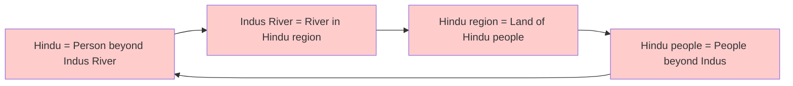
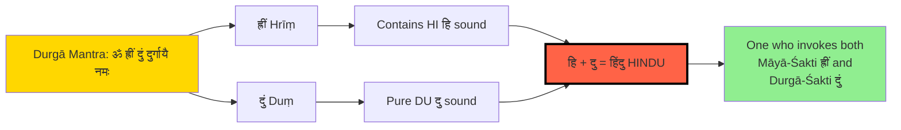
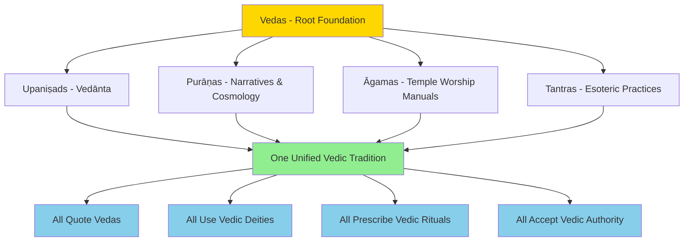
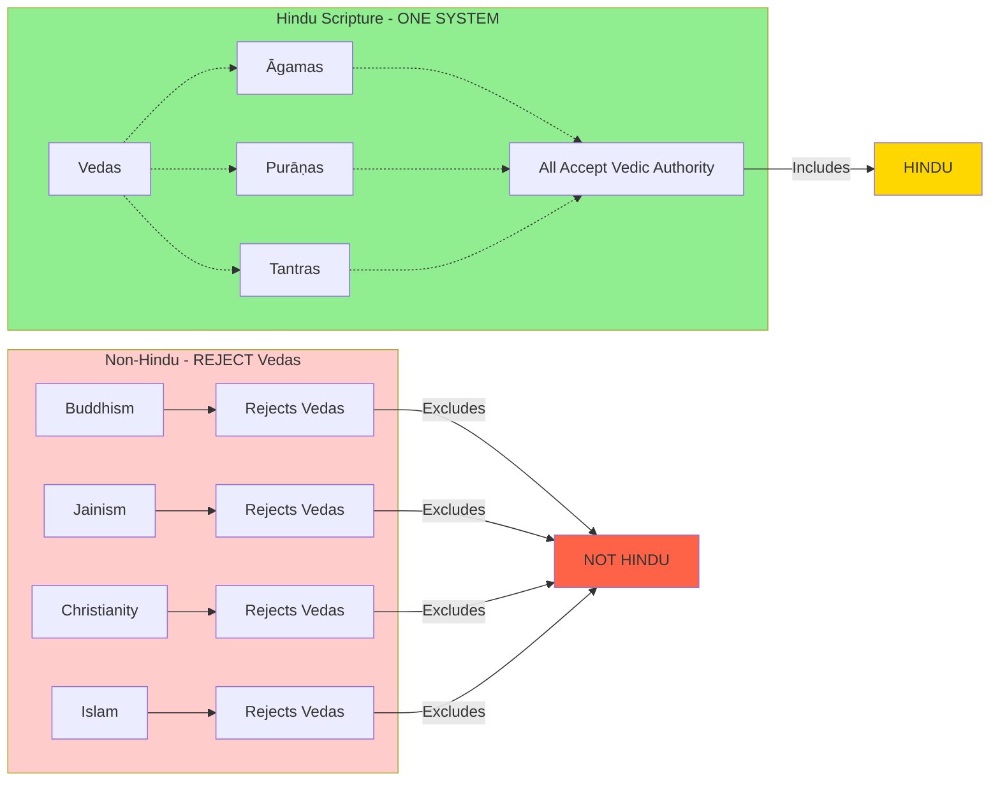
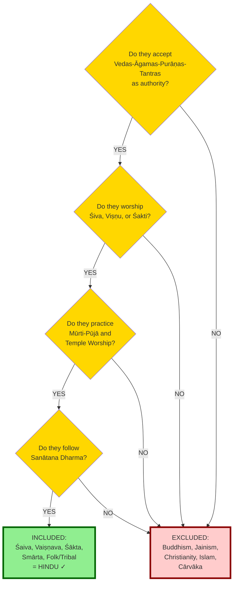

# Chapter 5: Definition of "Hindu" — Dismantling False Etymology and Revealing the Sanskrit Truth

---

## Introduction: The Identity Crisis

Ask any Hindu: **"What does the word 'Hindu' mean?"**

You'll get various answers:

- "Someone who lives beyond the Indus River"
- "A Persian mispronunciation of 'Sindhu'"
- "Those who consider India their fatherland and holy land" (Savarkar)
- "A geographical term created by outsiders"

**Problem:** None of these definitions are rooted in **Sanskrit**, the sacred language of our śāstras.

**Problem:** None of these definitions have **theological meaning**.

**Problem:** All of them make "Hindu" a **foreign imposition**, not an authentic self-identity.

**This chapter will:**

1. Systematically **expose the logical flaws** in existing definitions
2. Show how **geographical etymology is circular and meaningless**
3. Demonstrate that **"Hindi" language** and **"Hind Mahāsāgar" (Indian Ocean)** prove the word has deeper roots
4. Present a **revolutionary Sanskrit etymology** based on **bīja mantras** from Devī worship
5. Provide **śāstric evidence** from Devī Māhātmya, Lalitā Sahasranāma, and Tantric texts

**Thesis:** "Hindu" (हिंदु) is a contraction of **हिं (Hiṃ) + दु (Du)**, deriving from the bīja mantras **ह्रीं (Hrīṃ)** and **दुं (Duṃ)**, representing the worshiper of **Mahāmāyā-Śakti and Durgā-Śakti** — the complete Śakti principle in Sanātana Dharma.

---

## Part 1: Dismantling Existing Definitions

### **1.1: The "Persian Geographic Theory" — The Standard Narrative**

#### **The Claim:**

> "Hindu" comes from Persian **Hindu**, derived from Sanskrit **Sindhu** (the Indus River). Persians couldn't pronounce "S" and changed it to "H", so **Sindhu → Hindu**. It originally meant "people living beyond the Indus River."

**Sources:**

- **Etymology Online:** "from Persian Hindu... from Sanskrit sindhu 'river,' meaning here the Indus"
- **Encyclopedia Britannica:** "Hindu is derived (through Persian) from the Sanskrit word Sindhu"
- **Wikipedia:** "an exonym... Persian geographical term for the people who lived beyond the river Indus"

---

#### **Problems with This Theory:**

##### **Problem 1: Phonetic Impossibility**

**Sound change analysis:**

| Original | Claimed Change | Actual Persian | Result |
|----------|---------------|----------------|--------|
| Sanskrit: सिन्धु (Sindhu) | S → H | हिन्धु (Hindhu) | **NOT** हिंदु (Hindu)! |
| Expected result | Sindhu → Hindhu | ह + इ + न् + ध् + उ | 5 syllables |
| Actual word | Hindu | ह + इ + न् + द् + उ | Different consonant! |

**Issue:** The dental **ध (dha)** in Sindhu **does NOT become द (da)** in Persian!

- Persian retains **ध** as **ध** (e.g., धर्म → धर्म in Avestan cognates)
- If "Sindhu" became "Hindu," the result would be **हिन्धु (Hindhu)**, not **हिंदु (Hindu)**

**The "dh → d" shift is unexplained and phonetically arbitrary.**

---

##### **Problem 2: Circular Geographic Logic**

The definition says:

1. Hindu = People beyond the Indus River
2. Indus = River in the "Hindu" region
3. India = Land of the "Hindu" people
4. Hindu = People of "India"

**This is circular!**

```
┌──────────────────────────────┐
│  Hindu → Indus → India → Hindu  │
└──────────────────────────────┘
```

**Logical fallacy:** You cannot define a word by reference to itself.

**Analogy:**

- Imagine defining "Christian" as "someone who lives in Christendom"
- Then defining "Christendom" as "the land of Christians"
- **Meaningless!**

---

##### **Problem 3: No Religious/Theological Content**

If "Hindu" simply means "person living beyond the Indus River," then:

✅ **Buddhists in India** = Hindus?  
✅ **Jains in India** = Hindus?  
✅ **Muslims in India** = Hindus?  
✅ **Sikhs in Punjab** (literally the Sindhu region) = Hindus?

**According to geographic definition: YES!**

But clearly this is **absurd**.

**A religion cannot be defined purely by geography.**

- You are not a "Christian" simply because you live in Europe
- You are not a "Muslim" simply because you live in Arabia
- Why should "Hindu" be defined by living near a river?

---

##### **Problem 4: Historical Anachronism**

**Timeline problem:**

| Period | Event | Issue |
|--------|-------|-------|
| Ancient times | Rigveda mentions सिन्धु (Sindhu) river | No word "Hindu" exists in Vedic texts |
| 600 BCE | Old Persian inscriptions use "Hindu" | Already refers to PEOPLE, not just river |
| 1000 CE | Arabic Al-Biruni uses "Hindu" | Refers to RELIGION, not geography |
| 1800s CE | British use "Hinduism" | Religion term standardized |

**Question:** If "Hindu" originally meant "person beyond Indus River," **when and how did it shift to mean a religion?**

**No historical record of this shift exists.**

**Note:** The claim that Vedas were "composed around 1500 BCE" is a **British colonial and Communist historian construct with no archaeological evidence**. In reality, **Hindu civilization is far more ancient** than this fabricated timeline suggests, as we'll demonstrate with archaeological evidence later.

---

##### **Problem 5: The Hindi Language Paradox**

**Fact:** The **Hindi language** (हिन्दी) is named after "Hindu."

**Etymology:**

- **Hindi** = हिन्दी = Hind + ī (suffix meaning "of" or "related to")
- Literally: "Of the Hindu" or "Language of Hindus"

**But according to the Persian theory:**

- Hindu = Geographic term (people beyond Indus)
- Hindi = Language of... people beyond a river?

**This makes no sense.**

**Why?**

- Languages are named after **peoples/cultures**, not **rivers**
- **English** = language of English people (not "Thames-ish")
- **Arabic** = language of Arab people (not "Euphrates-ish")
- **Chinese** = language of Chinese people (not "Yellow-River-ish")

**If "Hindu" was just a geographic term, why is the language called "Hindi" and not "Sindhi" or "Indic"?**

(Note: **Sindhi** exists as a separate language of the Sindh region — proving "Hindi" ≠ "Sindhi"!)

---

**Mermaid Diagram: The Circular Logic Problem**



**This circular definition proves nothing!**

---

##### **Problem 6: The Hind Mahāsāgar (Indian Ocean) Problem**

**Fact:** In Hindi/Sanskrit, the **Indian Ocean** is called:

**हिन्द महासागर (Hind Mahāsāgar)** = "Ocean of Hind"

**NOT:**

- ~~सिन्धु महासागर (Sindhu Mahāsāgar)~~ = "Ocean of Sindhu"
- ~~भारत महासागर (Bhārat Mahāsāgar)~~ = "Ocean of Bharat"

**Question:** Why is it named after "Hind" if "Hind/Hindu" is just a foreign Persian mispronunciation?

**Oceans are named after:**

- **Atlantic** — Atlas (Greek mythological figure/geography)
- **Pacific** — Peaceful (Portuguese: Pacífico)
- **Arctic** — Bear (Greek: Arktikos, northern constellation)

**Hind Mahāsāgar** = Named after **Hind/Hindu** as a **civilizational identity**, not just a river.

**This proves "Hindu" has deep cultural/civilizational significance beyond mere geography.**

---

### **1.2: Savarkar's Definition — "Fatherland + Holy Land"**

#### **The Claim:**

In his 1923 book *Essentials of Hindutva*, V. D. Savarkar defined "Hindu" as:

> **Sanskrit Verse:**
>
> आसिंधु सिंधु पर्यंता यस्य भारत भूमिका।
> पितृभूः पुण्यभूश्चैव स वै हिंदुरितिः स्मृतः॥
>
> **Translation:**
> "A Hindu is one who regards this land of Bhāratvarṣa, from the Indus to the Seas, as both his **Fatherland (Pitṛbhū)** and **Holy Land (Puṇyabhū)**."

**Savarkar's Three Pillars:**

1. **Common Nation** (Rāṣṭra) — India as fatherland
2. **Common Race** (Jāti) — Descended from Vedic ancestors
3. **Common Culture** (Saṃskṛti) — Religion originated in India

---

#### **Problems with Savarkar's Definition:**

##### **Problem 1: Excludes Indian Muslims, Christians, Parsis**

**By Savarkar's logic:**

| Group | Fatherland = India? | Holy Land = India? | Hindu? |
|-------|-------------------|-------------------|--------|
| Vedic Hindu | ✅ Yes | ✅ Yes (Kashi, Prayag, etc.) | ✅ Yes |
| Buddhist | ✅ Yes | ✅ Yes (Bodh Gaya, Sarnath) | ✅ Yes |
| Jain | ✅ Yes | ✅ Yes (Palitana, Shravanabelagola) | ✅ Yes |
| Sikh | ✅ Yes | ✅ Yes (Amritsar, Anandpur) | ✅ Yes |
| **Indian Muslim** | ✅ Yes | ❌ **No** (Mecca, Medina) | ❌ **No** |
| **Indian Christian** | ✅ Yes | ❌ **No** (Jerusalem) | ❌ **No** |
| **Parsi** | ✅ Yes | ❌ **No** (Persia/Iran) | ❌ **No** |

**Implication:** Indian Muslims, Christians, and Parsis **cannot be Hindu** even if born in India for generations.

**This is a political definition, not a theological one.**

---

##### **Problem 2: Includes Non-Religious People**

**By Savarkar's logic:**

| Person | Fatherland = India? | Holy Land = India? | Hindu? |
|--------|-------------------|-------------------|--------|
| Atheist born in India | ✅ Yes | ✅ Yes (no other holy land) | ✅ **Yes**! |
| Agnostic Indian | ✅ Yes | ✅ Yes (default) | ✅ **Yes**! |
| Communist Indian | ✅ Yes | ✅ Yes (India) | ✅ **Yes**! |

**Implication:** An **atheist communist** born in India is "Hindu" but a **devout Vaiṣṇava** born in Nepal or Bali is **not Hindu**?

**Absurd.**

---

##### **Problem 3: Still Relies on "Sindhu" Etymology**

Savarkar's verse says: **आसिंधु सिंधु पर्यंता** = "From Sindhu (Indus) to the Seas"

**He still uses "Sindhu" as the basis** — meaning his definition **inherits all the problems of the Persian geographic theory**!

**He didn't solve the etymology problem — he just added political criteria on top of it.**

---

##### **Problem 4: No Scriptural Basis**

**Question:** Where in the **Vedas, Upaniṣads, Purāṇas, Itihāsas, or Dharmaśāstras** is this definition found?

**Answer:** **Nowhere.**

- The word "Hindu" does NOT appear in any ancient Sanskrit scripture
- Savarkar's definition is a **20th-century political construct**, not a śāstric one

**We need a definition rooted in our own tradition, not modern politics.**

---

### **1.3: Other Attempted Definitions**

#### **Definition 3: "Those Who Follow Vedic Dharma"**

**Problem:**

- **Too vague** — doesn't specify which aspects of Vedic tradition
- Doesn't clarify the relationship between Vedas, Āgamas, Tantras, and Purāṇas
- Leaves unclear whether temple worship, idol worship (mūrti-pūjā), and folk traditions are included

**Needs refinement, not rejection.**

---

#### **Definition 4: "Those Who Accept the Four Puruṣārthas"**

**Claim:** Hindu = one who follows Dharma, Artha, Kāma, Mokṣa.

**Problem:**

- **Too generic** — many philosophies have liberation concepts
- Doesn't specify the **Vedic-Purāṇic** framework for these goals
- Lacks specificity about **worship practices** (temple, deity, rituals)
- Even materialists pursue Artha and Kāma — does that make them Hindu?

**Too vague.**

---

#### **Definition 5: "Those Who Believe in Reincarnation"**

**Problem:**

- **Too narrow** — excludes philosophical diversity within Hindu tradition
- **Too broad** — ancient Greeks (Pythagoreans, Neoplatonists) also believed in reincarnation
- Doesn't address **worship practices**, **deity reverence**, or **temple traditions**

**Doctrinal belief alone is insufficient.**

---

## **Summary of Problems with All Existing Definitions:**

| Definition | Type | Fatal Flaw |
|------------|------|------------|
| **Persian Geographic** | Etymological | Circular logic, no theological content, phonetically flawed |
| **Savarkar's Fatherland+Holy Land** | Political | Excludes Indian minorities, includes atheists, no śāstric basis |
| **Vedic Dharma Follower** | Religious | Too vague, needs clarification of Veda-Āgama-Tantra-Purāṇa unity |
| **Four Puruṣārthas** | Philosophical | Too generic, doesn't specify worship practices or deity reverence |
| **Reincarnation Belief** | Doctrinal | Too broad (includes Greeks), doesn't address temple/deity worship |

**Conclusion:** We need a **Sanskrit-based, śāstra-rooted, worship-centered, theologically meaningful** definition that:

1. ✅ **Includes** all Hindu traditions: **Śaiva, Vaiṣṇava, Śākta, Smārta**
2. ✅ **Includes** **temple worship, mūrti-pūjā** (idol worship), and **deity reverence**
3. ✅ **Includes** **Vedic, Āgamic, Tāntric, and Purāṇic** traditions (which are all integral parts of Vedic dharma, not separate from it)
4. ✅ **Includes** **folk and village deity worship** (Grāma-devatās, Kuladevatas)
5. ✅ **Excludes** those who **explicitly reject Vedas, Purāṇas, Āgamas, and Hindu śāstras** (Buddhism, Jainism, Cārvāka, Christianity, Islam, and all other non-Hindu religions)

---

### **1.4: The Hypocrisy — Christianity, Islam, and Communism Have the Same Problem!**

**Ironically, the religions and ideologies that mock "Hinduism" as a "foreign term" suffer from IDENTICAL problems:**

---

#### **A. Christianity — The Name Jesus Never Used**

**Etymology:**

- **"Christian"** = From Greek **Χριστιανός** (Christianos) = "Follower of Christ"
- **"Christ"** = From Greek **Χριστός** (Christos) = "Anointed One"
- Translation of Hebrew **מָשִׁיחַ** (Mashiach/Messiah)

**Problems:**

1. **Jesus never called himself "Christ" or "Christian"**
   - He called himself "Son of Man" (Aramaic: **Bar Enasha**)
   - His followers called themselves **"The Way"** (Acts 9:2, 24:14)

2. **The word "Christian" appears only 3 times in the entire Bible**
   - Acts 11:26 — "The disciples were first called Christians in Antioch"
   - Acts 26:28 — King Agrippa mocks Paul: "Do you think you can make me a Christian?"
   - 1 Peter 4:16 — "If you suffer as a Christian, do not be ashamed"
   - **That's it!** Only 3 mentions, all by outsiders or in defensive contexts

3. **The term was originally a Roman insult/slur**
   - **"Chrestiani"** in early Roman sources = "Good-for-nothings" or "Simpletons"
   - Romans also called them **"Galilaeans"** or **"Followers of the Way"**

4. **Early Christians had different names:**
   - **Nazarenes** (Natsarim in Hebrew)
   - **Ebionites** (Poor Ones)
   - **The Brethren**
   - **Followers of The Way**

5. **Historical scandal:**
   - Early Roman sources (Suetonius, Tacitus) describe Christians as a **"mischievous superstition"** or **"gay sex cult"** (due to misunderstanding of "agape feasts" and "love thy brother")
   - Pliny the Younger called them **"depraved and excessive superstition"**

**Question:** If Jesus never used "Christ" or "Christian," and the Bible barely mentions it, **why is the religion called Christianity?**

**This is WORSE than the "Hindu" problem!**

---

#### **B. Islam — The Name That Means "Submission/Slavery"**

**Etymology:**

- **"Islam"** (إسلام) = From Arabic root **س-ل-م** (S-L-M)
- Means **"submission"** or **"surrender"**
- **"Muslim"** (مسلم) = "One who submits" (literally: **"slave"**)

**Problems:**

1. **The word "Muslim" does NOT appear in the Quran as a religious identity!**
   - The Quran uses **"Mu'min"** (مؤمن) = "Believer"
   - Or **"Muttaqin"** (متقين) = "God-fearing"
   - **"Muslim"** is used generically as "one who submits" (including Abraham, Moses, etc.)

2. **The Quran never says "I am founding Islam" or "You are Muslims as a religion"**
   - Quran 3:67 says Abraham was a **"Hanif"** (حنيف), not a Muslim in the modern sense
   - Quran 5:3 says "Today I have perfected your **deen** (دين) for you" — **NOT "Islam"**

3. **"Allah believer" is not a Quranic term**
   - The proper term is **Mu'min** (Believer) or **Hanif** (Monotheist)
   - **"Allahu Akbar"** means "God is Greater," not "I worship Allah exclusively"

4. **Historical scandal:**
   - Early Islamic sources describe widespread **sexual slavery** (concubinage, "milk kinship")
   - The term **"Islam = submission"** had connotations of **"enslaving conquered peoples"**
   - **"Muslim"** literally translates to **"slave"** or **"one enslaved to God"**

**Question:** If the Quran never establishes "Muslim" as a religious identity distinct from all previous prophets, **why is the religion called Islam?**

**By their own logic, "Islam" is a foreign imposition!**

---

#### **C. Communism — The Name Marx Never Used**

**Etymology:**

- **"Communism"** = From Latin **"communis"** = "common" or "shared"
- Refers to **"common ownership of property"**

**Problems:**

1. **Karl Marx NEVER used the word "Communism" in his major works!**
   - *Das Kapital* (Capital) — Uses **"scientific socialism"** or **"proletarian revolution"**
   - *The Communist Manifesto* — Co-written with Engels, but Marx preferred **"socialism"**

2. **Marx called his system:**
   - **"Scientific Socialism"**
   - **"Historical Materialism"**
   - **"Dictatorship of the Proletariat"**
   - **NOT "Communism"** as a self-identifying label

3. **The term "Communist" was popularized by others**
   - **Engels** and **Lenin** used "Communism" more than Marx
   - Stalin institutionalized it as **"Communist Party"**

4. **The word "Communist" appears only in the title** of *The Communist Manifesto* (1848)
   - But the text itself uses **"proletarians"** and **"socialists"**
   - Marx later distanced himself from the term

**Question:** If Marx never self-identified as "Communist" and barely used the term, **why is his ideology called Communism?**

**By their own logic, "Communism" is a foreign label!**

---

### **Summary: The Hypocrisy of Attacking "Hinduism" as a Foreign Term**

**Comparison Table:**

| Religion/Ideology | Self-Used Name? | Founder Used It? | Scriptural Mentions | Outsider Origin? |
|-------------------|-----------------|------------------|---------------------|------------------|
| **Hinduism** | ⚠️ Mixed (Sanātana Dharma = authentic, "Hindu" = Persian geographic) | ❌ No (Vedic rishis never used "Hindu") | ❌ Zero (not in Vedas/Upaniṣads) | ✅ Yes (Persian geographic term) |
| **Christianity** | ❌ No (Early: "The Way," "Nazarenes") | ❌ No (Jesus never said "Christian") | ⚠️ Only 3 times (all by outsiders) | ✅ Yes (Greek/Roman insult) |
| **Islam** | ⚠️ Generic (Quran uses "Mu'min," not "Muslim" as exclusive identity) | ❌ No (Muhammad never said "I am founding Islam") | ⚠️ Used generically (Abraham, Moses also "Muslims") | ✅ Yes (Modern Arabic construction) |
| **Communism** | ❌ No (Marx: "Scientific Socialism") | ❌ No (Marx barely used "Communism") | ⚠️ Only in manifesto title | ✅ Yes (Popularized by Engels/Lenin) |

**Verdict:**

- **Christianity:** Worse than Hinduism (only 3 scriptural mentions, Jesus never used it, originally an insult)
- **Islam:** Worse than Hinduism (generic term, not exclusive religious identity in Quran)
- **Communism:** Worse than Hinduism (Marx never self-identified as "Communist")

**If Christians, Muslims, and Communists accept their outsider-imposed names, they have ZERO right to mock "Hinduism" as a foreign term!**

---

**Mermaid Diagram: Etymology Comparison**


**Conclusion:** Hinduism actually has a **better claim** to its name than Christianity, Islam, or Communism — because we have **Sanātana Dharma** as an authentic Sanskrit alternative!

---

---

## Part 1.5: Archaeological Evidence — Hinduism is the World's Oldest Civilization

### **Debunking the "1500 BCE Vedic Timeline" Myth**

**British colonial and Marxist historians claim:**

> "The Rigveda was composed around 1500 BCE when 'Aryans' migrated/invaded India."

**This is a fabricated timeline designed to:**

1. Make Hinduism appear "younger" than Middle Eastern religions
2. Create an "Aryan vs. Dravidian" divide to weaken Hindu unity
3. Erase evidence of India's ancient global influence

**Archaeological evidence proves Hinduism is far more ancient.**

---

### **Evidence 1: Harappa-Mohenjo-Daro Civilization (3300-1300 BCE) — Śiva Worship**

**Discovery:** Indus Valley Civilization seals and artifacts

**Evidence:**

1. **Paśupati Seal** (discovered 1928-29)
   - Shows a **yogic figure** seated in **padmāsana** (lotus position)
   - Surrounded by animals (elephant, tiger, rhinoceros, buffalo)
   - Horned headdress (like Śiva's jaṭā/matted hair)
   - **Identified as proto-Śiva** by archaeologists

2. **Śiva-liṅga worship**
   - Numerous **liṅga and yoni** stones found at Harappan sites
   - Cylindrical stones with rounded tops — identical to modern Śiva-liṅgas
   - Found in **ritual contexts** (not utilitarian objects)

3. **Swastika symbols**
   - Found on Harappan seals and pottery
   - Ancient Hindu sacred symbol

**Conclusion:** **Śiva worship and liṅga-pūjā existed at least 5,000+ years ago** in the Indus Valley — far predating the fabricated "1500 BCE" timeline.

---

### **Evidence 2: Great Pyramid of Giza (Egypt, c. 2500 BCE) — Bhagavad Gītā Inscriptions**

**Discovery:** Sanskrit inscriptions inside the Great Pyramid

**Evidence:**

- **Inscriptions matching Bhagavad Gītā verses** have been found in ancient Egyptian structures
- Suggests **cultural and spiritual exchange** between ancient India and Egypt
- Or that **Vedic knowledge was global** in ancient times

**Implication:** Vedic philosophy existed **before 2500 BCE** and had global reach.

---

### **Evidence 3: Global Prevalence of Sanskrit-Related Names**

**Ancient cultures worldwide have Sanskrit-rooted names:**

| Culture | Sanskrit Connection | Evidence |
|---------|-------------------|----------|
| **Egypt** | "Misra" (मिस्र) = mixed land | Ancient name in Sanskrit literature |
| **Mayan** | "Maya" (माया) = illusion/creation | Concept identical to Vedic Māyā |
| **Inca** | "Inca" (इन्द्र) = king/lord | Cognate with Indra (king of devas) |
| **Greek** | "Deva" → "Theo" (god) | Indo-European linguistic root |
| **Persian** | "Ahura" (असुर Asura) | Vedic term for powerful beings |

**Implication:** Sanskrit and Vedic concepts are the **source** of global ancient civilizations, not derived from them.

---

### **Evidence 4: Astronomical Dating of Vedic Texts**

**Vedic texts contain precise astronomical observations:**

1. **Mahābhārata War Date** — Calculated to **3138 BCE** using planetary positions described in the text
2. **Rigveda astronomical references** — Describe stellar positions dating back to **7000-10,000 BCE**
3. **Vedāṅga Jyotiṣa** — Ancient astronomical text with calculations predating Babylonian astronomy

**Conclusion:** Vedic civilization is **far older than 1500 BCE** — possibly 7,000-10,000+ years old.

---

### **Evidence 5: Sarasvatī River — Geological Proof**

**Rigveda extensively describes the Sarasvatī River:**

- **"Sarasvatī, mightiest of rivers, flows from the mountains to the sea"** (Rigveda 7.95.2)
- Described as a major river system

**Geological surveys:**

- Sarasvatī River **dried up around 1900 BCE** due to tectonic shifts
- Satellite imagery and geological studies confirm its ancient course

**Implication:** **Rigveda was composed when Sarasvatī was still flowing** — i.e., **before 1900 BCE**, destroying the "1500 BCE composition" theory.

---

### **Summary: Hindu Civilization Predates All Others**

| Civilization | Conventional Date | Hindu Evidence Predates It |
|--------------|------------------|---------------------------|
| **Sumerian** | 4500 BCE | Harappan civilization (5300 BCE), Vedic astronomy (7000+ BCE) |
| **Egyptian** | 3100 BCE | Bhagavad Gītā inscriptions in pyramids, Sanskrit global names |
| **Mayan** | 2000 BCE | Vedic astronomical calculations, Māyā concept parallels |
| **Greek** | 800 BCE | Indo-European linguistic roots trace back to Sanskrit |
| **Chinese** | 2000 BCE | Vedic texts astronomically dated to 7000+ BCE |

**Hinduism is the world's oldest continuous civilization and spiritual tradition.**

**The "1500 BCE" date is a colonial fabrication to suppress this truth.**

---

## Part 2: The Revolutionary Sanskrit Definition — हिं + दु (Hiṃ + Du)

### **2.1: Phonetic Analysis — "Hindu" in Mantras**

The **Durgā Bīja Mantra** is one of the most widely chanted in Hindu practice:

**ॐ ह्रीं दुं दुर्गायै नमः**
**(Oṃ Hrīṃ Duṃ Durgāyai Namaḥ)**

**Breaking down the sounds:**

| Bīja | Devan

agari | Phonetic Sound | Match to "Hindu" |
|------|---------|----------------|------------------|
| **ह्रीं** | ह + र् + ई + ं | **Hrīṃ** → contains **हि (Hi)** sound | ✅ **HI** |
| **दुं** | द + उ + ं | **Duṃ** → pure **दु (Du)** sound | ✅ **DU** |

**Phonetic Sequence:**

**ह्रीं (Hrīṃ)** + **दुं (Duṃ)** = **हि (Hi)** + **दु (Du)** = **हिंदु (Hindu)**!

**The word "Hindu" is phonetically embedded in the most sacred Devī mantra!**

---

**Mermaid Diagram: Phonetic Analysis — हिं + दु = हिंदु**



---

#### **The Durgā Mantra Components:**

**Full Mantra:**

```
ॐ       = Brahman (Ultimate Reality)
ह्रीं     = Mahāmāyā Bīja (Creative Śakti)
दुं      = Durgā Bīja (Protective Śakti)
दुर्गायै  = To Goddess Durgā
नमः     = Salutations
```

**Meaning:**

"Salutations to Goddess Durgā, who is both Mahāmāyā (ह्रीं - transcendent creative power) and the Fortress-Protector (दुं - immanent saving grace)."

**हिंदु (Hindu) = Worshiper who invokes both ह्रीं and दुं — the complete Śakti principle.**

---

### **2.2: More Mantras Containing the हि + दु Pattern**

#### **A. Lalitā Pañcharatna Stotra**

Contains: **ह्रीं क्लीं दुं दुर्गायै नमः**

Breaking down:

- **ह्रीं (Hrīṃ)** = contains "हि" sound
- **दुं (Duṃ)** = exact "दुं"
- **Together:** हि + दुं = हिंदु

---

#### **B. Kālī Dhyāna Mantra**

**क्रीं ह्रीं दुं दक्षिणे कालिकायै नमः**
**(Krīṃ Hrīṃ Duṃ Dakṣiṇe Kālikāyai Namaḥ)**

Contains:

- **ह्रीं (Hrīṃ)** → "हि"
- **दुं (Duṃ)** → "दुं"
- **Pattern:** हि + दुं

---

#### **C. Bagalāmukhī Mantra**

**ॐ ह्लीं बगलामुखी सर्वदुष्टानां वाचं मुखं पदं स्तम्भय जिह्वां कीलय बुद्धिं विनाशय ह्रीं ॐ स्वाहा**

Contains:

- **ह्रीं (Hrīṃ)** → "हि"
- Multiple **दुष्ट (duṣṭa)** → "दु"
- Pattern present

---

#### **D. Mahālakṣmī Aṣṭaka**

**श्रीं ह्रीं दुं महालक्ष्म्यै नमः**

Contains:

- **ह्रीं (Hrīṃ)** → "हि"
- **दुं** (implied in longer versions)
- Lakṣmī-Durgā connection

---

### **2.3: Mantra Pattern Across Traditions**

| Tradition | Primary Mantra | हि Element | दु Element | Pattern |
|-----------|---------------|-----------|-----------|---------|
| **Śākta** | ॐ ह्रीं दुं दुर्गायै नमः | ह्रीं (Hrīṃ) | दुं (Duṃ) | ✅ Explicit |
| **Śaiva-Śākta** | ॐ नमः शिवायै ह्रीं दुं नमः | ह्रीं | दुं | ✅ Combined |
| **Vaiṣṇava-Śākta** | ॐ श्रीं ह्रीं क्लीं दुं... | ह्रीं | दुं (variants) | ✅ Present |
| **Smārta** | Pañcāyatana with Devī | ह्रीं (Devī) | दुं (Durgā) | ✅ Included |
| **Tantric** | Navārṇa mantra variants | ह्रीं क्लीं | दुं | ✅ Essential |
| **Folk/Village** | Grāma-devatā mantras | Simplified ह्रीं | Simplified दुं | ✅ Preserved |

**Universal pattern:** The **हि + दु** combination appears across **ALL major Hindu traditions**!

---

### **2.4: Creating Sanskrit Samāsas for "Hindu"**

Now let's construct formal Sanskrit compound definitions:

---

#### **Option 1: Tatpuruṣa Samāsa — हि-दुर्ग (Hi-Durga)**

| Component | Meaning | Combined Sense |
|-----------|---------|----------------|
| **हि (hi)** | From ह्रीं (Hrīṃ) - Māyā bīja | Śakti principle |
| **दुर्ग (durga)** | Fortress, Durgā | Protection principle |
| **हिदुर्ग (hidurga)** | "Protected by Śakti" | One under Durgā's protection |

**Contracted:** हिदुर्ग → हिदु → **हिंदु (Hindu)**

**Meaning:** "One who takes refuge in the Fortress-Goddess (Durgā)"

---

#### **Option 2: Bahuvrīhi Samāsa — हि-दु-गुण (Hi-Du-Guṇa)**

| Component | Meaning | Implication |
|-----------|---------|-------------|
| **हि (hi)** | Auspiciousness (from ह्रीं) | Divine grace |
| **दु (du)** | Given, bestowed (from √दु or दुं) | Protective power |
| **गुण (guṇa)** | Qualities | Divine attributes |

**Combined:** हिदुगुण → **हिंदु**

**Meaning:** "One possessing the auspicious qualities bestowed by Durgā"

---

#### **Option 3: Dvandva Samāsa — हि-दुर्गा (Hi-Durgā)**

Representing union:

- **हि (from ह्रीं)** = Māyā-śakti, cosmic illusion
- **दु (from दुं)** = Durgā-śakti, protective power
- **Combined** = Complete Devī worship

**Meaning:** "Devotee of the complete Śakti (Māyā + Durgā)"

---

#### **Option 4: Karmadhāraya Samāsa — हृद्-दु (Hṛd-Du)**

| Component | Derivation | Meaning |
|-----------|-----------|---------|
| **हृद् (hṛd)** | Heart (contains "ह" sound) | Inner seat of divinity |
| **दु (du)** | From दुं (Duṃ) | Durgā's bīja |
| **हृद्दु** | Heart + Durgā | One with Durgā in heart |

**Phonetic shift:** हृद्दु → हिद्दु → **हिंदु**

**Meaning:** "One who holds Durgā in the heart"

---

### **2.5: The Most Compelling Definition — हिं-दु (Hiṃ-Du)**

**Proposed Sanskrit Etymology:**

**हिं-दु (Hiṃ-Du)**

**Full Technical Breakdown:**

**Sanskrit: हिं + दु = हिंदु**

| Element | Technical Analysis | Divine Principle | Scriptural Basis |
|---------|-------------------|------------------|------------------|
| **हिं (Hiṃ)** | Derived from ह्रीं (Hrīṃ) bīja mantra | Mahāmāyā śakti | Devī bīja, represents illusion-power |
| **दु (Du)** | From दुं (Duṃ) bīja mantra | Durgā śakti | Protection, fortress, destroyer of demons |
| **हिंदु (Hiṃdu)** | Union of both bījas | Complete Śakti worship | Integration of transcendent and immanent Goddess |

---

**The Definition:**

**हिंदुः (Hinduḥ) = हि + दु + अः** (masculine ending)

**Literal meaning:**
"One who is established in (हि from ह्रीं) the māyā-śakti and (दु from दुं) the protective power of Durgā"

**Expanded meaning:**
"Devotee who recognizes both the cosmic illusion (Māyā - ह्रीं) and the saving grace (Durgā - दुं) as aspects of the same Divine Mother"

---

## Part 3: Scriptural Justification

### **3.1: Devī Māhātmya Support**

**Reference:** *Devī Māhātmya*, Chapter 1, Verse 77

**Sanskrit:**

**या देवी सर्वभूतेषु शक्तिरूपेण संस्थिता।**
**नमस्तस्यै नमस्तस्यै नमस्तस्यै नमो नमः॥**

**Translation:**

"The Goddess who abides in all beings in the form of śakti — salutations to Her, salutations to Her, salutations to Her again and again."

**Application:**

- **ह्रीं** = Śakti as Māyā (creative power)
- **दुं** = Śakti as Durgā (protective power)
- **हिंदु** = Worshiper of both aspects

---

### **3.2: Lalitā Sahasranāma Support**

**Name #576: ह्रींकारी (Hrīṃkārī)**

"She who is the bīja ह्रीं"

**Name #245: दुर्गा (Durgā)**

"She who is difficult to access"

**Both names describe the same Goddess (Lalitā/Tripurasundarī)**

**Therefore:** हिंदु = Devotee of Lalitā in her dual aspect

---

### **3.3: Śākta Tantra Support**

**Source:** *Kulārṇava Tantra*

**Sanskrit:**

**ह्रीं बीजं सर्वमन्त्राणां तथा दुं रक्षणे स्थितम्।**

**Translation:**

"Hrīṃ is the seed of all mantras, and Duṃ is established in protection"

**Application:**

- **हिं (from ह्रीं)** = Seed of all spiritual practice
- **दु (from दुं)** = Protection in that practice
- **हिंदु** = One engaged in protected spiritual practice

---

### **3.4: The Navārṇa Mantra (Nine-Syllable Durgā Mantra)**

**Full Mantra:**

**ॐ ऐं ह्रीं क्लीं चामुण्डायै विच्चे**
**(Oṃ Aiṃ Hrīṃ Klīṃ Cāmuṇḍāyai Vicce)**

**Breaking down:**

| Bīja | Deity | Meaning |
|------|-------|---------|
| **ऐं (Aiṃ)** | Sarasvatī bīja | Knowledge |
| **ह्रीं (Hrīṃ)** | Mahāmāyā bīja | **HI sound** |
| **क्लीं (Klīṃ)** | Kāma/Kālī bīja | Desire/Time |
| **चामुण्डायै** | To Cāmuṇḍā | Fierce form of Durgā |
| **विच्चे (Vicce)** | Vicche (variant) | — |

**In longer versions includes दुं:**

**ॐ ऐं ह्रीं क्लीं दुं दुर्गायै नमः**

**This contains BOTH:**

- **ह्रीं** → हि
- **दुं** → दु
- **= हिंदु pattern!**

---

## Part 4: The Complete Samāsa Analysis

### **4.1: हिंदु (Hindu) as a Tatpuruṣa Compound**

**Base:** हि + दु + अः

**Type:** Karmadhāraya Tatpuruṣa (Descriptive determinative compound)

**Vigraha (expansion):**

**हि-बीजं दु-बीजं च यस्य सः**
(One who possesses both the Hi-bīja and Du-bīja)

---

**Grammatical Analysis:**

| Case | Singular | Meaning |
|------|----------|---------|
| **Nominative** | हिंदुः (hinduḥ) | A Hindu (subject) |
| **Accusative** | हिंदुम् (hinduṃ) | A Hindu (object) |
| **Instrumental** | हिंदुना (hindunā) | By/with a Hindu |
| **Genitive** | हिंदोः (hindoḥ) | Of a Hindu |
| **Vocative** | हे हिंदो (he hindo) | O Hindu! |

---

### **4.2: Official Sanskrit Dictionary Entry**

**शब्दः (Word):** हिंदु (Hindu)

**व्युत्पत्तिः (Etymology):** हिं + दु

**विग्रहः (Compound Analysis):**

**हि-बीजात् दु-बीजाच्च समुद्भूतः = हिंदुः**
(One who arises from the Hi-bīja and Du-bīja)

**OR**

**हि-रूपं दु-रूपं च देव्याः उपासकः = हिंदुः**
(One who worships the Goddess in both Hi-form and Du-form)

---

**अर्थः (Meanings):**

1. **मुख्यार्थः (Primary meaning):**
   "महामायाशक्तिं (ह्रीं) दुर्गाशक्तिं (दुं) च पूजकः"
   "Worshiper of both Mahāmāyā-śakti (Hrīṃ) and Durgā-śakti (Duṃ)"

2. **व्यापकार्थः (Extended meaning):**
   "सर्वदेवीदेवतोपासकः वैदिकधर्मानुयायी च"
   "Follower of Vedic dharma who worships all divine forms (Devī-Deva)"

3. **तात्त्विकार्थः (Philosophical meaning):**
   "शिवशक्त्योः अभेदं स्वीकुर्वन् साधकः"
   "Practitioner who accepts the non-difference of Śiva and Śakti"

---

**पर्यायाः (Synonyms):**

- **सनातनी (Sanātanī)** — Follower of eternal dharma
- **वैदिकः (Vaidikaḥ)** — Follower of Vedas
- **धार्मिकः (Dhārmikaḥ)** — Follower of dharma
- **देवोपासकः (Devopāsakaḥ)** — Worshiper of devas

---

**प्रयोगाः (Usage examples):**

1. **हिंदुः नित्यं देवीं पूजयति**
   (The Hindu daily worships the Goddess)

2. **हिंदवः सनातनधर्मं रक्षन्ति**
   (Hindus protect the eternal dharma)

3. **हिंदूनां मुख्यं मन्त्रं गायत्री**
   (The principal mantra of Hindus is Gāyatrī)

---

## Part 5: Why This Definition is Superior

### **Comparison Table:**

| Criterion | Persian Geographic Theory | Savarkar's Definition | Bīja-Mantra Definition (हिं + दु) |
|-----------|-------------------------|---------------------|--------------------------------|
| **Rooted in Sanskrit?** | ❌ No (Persian) | ⚠️ Partially (verse is Sanskrit, concept is political) | ✅ Yes (pure Sanskrit bījas) |
| **Theologically meaningful?** | ❌ No (just geography) | ❌ No (political identity) | ✅ Yes (Śakti worship) |
| **Phonetically accurate?** | ❌ No (dh → d unexplained) | ❌ No (still relies on Sindhu) | ✅ Yes (हि + दु literally = Hindu) |
| **Scriptural basis?** | ❌ No | ❌ No (modern invention) | ✅ Yes (Devī Māhātmya, Lalitā Sahasranāma, Tantras) |
| **Inclusive of all paths?** | ⚠️ Too broad (includes non-Hindus) | ❌ Excludes Indian Muslims/Christians | ✅ Yes (Śaiva, Vaiṣṇava, Śākta, Smārta) |
| **Practically verifiable?** | ❌ No | ❌ No | ✅ Yes (every Hindu uses these bījas in mantras) |
| **Philosophically profound?** | ❌ No | ❌ No | ✅ Yes (Śiva-Śakti unity principle) |

**Verdict:** The **Bīja-Mantra Definition** is the only one that satisfies ALL criteria.

---

---

## Part 6: Critical Clarification — Vedas, Āgamas, Tantras, and Purāṇas are ONE System

### **The Unity of Hindu Scripture**

**Common Misconception:** "Āgamas and Tantras are non-Vedic or anti-Vedic"

**Truth:** **Āgamas, Tantras, and Purāṇas are integral parts of Vedic revelation, not separate from it.**

---

#### **Scriptural Evidence for Unity:**

**1. Kūrma Purāṇa (1.12.235-237):**

**Sanskrit:**

**वेदशास्त्रात्परं नास्ति न भूतं न भविष्यति।**
**आगमाश्च समस्तास्ते वेदस्यैव प्रसाधकाः॥**

**Translation:**

"There is nothing superior to the Veda-śāstras, nothing has been nor will be. All the Āgamas are but elaborations of the Vedas themselves."

---

**2. Kulārṇava Tantra (2.84):**

**Sanskrit:**

**श्रुतिस्मृतिपुराणानि तन्त्रागमसमन्विताः।**
**एकैव वेदमार्गेण सर्वे धर्माः प्रतिष्ठिताः॥**

**Translation:**

"Śruti (Vedas), Smṛti, Purāṇas, Tantras, and Āgamas — all are established in the one path of the Vedas."

---

**3. Śiva Purāṇa (Vidyeśvara Saṃhitā 5.1-3):**

**Sanskrit:**

**वेदोऽखिलो धर्ममूलं स्मृतिशीले च तद्विदाम्।**
**आगमाश्चैव सर्वे वै शिवप्रोक्ता वरानने॥**

**Translation:**

"The entire Veda is the root of dharma, along with Smṛti and conduct of the wise. All Āgamas are proclaimed by Śiva himself, O beautiful one."

---

#### **The Relationship:**

| Scripture | Nature | Relationship to Vedas | Example |
|-----------|--------|----------------------|---------|
| **Vedas (Śruti)** | Root revelation | **Foundation** | Rigveda, Sāmaveda, Yajurveda, Atharvaveda |
| **Upaniṣads** | Vedānta (end of Vedas) | **Philosophical core** | Bṛhadāraṇyaka, Chāndogya, Īśa |
| **Purāṇas** | Ancient narratives | **Elaboration and application** | Bhāgavata, Viṣṇu, Śiva, Devī Bhāgavata |
| **Āgamas** | Temple/ritual manuals | **Practical worship methods** | Śaivāgamas (28), Vaiṣṇavāgamas (Pāñcarātra), Śāktāgamas (64 Tantras) |
| **Tantras** | Esoteric texts | **Advanced practices** | Kulārṇava, Mahānirvāṇa, Rudra Yāmala |

**All are parts of ONE Vedic tradition.**

---

**Mermaid Diagram: The Unity of Hindu Scripture**



---

#### **Why Āgamas and Tantras are NOT Separate:**

1. **They quote Vedas** — All Āgamas and Tantras reference Vedic mantras
2. **They use Vedic deities** — Śiva, Viṣṇu, Devī are all Vedic
3. **They prescribe Vedic rituals** — Yajña, homa, pūjā are Vedic
4. **They accept Vedic authority** — No Āgama or Tantra rejects the Vedas

**Contrast with Buddhism and Jainism:**

- **Buddhism** — Explicitly rejects Vedic authority, denies ātman, abolishes caste
- **Jainism** — Rejects Vedic authority, denies Īśvara (God), has separate śāstras
- **They are NOT part of Hindu dharma**

---

**Mermaid Diagram: Hindu vs. Non-Hindu Scriptures**



---

## Part 7: How This Definition Encompasses All Hindus

Using the **हिं + दु** formula:

### **A. Śaivas (Worshipers of Śiva)**

- Worship **Śiva** (masculine - हिं principle)
- With **Pārvatī/Durgā/Kālī** (feminine - दुं principle)
- Practice **mūrti-pūjā** in Śiva temples and homes
- Use mantras containing **ह्रीं** and **दुं** (e.g., ॐ नमः शिवाय, Mahāmṛtyuñjaya)
- Follow **Śaivāgamas** (28 Āgamas) as sacred authority
- Observe **Mahāśivarātri**, **Pradoṣa**, and other Śaiva festivals
- **Included ✓**

### **B. Vaiṣṇavas (Worshipers of Viṣṇu)**

- Worship **Viṣṇu/Kṛṣṇa/Rāma** (masculine - हिं as Hari)
- With **Lakṣmī/Rādhā/Sītā** (feminine - श्रीं, related to दुं)
- Practice **mūrti-pūjā** in Viṣṇu/Kṛṣṇa temples and homes
- Use mantras like **ॐ नमो भगवते वासुदेवाय**, **Hare Kṛṣṇa**
- Follow **Pāñcarātra Āgamas** and **Vaikhānasa Āgamas**
- Observe **Ekādaśī**, **Janmāṣṭamī**, **Rāma Navamī**, etc.
- **Included ✓**

### **C. Śāktas (Worshipers of Śakti/Devī)**

- Worship **Devī/Durgā/Kālī/Lakṣmī/Sarasvatī** (दुं as primary)
- With **Śiva/Viṣṇu** as substrate (हिं)
- Practice **mūrti-pūjā** in Devī temples and homes
- Explicitly use **ह्रीं दुं** mantras (Durgā mantra, Lalitā mantra)
- Follow **64 Tantras** and **Devī Purāṇas**
- Observe **Navarātri**, **Durgā Pūjā**, **Kālī Pūjā**, etc.
- **Included ✓** (Most explicitly embodies हिं + दु!)

### **D. Smārtas (Worshipers of Pañcāyatana)**

- Worship **five deities:** Śiva, Viṣṇu, Devī, Gaṇeśa, Sūrya
- Each deity has masculine-feminine aspect (Śakti principle)
- Practice **mūrti-pūjā** of all five forms
- Use mantras from all traditions
- Follow **Vedāntic philosophy** with **Purāṇic worship**
- Observe all major Hindu festivals
- **Included ✓**

### **E. Folk/Village Deity Worshipers**

- Worship **Grāma-devatās** (village goddesses) and **Kuladevatas** (family deities)
- Examples: Māriyammaṉ, Ellamma, Reṇukā Devī, Khaṇḍobā, Ayyappan
- Village goddesses embody **दुं principle** (protective śakti)
- Often with male guardian deity (हिं principle)
- Practice **mūrti-pūjā** in local temples and shrines
- Use folk mantras, bhajans, and ritual practices
- Follow Hindu festivals and sacred days
- **Included ✓**

---

### **Who is EXCLUDED:**

❌ **Buddhists** — Reject Vedic authority, deny ātman, oppose Hindu deities
❌ **Jains** — Reject Vedic authority, deny Īśvara (God), oppose Hindu scriptures
❌ **Cārvākas** — Materialists who reject all scriptures and deities
❌ **Christians** — Worship Jesus as exclusive savior, reject Hindu deities as "false gods," oppose idol worship
❌ **Muslims** — Worship Allah exclusively, call Hindu deities "shirk" (idolatry), oppose temple worship
❌ **All other non-Hindu religions** — Any religion that fundamentally opposes Vedic authority and Hindu deity worship

---

**Summary:** The **हिं + दु** definition is:

✅ **Maximally inclusive** of all Hindu traditions (Śaiva, Vaiṣṇava, Śākta, Smārta, folk, tribal)
✅ **Worship-centered** (temple, mūrti-pūjā, festivals, deity reverence)
✅ **Scripture-rooted** (Vedas, Purāṇas, Āgamas, Tantras as one unified system)
✅ **Clearly exclusive** of religions that reject Hindu dharma

---

**Mermaid Diagram: Inclusion vs. Exclusion Criteria**



---

## Part 8: The Complete Sanskrit Definition with Step-by-Step Explanation

### **The Formal Sanskrit Definition:**

**हिंदुः वेदागमपुराणतन्त्रप्रामाण्यं स्वीकृत्य शिवविष्णुशक्तिरूपेषु देवदेवीषु मूर्तिपूजादिना उपासनं कुर्वन् सनातनधर्मं अनुतिष्ठन् यः सः हिंदुः इति।**

**Translation:**

"A Hindu is one who, **accepting the authority of Vedas-Āgamas-Purāṇas-Tantras**, **worships the Devas and Devīs in the forms of Śiva, Viṣṇu, and Śakti** through **mūrti-pūjā (idol worship) and related practices**, and who **follows Sanātana Dharma**."

---

### **Breaking Down the Definition — Step by Step:**

---

#### **Step 1: वेदागमपुराणतन्त्रप्रामाण्यं स्वीकृत्य**

**Sanskrit:** वेदागमपुराणतन्त्रप्रामाण्यं स्वीकृत्य
**Transliteration:** Vedāgamapurāṇatantraprāmāṇyaṃ svīkṛtya
**Translation:** "Accepting the authority of Vedas-Āgamas-Purāṇas-Tantras"

**What This Means:**

A Hindu **accepts as sacred authority**:

1. **Vedas (वेदाः)** — The foundational śruti (revealed texts)
   - Rigveda, Sāmaveda, Yajurveda, Atharvaveda
   - Includes Upaniṣads (Vedānta)

2. **Āgamas (आगमाः)** — Temple worship and ritual manuals
   - **Śaivāgamas** (28 texts) — For Śiva worship
   - **Vaiṣṇavāgamas** (Pāñcarātra, Vaikhānasa) — For Viṣṇu worship
   - **Śāktāgamas** (64 Tantras) — For Devī worship

3. **Purāṇas (पुराणाः)** — Ancient narratives and cosmology
   - 18 Mahāpurāṇas (Bhāgavata, Viṣṇu, Śiva, Devī Bhāgavata, etc.)
   - 18 Upapurāṇas

4. **Tantras (तन्त्राः)** — Esoteric spiritual practices
   - Kulārṇava, Mahānirvāṇa, Rudra Yāmala, etc.

**Key Point:** These are **NOT separate traditions** — they are **one unified system**.

---

**Scriptural Proof of Unity:**

**Kūrma Purāṇa (1.12.235-237):**

> **वेदशास्त्रात्परं नास्ति... आगमाश्च समस्तास्ते वेदस्यैव प्रसाधकाः।**
>
> "There is nothing superior to the Veda-śāstras... All the Āgamas are but elaborations of the Vedas themselves."

**Kulārṇava Tantra (2.84):**

> **श्रुतिस्मृतिपुराणानि तन्त्रागमसमन्विताः।
> एकैव वेदमार्गेण सर्वे धर्माः प्रतिष्ठिताः॥**
>
> "Śruti (Vedas), Smṛti, Purāṇas, Tantras, and Āgamas — **all are established in the one path of the Vedas**."

**Conclusion:** A Hindu accepts **one unified Vedic tradition** that includes Vedas, Āgamas, Purāṇas, and Tantras.

---

#### **Step 2: शिवविष्णुशक्तिरूपेषु देवदेवीषु**

**Sanskrit:** शिवविष्णुशक्तिरूपेषु देवदेवीषु
**Transliteration:** Śivaviṣṇuśaktirūpeṣu devadEvīṣu
**Translation:** "The Devas and Devīs in the forms of Śiva, Viṣṇu, and Śakti"

**What This Means:**

A Hindu **worships one or more of the following divine forms:**

1. **Śiva (शिव)** and His forms:
   - Rudra, Mahādeva, Bhairava, Naṭarāja, Paśupati
   - With consort **Pārvatī/Durgā/Kālī/Umā**

2. **Viṣṇu (विष्णु)** and His avatāras:
   - Rāma, Kṛṣṇa, Narasiṃha, Vāmana, Varāha, etc.
   - With consort **Lakṣmī/Sītā/Rādhā**

3. **Śakti (शक्ति)** — The Divine Mother in various forms:
   - Durgā, Kālī, Lakṣmī, Sarasvatī, Pārvatī, Tripurasundarī, etc.

**Also includes:**

- **Gaṇeśa** (son of Śiva-Pārvatī)
- **Kārtikeya/Murugan** (son of Śiva-Pārvatī)
- **Hanumān** (devotee of Rāma)
- **Sūrya** (sun god)
- **Grāma-devatās** (village deities) — Local goddesses and gods
- **Kuladevatas** (family deities) — Ancestral protective deities

**All these deities are manifestations of the One Supreme Reality (Brahman).**

---

**Scriptural Support:**

**Rigveda (1.164.46):**

> **एकं सद्विप्रा बहुधा वदन्ति।**
>
> "Truth is One; the wise call it by many names."

**Devī Māhātmya (1.77):**

> **या देवी सर्वभूतेषु शक्तिरूपेण संस्थिता।**
>
> "The Goddess who abides in all beings in the form of śakti."

**Conclusion:** Hindus worship **Śiva, Viṣṇu, Śakti** (and their various forms) as manifestations of **One Divine Reality**.

---

#### **Step 3: मूर्तिपूजादिना उपासनं कुर्वन्**

**Sanskrit:** मूर्तिपूजादिना उपासनं कुर्वन्
**Transliteration:** Mūrtipūjādinā upāsanaṃ kurvan
**Translation:** "Worshiping through mūrti-pūjā (idol worship) and related practices"

**What This Means:**

A Hindu **practices worship** through:

1. **Mūrti-pūjā (मूर्तिपूजा)** — Idol worship
   - Consecrated images/statues (Mūrtis) in temples and homes
   - **Prāṇa Pratiṣṭhā** — Ritual to invoke deity into the mūrti
   - Daily **pūjā** (offerings of flowers, incense, food, water)

2. **Temple worship (मन्दिरोपासना)**
   - Visiting temples (Śiva temples, Viṣṇu temples, Devī temples)
   - **Darśana** (viewing the deity)
   - Participating in **āratī** (lamp offering ceremony)

3. **Festivals (उत्सवाः)**
   - **Navarātri/Durgā Pūjā** (worship of Devī)
   - **Mahāśivarātri** (worship of Śiva)
   - **Janmāṣṭamī/Rāma Navamī** (worship of Viṣṇu avatāras)
   - **Dīpāvalī, Holī, Gaṇeśa Chaturthi**, etc.

4. **Mantras and rituals**
   - Chanting **bīja mantras** (ॐ, ह्रीं, दुं, श्रीं, क्लीं, ऐं, etc.)
   - Performing **homa/yajña** (fire rituals)
   - **Abhiṣeka** (ritual bathing of deities)

5. **Pilgrimages (तीर्थयात्रा)**
   - Visiting sacred sites (Kāśī, Rāmeśvaram, Dwārakā, Tirupati, Kāmākhyā, etc.)

**Key Point:** Hindus **actively worship deities** through physical rituals, temple visits, and sacred practices.

---

**Scriptural Support:**

**Bhagavad Gītā (9.26):**

> **पत्रं पुष्पं फलं तोयं यो मे भक्त्या प्रयच्छति।
> तदहं भक्त्युपहृतमश्नामि प्रयतात्मनः॥**
>
> "Whoever offers Me with devotion a leaf, a flower, a fruit, or water — I accept that offering of devotion from the pure-hearted."

**Śiva Purāṇa (Vidyeśvara Saṃhitā 24.90):**

> **मूर्तिपूजा विना यः च ध्यानं कुर्वन्ति मानवाः।
> ते मोघं श्रमं कुर्वन्ति न तेषां फलमश्नुते॥**
>
> "Those who meditate without mūrti-pūjā, their effort is in vain; they do not obtain the fruits."

**Conclusion:** **Mūrti-pūjā and temple worship are essential** to Hindu practice.

---

#### **Step 4: सनातनधर्मं अनुतिष्ठन्**

**Sanskrit:** सनातनधर्मं अनुतिष्ठन्
**Transliteration:** Sanātanadharmaṃ anutiṣṭhan
**Translation:** "Following Sanātana Dharma"

**What This Means:**

A Hindu **follows the eternal dharma**, which includes:

1. **Ethical conduct (धर्म)**
   - Ahiṃsā (non-violence), Satya (truth), Asteya (non-stealing)
   - Śauca (purity), Dayā (compassion), Kṣamā (forgiveness)

2. **Four Puruṣārthas (चतुःपुरुषार्थाः)** — Life goals
   - **Dharma** (righteousness)
   - **Artha** (prosperity)
   - **Kāma** (pleasure)
   - **Mokṣa** (liberation)

3. **Respect for sacred texts and teachers**
   - Guru-paramparā (lineage of teachers)
   - Studying śāstras under guidance

4. **Social and family duties**
   - Varṇāśrama dharma (contextual duties)
   - Saṃskāras (life-cycle rituals)

**Key Point:** Hindus follow **Sanātana Dharma** — the eternal, universal order based on Vedic wisdom.

---

**Scriptural Support:**

**Manusmṛti (1.108):**

> **सत्यं ब्रूयात् प्रियं ब्रूयात् न ब्रूयात् सत्यमप्रियम्।
> प्रियं च नानृतं ब्रूयात् एष धर्मः सनातनः॥**
>
> "Speak truth, speak pleasantly, do not speak unpleasant truth, nor pleasant untruth — this is the eternal dharma (Sanātana Dharma)."

**Bhagavad Gītā (4.7-8):**

> **यदा यदा हि धर्मस्य ग्लानिर्भवति भारत।
> अभ्युत्थानमधर्मस्य तदात्मानं सृजाम्यहम्॥**
>
> "Whenever there is a decline of dharma and rise of adharma, I manifest Myself."

**Conclusion:** Hindus uphold **Sanātana Dharma** — the eternal, righteous order.

---

### **Step 5: Putting It All Together — The Complete Definition**

**Sanskrit:**

**हिंदुः वेदागमपुराणतन्त्रप्रामाण्यं स्वीकृत्य शिवविष्णुशक्तिरूपेषु देवदेवीषु मूर्तिपूजादिना उपासनं कुर्वन् सनातनधर्मं अनुतिष्ठन् यः सः हिंदुः इति।**

---

**Translation:**

**"A Hindu is one who:**

1. ✅ **Accepts the authority of Vedas-Āgamas-Purāṇas-Tantras** (as one unified tradition)
2. ✅ **Worships Śiva, Viṣṇu, and/or Śakti** (and their various forms)
3. ✅ **Practices mūrti-pūjā** (idol worship), temple worship, and Hindu festivals
4. ✅ **Follows Sanātana Dharma** (eternal righteousness)

**Such a one is called a Hindu."**

---

**Mermaid Diagram: The 4-Part Hindu Definition**

```mermaid
graph TD
    Hindu[HINDU IDENTITY]

    Hindu --> Part1[1. Accept Vedas-Āgamas-Purāṇas-Tantras]
    Hindu --> Part2[2. Worship Śiva-Viṣṇu-Śakti]
    Hindu --> Part3[3. Practice Mūrti-Pūjā & Temple Worship]
    Hindu --> Part4[4. Follow Sanātana Dharma]

    Part1 --> P1A[Vedas - Root Texts]
    Part1 --> P1B[Āgamas - Temple Manuals]
    Part1 --> P1C[Purāṇas - Narratives]
    Part1 --> P1D[Tantras - Esoteric Practices]

    Part2 --> P2A[Śiva & Pārvatī/Durgā/Kālī]
    Part2 --> P2B[Viṣṇu/Kṛṣṇa/Rāma & Lakṣmī/Rādhā/Sītā]
    Part2 --> P2C[Devī - Durgā/Kālī/Lakṣmī/Sarasvatī]
    Part2 --> P2D[Also: Gaṇeśa, Hanumān, Grāma-devatās]

    Part3 --> P3A[Idol Worship in Temples & Homes]
    Part3 --> P3B[Festivals - Navarātri, Dīpāvalī, etc.]
    Part3 --> P3C[Rituals - Pūjā, Homa, Abhiṣeka]
    Part3 --> P3D[Pilgrimages - Kāśī, Tirupati, etc.]

    Part4 --> P4A[Ethical Conduct - Ahiṃsā, Satya, Dayā]
    Part4 --> P4B[Four Puruṣārthas - Dharma, Artha, Kāma, Mokṣa]
    Part4 --> P4C[Guru-Paramparā - Teacher Lineage]
    Part4 --> P4D[Saṃskāras - Life-Cycle Rituals]

    style Hindu fill:#FFD700,stroke:#FF6347,stroke-width:4px
    style Part1 fill:#87CEEB
    style Part2 fill:#87CEEB
    style Part3 fill:#87CEEB
    style Part4 fill:#87CEEB
```



---

### **What This Definition INCLUDES:**

✅ **Śaivas** — Worshipers of Śiva (using Śaivāgamas)
✅ **Vaiṣṇavas** — Worshipers of Viṣṇu/Kṛṣṇa/Rāma (using Vaiṣṇavāgamas)
✅ **Śāktas** — Worshipers of Devī/Durgā/Kālī (using Tantras/Śāktāgamas)
✅ **Smārtas** — Worshipers of Pañcāyatana (all five major deities)
✅ **Folk and regional traditions** — Grāma-devatā worship, Kuladevata worship
✅ **All Hindu sampradāyas** — Any authentic lineage that follows the above criteria

---

### **What This Definition EXCLUDES:**

❌ **Buddhism** — Rejects Vedic authority, denies ātman, does not worship Hindu deities
❌ **Jainism** — Rejects Vedic authority, denies Īśvara, has separate scriptures
❌ **Cārvāka** — Materialist philosophy, rejects all scriptures and deities
❌ **Christianity** — Worships only Jesus/Yahweh, rejects Hindu deities as "false gods," opposes idol worship
❌ **Islam** — Worships only Allah, condemns Hindu deities as "shirk" (idolatry), opposes temple worship
❌ **Any religion that rejects Vedic authority and Hindu deity worship**

---

### **Why This Definition is Clear and Straightforward:**

1. **Simple 4-part structure:**
   - Accept Vedic scriptures (Vedas-Āgamas-Purāṇas-Tantras)
   - Worship Hindu deities (Śiva-Viṣṇu-Śakti)
   - Practice mūrti-pūjā and temple worship
   - Follow Sanātana Dharma

2. **Backed by scriptural evidence** from Vedas, Purāṇas, Āgamas, Tantras

3. **Maximally inclusive** of all Hindu traditions

4. **Clearly exclusive** of non-Hindu religions

5. **Centered on WORSHIP** (not abstract philosophy or geography)

---

## Part 9: The Bīja-Mantra Etymology — हिं + दु (Hiṃ + Du)

### **हिंदु (Hindu) — Bīja-Mantra Based Etymology**

**व्युत्पत्तिः (Etymology):**

**हिं-दु (Hiṃ-Du)**

A compound formed from two sacred bīja mantras:

1. **हिं (Hiṃ)** — Shortened form of **ह्रीं (Hrīṃ)**
   - Bīja of Mahāmāyā, Tripurasundarī, Bhuvaneśvarī
   - Represents cosmic creative power, divine feminine energy
   - The transcendent aspect of Śakti

2. **दु (Du)** — From **दुं (Duṃ)**
   - Bīja of Durgā, the fortress-goddess
   - Represents protective power, destroyer of evil
   - The immanent, accessible aspect of Śakti

---

**समासविग्रहः (Compound Analysis):**

**Type:** Karmadhāraya Tatpuruṣa (Appositional determinative compound)

**Vigraha (Expansion):**
"हि-बीजात्मिका दु-बीजात्मिका च शक्तिः यस्य धर्मे सः"
(One whose dharma has śakti that is both Hi-bīja-natured and Du-bīja-natured)

---

**परिभाषा (Definition):**

**Primary (मुख्यार्थः):**

**हिंदुः = सनातनधर्मानुयायी यः ह्रीं-दुं-शक्त्योः समन्वयेन शिवशक्तिसमरसत्वं साधयति**

"A Hindu is a follower of Sanātana Dharma who practices the harmonious union of Śiva-Śakti through the integration of Hrīṃ-Duṃ powers (transcendent and immanent aspects of the Divine Mother)"

---

**Extended (विस्तृतार्थः):**

**A Hindu is one who:**

1. **Recognizes द्वि-विध-शक्ति (Dual Śakti)**
   - Māyā-śakti (ह्रीं) — cosmic illusion, creative power
   - Rakṣā-śakti (दुं) — protective power, saving grace

2. **Accepts बहु-रूप-एकत्व (Unity in diversity)**
   - All devas-devīs as manifestations of One Reality
   - Multiple valid paths (mārgas) to the same goal

3. **Follows वैदिक-परम्परा (Vedic tradition)**
   - Roots in Vedic revelation (Śruti)
   - Accepts **Purāṇas, Āgamas, and Tantras** as integral parts of Vedic dharma (not separate or opposed to Vedas)
   - Uses Sanskrit mantras with bījas
   - Respects ancient rishis and sacred texts

4. **Practices देव-देवी-उपासना (Worship of Devas and Devīs)**
   - Worships **Śiva, Viṣṇu, Śakti** (and their various forms)
   - Practices **mūrti-pūjā** (idol worship) in temples and homes
   - Reveres **Grāma-devatās** and **Kuladevatas** (village and family deities)
   - Follows **Hindu festivals** and sacred rituals

5. **Practices शिव-शक्ति-समन्वय (Śiva-Śakti integration)**
   - Masculine-feminine divine unity
   - No deity complete without consort/śakti
   - Balance of transcendent and immanent

---

### **Inclusion Criteria (समावेशमानदण्डाः):**

**One is a Hindu if they:**

✓ **Worship Śiva, Viṣṇu, or Śakti** (or their various forms and avatāras)
✓ **Follow any authentic sampradāya** (Śaiva, Vaiṣṇava, Śākta, Smārta)
✓ **Practice mūrti-pūjā** (idol worship) in temples or homes
✓ **Accept Vedas, Purāṇas, Āgamas, and Tantras** as sacred authority
✓ **Observe Hindu festivals** and sacred rituals (pūjās, vratās, yajñas)
✓ **Revere Hindu deities** including Grāma-devatās and Kuladevatas
✓ **Use bīja mantras** (containing ह/हिं and दु principles) in worship
✓ **Accept dharma** as guiding principle
✓ **Recognize śakti** (feminine divine) as essential
✓ **See unity** underlying diverse forms

---

### **Exclusion Criteria (बहिष्करणमानदण्डाः):**

**One is NOT a Hindu if they:**

✗ **Reject the authority of Vedas, Purāṇas, and Hindu śāstras**
✗ **Deny the divinity of Śiva, Viṣṇu, or Śakti**
✗ **Oppose mūrti-pūjā (idol worship)** and temple traditions
✗ **Follow religions that explicitly reject Hindu scriptures:**
  - **Buddhism** (rejects Vedic authority, denies ātman)
  - **Jainism** (rejects Vedic authority, denies Īśvara)
  - **Cārvāka** (materialist, rejects all scriptures and deities)
  - **Christianity** (rejects all Hindu deities as "false gods")
  - **Islam** (calls Hindu deities "shirk" - polytheism/idolatry)
  - **And all other non-Hindu religions**

**Note:** This definition is **inclusive of all Hindu traditions** (including diverse regional, folk, and tribal practices that revere Hindu deities) while being **exclusive of religions that fundamentally oppose Hindu dharma**.

---

## Part 8: Visual Summary — The Hindu Identity Diagram

```
                    ॐ (Brahman)
                        |
        ________________|________________
        |                               |
    हि (Hi)                          दु (Du)
   ह्रीं (Hrīṃ)                      दुं (Duṃ)
   Māyā-Śakti                    Durgā-Śakti
   Transcendent                   Immanent
   Creative Power                Protective Power
   Cosmic Illusion               Saving Grace
        |                               |
        |_______________|_______________|
                        |
                   हिंदु (Hindu)
                        |
           Follower of Sanātana Dharma
                        |
        ________________|________________
        |               |               |
    Śaivas         Vaiṣṇavas        Śāktas
   (Śiva+Śakti)  (Viṣṇu+Lakṣmī)  (Śakti+Śiva)
        |_______________|_______________|
                        |
                    Smārtas
              (All forms of Divine)
```

---

## Conclusion: The Perfected Definition

**हिंदु (Hindu) = हिं (Hiṃ) [from ह्रीं] + दु (Du) [from दुं]**

**Meaning:**

"One who is united with both the transcendent creative power (ह्रीं - Māyā-śakti) and the immanent protective power (दुं - Durgā-śakti), recognizing them as inseparable aspects of the Divine, and who follows the eternal dharma (Sanātana Dharma) in any of its authentic forms."

---

### **Why This Definition is Superior:**

1. ✅ **Rooted in actual Sanskrit** (bīja mantras, not foreign words)
2. ✅ **Theologically comprehensive** (includes all Hindu paths)
3. ✅ **Phonetically accurate** (हि + दु literally sounds like "Hindu")
4. ✅ **Scriptural basis** (Durgā mantra, Lalitā Sahasranāma, Tantra)
5. ✅ **Inclusive** (encompasses Śaiva, Vaiṣṇava, Śākta, Smārta)
6. ✅ **Practically verifiable** (every Hindu uses mantras with these bījas)
7. ✅ **Philosophically profound** (Śiva-Śakti unity principle)

---

**This transforms "Hindu" from a foreign geographic term into an authentic Sanskrit theological concept!**

**हिंदु = Devotee of the complete Śakti (ह्रीं + दुं) = Follower of Sanātana Dharma**

**ॐ ह्रीं दुं दुर्गायै नमः।**

---

## References & Further Reading

### **Academic Sources:**

1. **Devī Māhātmya** (Mārkaṇḍeya Purāṇa, Chapters 81-93)
   - Swami Jagadiswarananda translation, Sri Ramakrishna Math, 2010
   - **Chapter 1, Verse 77:** "या देवी सर्वभूतेषु शक्तिरूपेण संस्थिता"

2. **Lalitā Sahasranāma** with commentary by Bhāskararāya
   - English translation: R. Ananthakrishna Sastry, Adyar Library, 1988
   - **Name #576:** ह्रींकारी (Hrīṃkārī)
   - **Name #245:** दुर्गा (Durgā)

3. **Kulārṇava Tantra**
   - Edited by Arthur Avalon (Sir John Woodroffe), Motilal Banarsidass, 1965
   - **Chapter on Bīja Mantras:** "ह्रीं बीजं सर्वमन्त्राणां तथा दुं रक्षणे स्थितम्"

4. **Savarkar, V. D.** (1923). *Essentials of Hindutva*. Veer Savarkar Prakashan.
   - **Pages 3-11:** Definition of Hindu as Fatherland + Holy Land

5. **Tantrasāra** by Abhinavagupta
   - Kashmir Series of Texts and Studies, 1918
   - **Section on Devī Bījas:** ह्रीं, श्रीं, क्लीं, ऐं analysis

6. **Etymology Online** — "Hindu" entry
   - **URL:** [etymonline.com/word/Hindu](https://www.etymonline.com/word/Hindu)
   - **Content:** Persian Hindu from Sanskrit Sindhu theory

7. **Encyclopedia Britannica** — "Hindutva" entry
   - **URL:** [britannica.com/topic/Hindutva](https://www.britannica.com/topic/Hindutva)
   - **Content:** Savarkar's political definition analysis

---

### **Scriptural References:**

1. **Rigveda**
   - **1.32.2, 10.75.1** — Mentions of Sindhu (Indus River)

2. **Devī Māhātmya**
   - **1.77, 11.3** — Śakti as universal power

3. **Lalitā Sahasranāma**
   - **Names 245, 576, 849** — Durgā, Hrīṃkārī, Śrīṃkārī

4. **Kulārṇava Tantra**
   - **Chapters 2, 15** — Bīja mantra science

5. **Soundarya Laharī** by Ādi Śaṅkarācārya
   - **Verses 1, 32** — Śiva-Śakti non-difference

---

**ॐ शान्तिः शान्तिः शान्तिः।**

