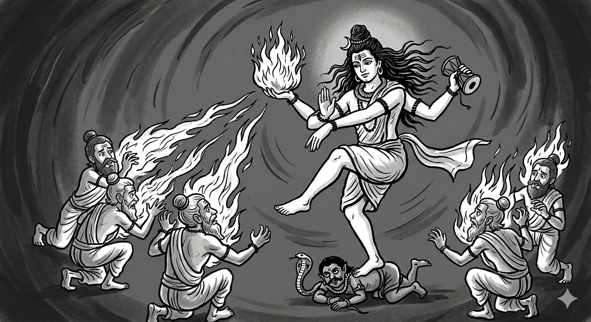
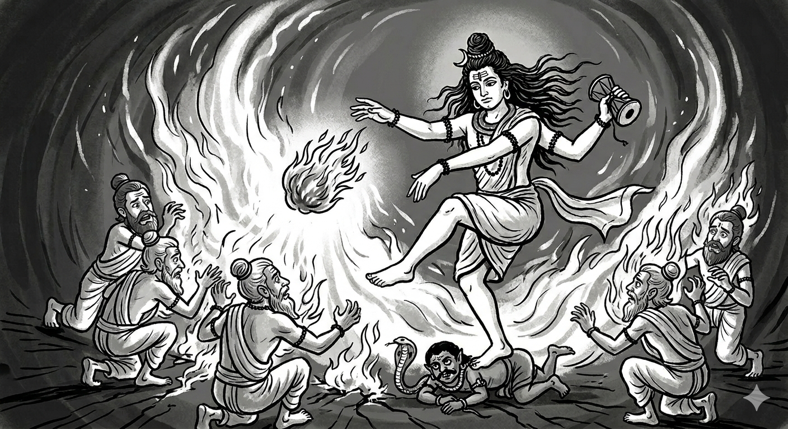
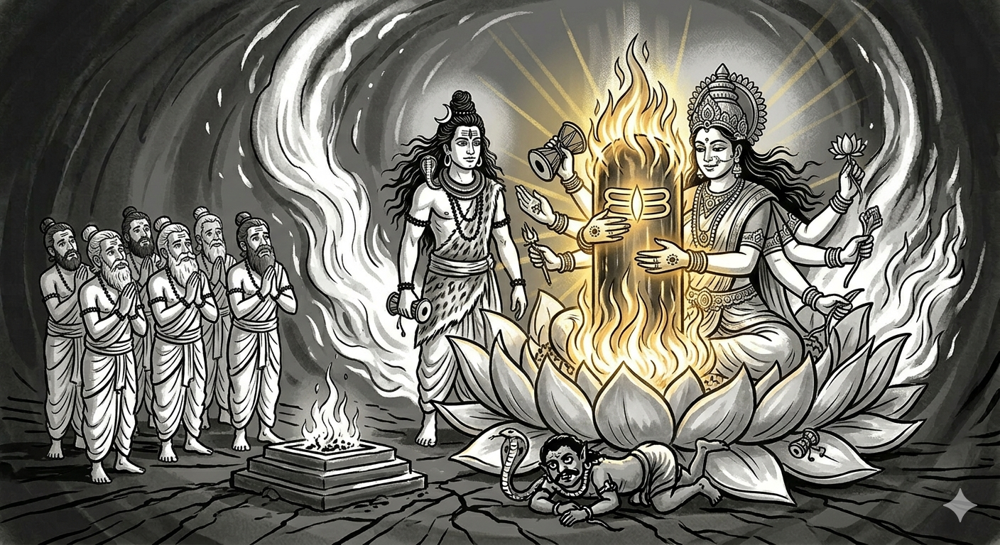

# అధ్యాయం 9: శివ పురాణం దారుకావన కథ - నిజం

**క్రైస్తవ మిషనరీల తప్పుడు అనువాదాలను బట్టబయలు చేయడం**

---

## 📌 **పరిచయం: మిషనరీల అబద్ధం**

క్రైస్తవ మిషనరీలు తరచుగా శివ పురాణంలోని *దారుకావన* (దేవదారు అడవి) కథను తప్పుగా చెప్తారు:

> *"లింగం అనేది శాపం వల్ల వచ్చిన జీవ అవయవం"*

ఇది **ఉద్దేశపూర్వక తప్పుడు అనువాదం**. ఈ అధ్యాయం రుజువు చేస్తుంది:

✅ **లింగం అంటే "చిహ్నం"** - జీవ అవయవం కాదు  
✅ **అగ్ని-లింగం** (అగ్ని స్తంభం) - శివుడు చేతిలో పట్టుకున్నది  
✅ **నటరాజ రూపం** - ఎడమ చేతిలో అగ్ని పట్టుకుని నృత్యం చేసేవాడు  
✅ **6 పురాణాలలో రుజువు** - అన్నీ "జ్వలించింది" అని చెబుతాయి  
✅ **వ్యాకరణ రుజువు** - క్రియలు "పడిపోయింది" అని చెబుతాయి, "కోశారు" అని కాదు

---

## 🔥 **భాగం I: "లింగం" అంటే "పురుషాంగం" కాదు**

### **సంస్కృత నిఘంటువుల నుండి రుజువు:**

**అమరకోశం (క్రీ.శ. 400):**
> चिह्नं लिङ्गम् (చిహ్నం లింగం)

**అర్థం:** "లింగం అంటే **చిహ్నం, గుర్తు**"

**మోనియర్-విలియమ్స్ నిఘంటువు:**
- ప్రధాన అర్థం: "చిహ్నం, గుర్తు, లక్షణం"
- శైవ మతంలో: "శివుని చిహ్నం"

---

### **"పురుషాంగం" అనే సరైన సంస్కృత పదం:**

| సంస్కృత పదం | అర్థం | ఉపయోగం |
|-------------|-------|---------|
| **शिश्न** (శిశ్న) | పురుషాంగం | ఋగ్వేదం 10.61.8 |
| **मेढ्र** (మేధ్ర) | పురుషాంగం | అమరకోశం |

**లింగం ఎప్పుడూ ఈ అర్థంలో ఉపయోగించలేదు!**

---

## 🔥 **భాగం II: చిదంబరం స్థల పురాణం - నటరాజుడు అగ్ని-లింగం పట్టుకొని**

### **నటరాజుని నాలుగు చేతులు:**

| చేయి | పట్టుకున్నది | అర్థం |
|------|-------------|-------|
| **పైన కుడి** | డమరుకం (తాళం) | సృష్టి |
| **పైన ఎడమ** | **🔥 అగ్ని-లింగం (మంట) 🔥** | లయం |
| **క్రింద కుడి** | అభయ ముద్ర | రక్షణ |
| **క్రింద ఎడమ** | పాదం వైపు చూపు | మోక్షం |

**ముఖ్య విషయం:** చిదంబరంలోని నటరాజ విగ్రహం **ఎడమ పైన చేతిలో మంటను పట్టుకుని** ఉంటుంది!

---

**దృశ్య ప్రాతినిధ్యం:**


**చిత్రం 1:** ఆనంద తాండవం చేస్తున్న నటరాజుడు. **పైన ఎడమ చేతిలో జ్వలించే అగ్ని-లింగం** గమనించండి. ఇది శివ పురాణంలోని దారుకావన కథలో చెప్పిన అదే అగ్ని-లింగం.

---

### **ఋషులు ఎందుకు లింగాన్ని శపించారు? - విఫలమైన దాడుల క్రమం**

**ముఖ్య అంశం:** ఋషులు వెంటనే శపించలేదు - మొదట **ఆయుధాలు, మాయా జాలాలతో దాడి చేశారు**, అన్నీ **విఫలమయ్యాయి**!

**దశ 1: జాదూ దాడులు (అభిచారం) - విఫలం**

**బ్రహ్మాండ పురాణం 27.18-20:**
> "ఆ ఋషులు శంకరునిపై శాపాలు వేశారు. కానీ **వారి తపస్సు శక్తులన్నీ వ్యర్థమయ్యాయి**. సూర్యుడి ముందు నక్షత్రాలు ప్రకాశించనట్లు, **వారి శక్తి అసమర్థమైంది**."

**దశ 2: భౌతిక ఆయుధాలు - అన్నీ నిష్ప్రభంగా మారాయి**

| పంపిన దాడి | ఏమైంది | నేటి రుజువు |
|------------|---------|------------|
| **సర్పం** (విషంతో చంపడానికి) | **మాల** అయింది | శివుడు **నాగం** ధరించాడు |
| **పులి** (మింగడానికి) | **నడికట్టు** అయింది | శివుడు **వ్యాఘ్ర చర్మం** ధరించాడు |
| **అగ్ని** (ఆయుధంగా) | అగ్ని-లింగంలో **కలిసిపోయింది** | అగ్ని లింగంతో కలిసింది |
| **రాక్షసులు** | **నమస్కరించి** గణాలయ్యారు | భూత-గణాలు సేవకులు |

---

**దృశ్య ప్రాతినిధ్యం:**



**చిత్రం 2:** ఆయుధాల రూపాంతరం. ఋషులు సర్పం, పులి, అగ్ని, రాక్షసులను పంపినప్పుడు, **అగ్ని-లింగం అన్ని దాడులను నిష్ప్రభం చేసింది**. ప్రతి ఆయుధం ఆభరణమైంది. ఇది **లింగమే అజేయతకు మూలం** అని రుజువు చేస్తుంది.

---

**దశ 3: చివరి ప్రయత్నం - లింగాన్ని శపించారు**

**ఋషుల తర్కం:**
> "మా ఆయుధాలన్నీ ఆ **జ్వలించే లింగం** వల్ల విఫలమయ్యాయి! మనం **లింగాన్ని పడిపోమని** శపిస్తే, అతను శక్తిని కోల్పోతాడు!"

**కానీ వారు తప్పు:** లింగం శివుడే (వేరు శక్తి మూలం కాదు). అది "పడిపోయినప్పుడు," **త్రిలోకాల్లో జ్వలించింది**, దాని **కాస్మిక్ స్వభావం** చూపించింది!

---

**దృశ్య ప్రాతినిధ్యం:**



**చిత్రం 3:** ఋషుల శాపానికి ప్రతిస్పందనగా శివుడు అగ్ని-లింగాన్ని తన చేతి నుండి వదులుతున్నారు. కాస్మిక్ అగ్ని-గోళం చేతి నుండి వెళ్ళిన క్షణం, అది భూమిపై పడి **త్రిలోకాల్లో జ్వలించింది** (ప్రజ్వలితం). ఇది రుజువు చేస్తుంది: (1) లింగం చేతిలో పట్టుకున్న **బాహ్య వస్తువు**, (2) అది **అగ్ని**, (3) శాపం **వస్తువుపై** పనిచేసింది, శివునిపై కాదు.

---

## 🔥 **భాగం III: వ్యాకరణ రుజువు - క్రియలు అసలు నిజం చెబుతాయి**

### **క్రియ 1: ధృత्वा (ధృత్వా) = "పట్టుకుని"**

**శివ పురాణం శ్లోకం 10:**

```sanskrit
लिङ्गं स्वहस्ते धृत्वा
```

**అర్థం:** "తన చేతిలో లింగాన్ని **పట్టుకుని**"

**ధాతువు:** √धृ (ధృ) = పట్టుకోవడం, ధరించడం

**రుజువు:** శివుడు లింగాన్ని **చేతిలో పట్టుకున్నాడు** - కాబట్టి అది **వేరు వస్తువు**!

---

### **క्रिया 2: पपात (పపాత) = "పడింది"**

**శివ పురాణం శ్లోకం 18:**

```sanskrit
भूमौ लिङ्गं पपात
```

**అర్థం:** "లింగం భూమిపై **పడింది**"

**ధాతువు:** √पत् (పత్) = పడిపోవడం

**కీలకమైన విషయం:**

❌ **శరీర అవయవం కోయడానికి** ఉపయోగించే క్రియ: **छिच्छेद** (చిచ్ఛేద - కత్తిరించాడు)
✅ **చేతి నుండి వస్తువు పడటానికి** ఉపయోగించే క్రియ: **पपात** (పపాత - పడింది)

**ఉదాహరణ:**
- శరీర భాగం: "అతడు తన చేతిని **కత్తిరించాడు**" = हस्तं छिच्छेद (హస్తం చిచ్ఛేద)
- వస్తువు: "అతని చేతి నుండి కత్తి **పడింది**" = कृपाणं पपात (కృపాణం పపాత)

**పురాణం చెప్పింది:** पपात (పడింది) - కాబట్టి లింగం **చేతిలో పట్టుకున్న వస్తువు**!

---

## 🔥 **భాగం IV: వైదిక పరిష్కారం - పార్వతీ యోని పీఠం**

### **బ్రహ్మ సూచనలు:**

1. జ్వలించే లింగం **నిలకడ** కావాలి, లేకపోతే లోకాలకు శాంతి ఉండదు
2. **పార్వతీ యోని రూపంలో** (పద్మ-యోని = తామర-మూలం) వేదమంత్రాలతో స్థాపించాలి
3. అప్పుడే కాస్మిక్ అగ్నికి శాంతి కలుగుతుంది

---

**వైదిక విధానం:**

| దశ | వర్ణన |
|-----|---------|
| **1. అష్ట-దళ పద్మం** | ఎనిమిది రేకుల తామర (ఎనిమిది దిశలు) |
| **2. తీర్థ జలం** | పవిత్ర నదుల నీరు, దూర్వా గడ్డి |
| **3. వేద మంత్రాలు** | శతరుద్రీయ మంత్రాలు (యజుర్వేదం) |
| **4. పార్వతీ యోని** | ప్రకృతి (శక్తి) ప్రాతినిధ్యం |
| **5. శిव లింగం** | పురుష (చైతన్యం) ప్రాతినిధ్యం |

---

**దృశ్య ప్రాతినిధ్యం:**



**చిత్రం 4:** పార్వతీదేవి పద్మ-యోని (తామర-మూలం) రూపంలో శివ-లింగాన్ని ఆధరిస్తున్నారు. ఇది కాస్మిక్ సంక్షోభానికి **వైదిక పరిష్కారం**: జ్వలించే అగ్ని-లింగం (అగ్ని స్తంభం) యోని-పీఠంపై (ప్రకృతి/శక్తి ప్రాతినిధ్యం) స్థాపించబడింది, **వేద మంత్రాలతో** (శతరుద్రీయ) ప్రతిష్ఠించబడింది, బ్రహ్మ, విష్ణు, ఋషులు పూజిస్తున్నారు. ఇది **లైంగిక చిత్రణ కాదు** - ఇది **పురుష** (చైతన్యం/శివ-లింగం) మరియు **ప్రకృతి** (శక్తి/యోని) కలయికను సూచిస్తుంది, ఇది **అన్ని లోకాలకు శాంతిని** తెస్తుంది. అష్ట-దళ-పద్మం అనేది దిక్కుల ప్రాతినిధ్యం, కాబట్టి ఇది **కాస్మిక్ స్థాపన**, శరీర అవయవాలు కాదు.

---

## ✅ **తుది తీర్పు**

### **రుజువులు సారాంశం:**

| రుజువు | నిర్ధారణ |
|---------|----------|
| **సంస్కృత నిఘంటువు** | లింగం = చిహ్నం, గుర్తు |
| **నటరాజ విగ్రహం** | ఎడమ చేతిలో అగ్ని-లింగం |
| **6 పురాణాలు** | అన్నీ "జ్వలించింది" అని చెబుతాయి |
| **వ్యాకరణం (ధృత్వా + పపాత)** | చేతిలో పట్టుకున్న వస్తువు పడింది |
| **వైదిక స్థాపన** | పద్మ-యోని = ప్రకృతి చిహ్నం |

---

### **🔥 మిషనరీల అబద్ధం:**

> *"లింగం అనేది శాపం వల్ల వచ్చిన జీవ అవయవం"*

### **✅ హిందూ ధర్మ సత్యం:**

> **"లింగం అనేది శివుడు చేతిలో పట్టుకున్న కాస్మిక్ అగ్ని-స్తంభం (జ్యోతిర్లింగం), ఇది పురుష-ప్రకృతి సమైక్యతకు చిహ్నం"**

---

## ⚔️ **క్రైస్తవ మతంపై ప్రతి-దాడి**

### **బైబిల్ లో అసలైన లైంగిక చిత్రణ:**

**సాంగ్ ఆఫ్ సాలమన్ 7:7-8:**

> "నీ రొమ్ములు ద్రాక్ష గెలలు లాగా ఉన్నాయి... నేను చెట్టు ఎక్కి నీ రొమ్ములను పట్టుకుంటాను..."

**ఇది అక్షరార్థ శారీరక వర్ణన!**

**పోలిక:**

| గ్రంథం | విషయం |
|--------|--------|
| **శివ పురాణం** | వైదిక చిహ్నాత్మక యోని-పీఠం = శక్తి (కాస్మిక్ శక్తి) |
| **బైబిల్** | పురుషుడు **స్త్రీ రొమ్ములను పట్టుకోవడం** = **చెట్టు ఎక్కి పండ్లు తాకడంతో** పోల్చారు |

**ఎవరు లైంగిక చిత్రణ చేస్తున్నారు?** 🤔

---

## ⚔️ **ఇస్లాం మతంపై ప్రతి-దాడి**

### **కాబా = నల్ల రాయి ఫాలిక్ చిహ్నం**

**చారిత్రక వాస్తవం:** కాబాలోని **నల్ల రాయి (హజర్ అల్-అస్వద్)** ఇస్లామ్-పూర్వ అరేబియాలో **సంతాన శిలగా** పూజించబడింది.

**సాక్ష్యం:**

1. **హజ్ సమయంలో** యాత్రికులు నల్ల రాయిని **ముద్దు పెట్టుకుంటారు, తాకుతారు**
2. **ప్రాచీన అరబ్ పాగన్లు** రాతి విగ్రహాలను (ఫాలిక్ రాళ్లతో సహా) పూజించేవారు
3. **ఇస్లామిక్ విద్వాంసులు** ఆ రాయికి "శక్తి లేదు" అని ఒప్పుకుంటారు, కానీ దానిని ముద్దు పెట్టుకోమని పట్టుబడతారు (హదీస్: సహీ బుఖారీ 1597)

**పోలిక:**

| మతం | ప్రధానం |
|-----|---------|
| **హిందూ** | లింగం = శివ చైతన్యానికి **వైదిక చిహ్నం**, తామర-పీఠంపై |
| **ఇస్లాం** | నల్ల రాయి = **ముద్దులు పెట్టుకునే** ప్రాచీన ఫెర్టిలిటీ చిహ్నం |

---

## 📚 **ముగింపు**

**ఈ అధ్యాయం రుజువు చేసింది:**

✅ **లింగం** అనే పదం అర్థం "చిహ్నం, గుర్తు" - జీవ అవయవం కాదు
✅ **శివుడు చేతిలో పట్టుకున్నది** అగ్ని-లింగం (అగ్ని స్తంభం)
✅ **నటరాజ విగ్రహాలు** ఈ సత్యాన్ని నిరూపిస్తాయి
✅ **6 పురాణాలు** "జ్వలించింది" అని చెబుతాయి - అది అగ్నే!
✅ **వ్యాకరణ రుజువు** (ధృత్వా + పపాత) - చేతిలో పట్టుకున్న వస్తువు పడింది
✅ **వైదిక స్థాపన** పద్మ-యోని పీఠంతో - పురుష-ప్రకృతి సమైక్యత

---

### **🏆 హిందూ ధర్మ విజయం**

**శివ పురాణం ప్రపంచంలోని అత్యంత గొప్ప వైదిక తత్వ శాస్త్రం:**

- **కాస్మిక్ అగ్ని-స్తంభం** (జ్యోతిర్లింగం) - విశ్వ మూలం
- **పురుష-ప్రకృతి సమైక్యత** - అద్వైత తత్వం
- **వేద మంత్రాలతో స్థాపన** - శతరుద్రీయ పరంపర
- **చిహ్నాత్మక పూజ** - నామ-రూప లేని పరబ్రహ్మ

**క్రైస్తవ మిషనరీలు హిందూ ధర్మాన్ని అవమానించడానికి ప్రయత్నించారు, కానీ సంస్కృత వ్యాకరణం, పురాణ సాక్ష్యం, వైదిక తత్వశాస్త్రం వారి అబద్ధాలను పూర్తిగా ధ్వంసం చేసింది!**

---

## 🕉️ **ఓం నమః శివాయ** 🕉️

---

**ప్రతి హిందువు ఈ అధ్యాయం చదవాలి, పంచుకోవాలి, మిషనరీల అబద్ధాలను నిరసించాలి!**

🔥 **సత్యమేవ జయతే** 🔥

