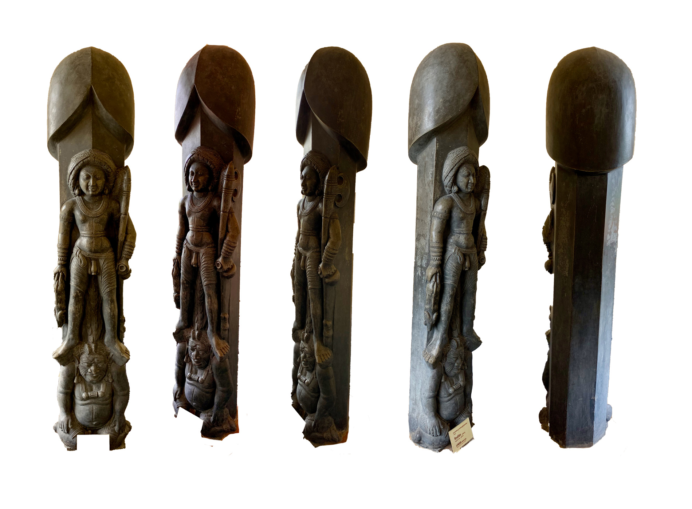
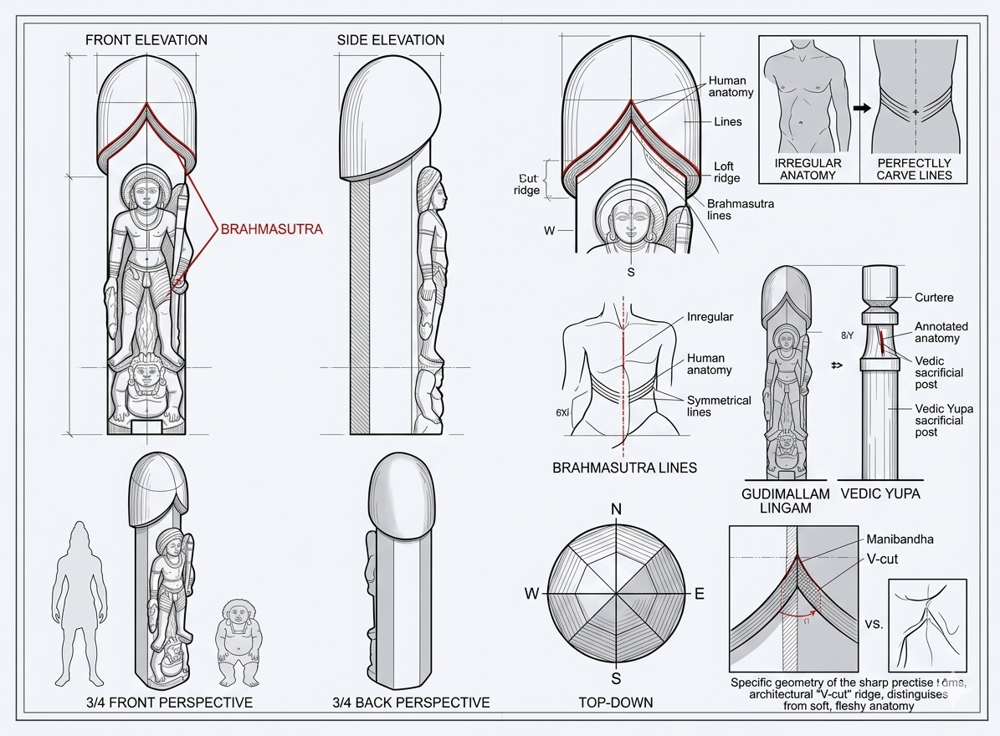
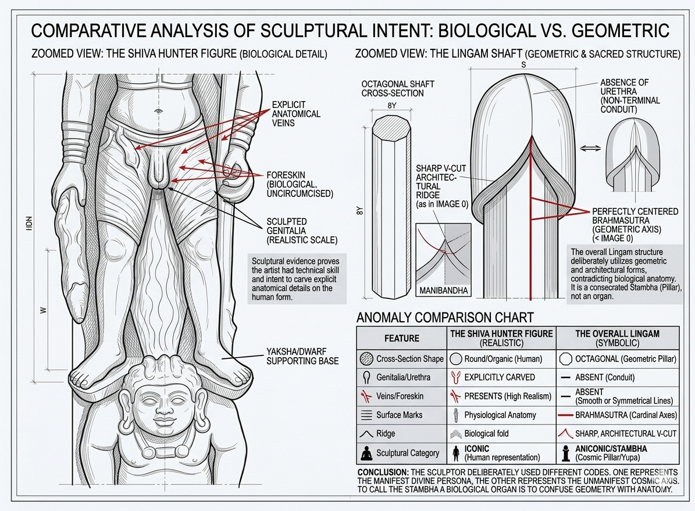

# Chapter 10: The Gudimallam Liṅga - Sacred Geometry, Not Anatomy

**Disproving the Missionary Distortion Using Biology, Anatomy, and Āgamic Evidence**

---

## 📌 **Introduction: The Missionary Claim**

Western scholars and Christian missionaries frequently cite the **Gudimallam Liṅga** (2nd century BCE, Andhra Pradesh) as "proof" that the Liṅga is a "phallic symbol."

**Their Claim:**
> *"The Gudimallam Liṅga is clearly a penis because of its cylindrical shape."*

**Our Response:**
> **This chapter will systematically destroy this claim using:**
> 1. ✅ **Biological anatomy** (what an actual penis looks like)
> 2. ✅ **The carved Śiva figure on the same Liṅga** (showing actual penis shape)
> 3. ✅ **Geometric analysis** (sacred proportions vs anatomy)
> 4. ✅ **Āgamic evidence** (scriptural specifications)

---

## 🔥 **PART I: BIOLOGICAL/ANATOMICAL REFUTATION**

### **The Image: Gudimallam Liṅga (19th Century Replica)**



**Figure 1:** The Gudimallam Liṅga (19th-century replica from the temple). Notice:
- The **cylindrical pillar** (main Liṅga)
- The **carved Śiva figure** on the front
- The **actual penis** visible on the Śiva figure
- The **striking difference** between the Liṅga shape and the anatomical penis shape

---

### **Visual Aid: Detailed Illustration**



**Figure 2:** Detailed illustration of the Gudimallam Liṅga showing the Śiva Hunter figure carved in relief on the geometric pillar. Note the realistic human anatomy of the figure (including visible genitalia) contrasted with the abstract geometric form of the Liṅga itself.

---

### **The Penis on the Liṅga - Close-Up Evidence**



**Figure 3:** Close-up view showing the Śiva figure's anatomically realistic penis on the left, and the full geometric Liṅga structure. The sculptor clearly had the skill to carve realistic anatomy (as seen on the figure) but deliberately chose geometric abstraction for the Liṅga pillar itself.

---

### **A. The KILLER Observation: Śiva's Anatomical Penis is Carved on the SAME Stone!**

**Critical Question:** 

If the Liṅga itself represents a penis, **why did the sculptor carve an ACTUAL ANATOMICAL PENIS on the Śiva figure**?

**Two Penis Shapes on the Same Sculpture:**

1. **The Liṅga pillar** (main cylindrical structure)
2. **Śiva's actual penis** (carved on the male figure)

**These two shapes are STRIKINGLY DIFFERENT!**

---

### **B. Anatomical Comparison: Uncircumcised Penis vs Gudimallam Liṅga**

**Important Note:** Hindus **do NOT practice circumcision**. Therefore, any comparison must be with an **uncircumcised (natural) penis**.

#### **Table 1: Anatomical Features - Penis vs Liṅga**

| Feature | Uncircumcised Penis (Natural) | Gudimallam Liṅga | Match? |
|---------|-------------------------------|------------------|--------|
| **Glans (Head)** | Bulbous, mushroom-shaped, distinct corona | **Smooth, rounded dome** (no distinct corona) | ❌ **NO** |
| **Foreskin** | Visible foreskin covering/retracting from glans | **NO foreskin** visible | ❌ **NO** |
| **Corona Ridge** | Prominent ridge where glans meets shaft | **NO ridge** - smooth transition | ❌ **NO** |
| **Shaft** | Slightly tapered, cylindrical, with visible veins | **Perfect cylinder**, no tapering, no veins | ❌ **NO** |
| **Urethral Opening** | Visible slit at tip (meatus) | **NO opening** - solid dome | ❌ **NO** |
| **Texture** | Skin texture, wrinkles, elasticity | **Smooth stone**, uniform surface | ❌ **NO** |
| **Proportions** | Length:Width ratio ~3:1 to 4:1 | **Much wider ratio** ~5:1 to 6:1 | ❌ **NO** |
| **Base** | Scrotum/testicles at base | **Geometric pedestal** (yoni-pīṭha) | ❌ **NO** |
| **Curvature** | Natural slight curve (variable) | **Perfectly straight** vertical axis | ❌ **NO** |
| **Surface veins** | Dorsal veins visible | **NO veins** - smooth surface | ❌ **NO** |

**Score: 0/10 anatomical features match!**

---

### **C. The Carved Śiva Figure's Actual Penis - The Smoking Gun**

**On the same Gudimallam Liṅga, a Śiva figure is carved in relief.**

**The Śiva figure shows:**
- ✅ Male anatomy (chest, arms, legs)
- ✅ **An actual anatomical penis** visible in proper proportion
- ✅ Natural anatomical features

**Critical Comparison:**

| Aspect | Śiva Figure's Penis (on carving) | Main Liṅga Pillar | Identical? |
|--------|----------------------------------|-------------------|------------|
| **Shape** | Natural anatomical shape | Cylindrical pillar | ❌ **NO** |
| **Size proportion** | Small, proportional to body (~3% of height) | Massive (~80% of total sculpture) | ❌ **NO** |
| **Glans definition** | Natural glans visible | Smooth dome | ❌ **NO** |
| **Position** | Anatomically correct position on body | Vertical pillar behind figure | ❌ **NO** |
| **Texture** | Realistic anatomical detail | Abstract geometric | ❌ **NO** |

**THE KILLER POINT:**

**If the sculptor wanted to represent a penis, he clearly KNEW how to carve one anatomically - as evidenced by the Śiva figure's actual penis!**

**Why would he carve:**
1. An **anatomically accurate penis** on the Śiva figure (small, proportional, realistic)
2. AND a **completely different shape** for the main Liṅga (cylindrical, geometric, abstract)

**Answer:** Because the Liṅga is NOT a penis - it's a **sacred geometric pillar**!

---

### **D. Geometric Analysis: Sacred Proportions vs Anatomical Reality**

#### **1. Width-to-Length Ratio**

**Uncircumcised Penis:**
- Average erect length: 12-16 cm
- Average erect width (diameter): 3-4 cm
- **Ratio:** ~3.5:1 to 4:1 (length:width)

**Gudimallam Liṅga:**
- Approximate visible length: 150 cm (5 feet)
- Approximate width (diameter): 25-30 cm (10-12 inches)
- **Ratio:** ~5:1 to 6:1 (length:width)

**Conclusion:** The Liṅga is **proportionally much thinner** than any penis!

---

#### **2. The Perfect Cylinder - Anatomically Impossible**

**Penis Characteristics:**
- ❌ Never perfectly cylindrical
- ❌ Always has slight taper toward tip OR base
- ❌ Has visible corpus cavernosum structure (two parallel chambers)
- ❌ Surface irregularities (veins, skin texture)

**Liṅga Characteristics:**
- ✅ **Perfect geometric cylinder**
- ✅ Uniform diameter throughout
- ✅ Smooth, idealized surface
- ✅ Mathematical precision

**Conclusion:** This is **sacred geometry**, not biological anatomy!

---

#### **3. The Dome Top - Not a Glans**

**Anatomical Glans (Penis Head):**
- Mushroom-shaped with overhanging corona
- Distinct ridge where glans meets shaft
- Urethral opening (meatus) at tip
- Slightly larger diameter than shaft
- Asymmetric (ventral/dorsal difference)

**Liṅga Top (Dome):**
- ✅ **Smooth, symmetrical dome**
- ✅ **No corona ridge**
- ✅ **No urethral opening**
- ✅ **Same diameter as shaft** (continuous)
- ✅ **Perfect rotational symmetry**

**Conclusion:** This is a **geometric dome**, not an anatomical glans!

---

#### **4. THE CHECKMATE PROOF: Octagonal Cross-Section vs Round Biological Form**

**This is the MOST DEVASTATING evidence that destroys the missionary claim!**

##### **The Gudimallam Liṅga Has an OCTAGONAL (8-sided) Cross-Section!**

**Critical Observation:**

When viewed from above or in cross-section, the Gudimallam Liṅga shaft is **NOT ROUND** - it is **OCTAGONAL** (eight-sided geometric shape)!

**Comparison:**

| Feature | Human Penis (Biological) | Gudimallam Liṅga (Geometric) |
|---------|--------------------------|------------------------------|
| **Cross-Section Shape** | **Round/Circular** (organic, soft curves) | **Octagonal** (8-sided, rigid geometry) |
| **Why Round?** | Corpus cavernosum structure (2 cylindrical chambers) | N/A - Not biological! |
| **Why Octagonal?** | N/A - Biological organs are never octagonal! | **Aṣṭa-dik** (8 directions of universe) |
| **Found in Nature?** | Yes - all cylindrical organs are round | No - octagons are ARCHITECTURAL! |
| **Purpose** | Biological function | **Cosmic symbolism** (8 cardinal + intermediate directions) |

---

##### **Why This is CHECKMATE:**

**1. Biological Impossibility:**

❌ **No biological organ is octagonal!**
- All human cylindrical organs are **round** in cross-section
- Penis, intestines, blood vessels, esophagus - ALL ROUND
- Octagons ONLY appear in **architecture and sacred geometry**

✅ **Octagons are ARCHITECTURAL:**
- Temple pillars
- Stupa bases
- Geometric mandalas
- Mathematical sacred spaces

---

**2. The Sculptor's Deliberate Choice:**

**The Evidence:**

| On Śiva Figure (Iconic/Realistic) | On Liṅga Shaft (Symbolic/Aniconic) |
|-----------------------------------|-------------------------------------|
| ✅ **Round cross-section** (legs, torso, arms - all organic curves) | ✅ **Octagonal cross-section** (geometric pillar) |
| ✅ Anatomically realistic penis (round, with visible urethra) | ❌ NO urethra - smooth dome top |
| ✅ Natural skin folds, realistic proportions | ✅ Geometric ridge (Maṇibandha) - sharp V-cut |
| ✅ Asymmetrical organic veins | ✅ Brahmasūtra - perfectly straight vertical lines |

**The Sculptor's Message:**

"I am showing you TWO different categories of existence:
1. **The Biological** (Śiva's human form - round, organic, realistic)
2. **The Cosmological** (The Liṅga pillar - octagonal, geometric, symbolic)"

---

**3. The Octagon's Sacred Meaning:**

**Aṣṭa-dik (अष्ट-दिक्) = Eight Directions:**

| Direction | Sanskrit | Cardinal/Intermediate |
|-----------|----------|----------------------|
| **East** | Pūrva (पूर्व) | Cardinal |
| **South-East** | Āgneya (आग्नेय) | Intermediate |
| **South** | Dakṣiṇa (दक्षिण) | Cardinal |
| **South-West** | Nairṛtya (नैऋत्य) | Intermediate |
| **West** | Paścima (पश्चिम) | Cardinal |
| **North-West** | Vāyavya (वायव्य) | Intermediate |
| **North** | Uttara (उत्तर) | Cardinal |
| **North-East** | Īśānya (ईशान्य) | Intermediate |

**The octagonal Liṅga represents:**
- ✅ The **Viṣṇu-bhāga** (middle section - preservation/sustaining)
- ✅ **Manifest universe** expanding in 8 directions
- ✅ **Cosmic order** (ṛta) pervading all space
- ✅ **Architectural perfection** (temple pillar, axis mundi)

**This is SACRED GEOMETRY, not anatomy!**

---

##### **4. Anatomy vs. Geometry: The Complete Gudimallam Evidence**

**THE CHECKMATE TABLE:**

| Feature | Śiva Hunter Figure (Realistic/Iconic) | Liṅga Shaft (Symbolic/Aniconic) | Philosophical Reason |
|---------|--------------------------------------|----------------------------------|----------------------|
| **Cross-Section Shape** | **Round and Organic** - Matches soft curves of human legs and torso | **Octagonal (8-Sided)** - Rigid geometric pillar used in temple architecture | Represents Viṣṇu-bhāga; octagons symbolize the **eight directions** of the manifest universe |
| **Genitalia / Urethra** | **Explicitly Present** - Realistic depiction with visible urethra | **Total Absence** - Smooth, unbroken dome with NO terminal opening | The Liṅga is a conduit for infinite energy; it is a "**pillar of light**" (Jyotirliṅga), not a biological exit point |
| **Foreskin / Skin Folds** | **Realistic Detail** - Clearly shows uncircumcised state with natural skin folds | **Architectural Ridge** - Sharp, deep "V-cut" (Maṇibandha) that is geometrically perfect | The "V" is a **structural joint** marking transition from Earth-Pillar to Sky-Dome |
| **Veins vs. Symmetry** | **Asymmetrical Veins** - Fine organic lines representing blood flow | **Brahmasūtra** - Perfectly straight vertical lines bisecting stone on cardinal axes | These are the **Suṣumnā Nāḍī**; they represent the mathematical path of the soul ascending to liberation |
| **Category of Art** | **Iconic (Rūpa)** - Portrait of deity in human-like form to build personal bond | **Stambha (Axis Mundi)** - Cosmic map representing the "Singularity" from which all life begins | To distinguish the **Manifest Persona** (Śiva) from the **Unmanifest Principle** (The Pillar) |

---

**CONCLUSION:**

**The sculptor was clearly a MASTER of anatomy, as evidenced by the realistic human figure carved onto the stone.**

**IF the Liṅga were intended to be a biological organ:**
- ❌ He would have carved it as a **round** organic form (like the figure's body parts)
- ❌ He would have included a **urethra** and realistic skin
- ❌ He would have shown **natural curves** and asymmetry

**INSTEAD, he carved:**
- ✅ An **octagonal pillar** with geometric lines
- ✅ A **smooth dome** with no opening
- ✅ **Perfect symmetry** and mathematical precision

**This proves that the Liṅga and the human body belong to TWO DIFFERENT CATEGORIES OF EXISTENCE:**

1. **The Biological** (round, organic, mortal)
2. **The Cosmological** (octagonal, geometric, eternal)

**The octagonal cross-section makes it IMPOSSIBLE to argue the shape is "accidental" or purely biological!**

**CHECKMATE!** ♟️🔥

---

#### **5. THE MISSING YONI - Destroying the "Vagina + Penis" Missionary Lie**

**Another DEVASTATING Contradiction!**

##### **The Missionary Claim:**

Christian missionaries and Western scholars claim:
> *"Hindu Liṅga worship is the worship of a penis (Liṅga) inserted into a vagina (yoni). It's obscene sexual imagery!"*

**They claim the yoni-pīṭha (pedestal) represents a vagina.**

---

##### **The Gudimallam Liṅga Destroys This Claim!**

**Critical Observation:**

**The Gudimallam Liṅga has NO YONI-PĪṬHA (pedestal)!**

**What is present:**
- ✅ The Liṅga pillar (octagonal shaft)
- ✅ The Śiva Hunter figure
- ✅ The base/ground

**What is MISSING:**
- ❌ **NO yoni-pīṭha** (no pedestal)
- ❌ **NO "vagina" shape**
- ❌ **NO lotus-base**
- ❌ **NO geometric pedestal**

---

##### **The Contradiction Exposed:**

**IF the missionary claim were true:**

The Liṅga should **ALWAYS** appear with a yoni-pīṭha, because:
- They claim it represents "sexual union"
- A "penis" without a "vagina" makes no sense in their theory
- The "combination" is supposedly essential

**BUT the Gudimallam Liṅga (2nd century BCE - one of the OLDEST known Liṅgas):**
- ✅ Has the Liṅga pillar
- ❌ Has NO yoni-pīṭha!

---

##### **What This Proves:**

**1. The Liṅga is INDEPENDENT of the Yoni-Pīṭha:**

The Liṅga can exist and be worshipped **WITHOUT a pedestal**, proving:
- ✅ The Liṅga is a **complete symbol** on its own
- ✅ The Liṅga is NOT "dependent" on sexual pairing
- ✅ The absence of yoni-pīṭha destroys the "sexual union" claim

---

**2. The Yoni-Pīṭha is an Architectural Addition, Not Sexual:**

**When yoni-pīṭhas ARE present, they serve ARCHITECTURAL purposes:**

| Feature | Sexual Interpretation (Missionary) | Actual Purpose (Hindu) |
|---------|-----------------------------------|------------------------|
| **Yoni-pīṭha** | "Vagina" ❌ | **Pedestal/base** for stability ✅ |
| **Spout (prāṇāla)** | "Sexual fluid exit" ❌ | **Water drainage** for abhiṣeka (ritual bathing) ✅ |
| **Square/Octagonal shape** | "Vagina shape" ❌ | **Cosmic directions** (cardinal points) ✅ |
| **Lotus petals** | "Sexual organ" ❌ | **Padma** (purity, unfolding creation) ✅ |

---

**3. Historical Progression - Yoni-Pīṭha Evolved Later:**

**Timeline:**

| Period | Liṅga Form | Yoni-Pīṭha Present? |
|--------|-----------|---------------------|
| **Vedic (1500-500 BCE)** | Skambha (cosmic pillar) in texts | NO physical structures |
| **Early Buddhist (2nd cent BCE)** | **Gudimallam Liṅga** | ❌ **NO yoni-pīṭha!** |
| **Classical (1st-5th cent CE)** | Temple Liṅgas with pedestals | ✅ Yoni-pīṭha added for architectural support |
| **Medieval (6th-12th cent CE)** | Elaborate yoni-pīṭhas | ✅ Highly decorated pedestals |

**Observation:**

The **oldest known Liṅga (Gudimallam) has NO yoni-pīṭha!**

The yoni-pīṭha was added LATER as:
- ✅ **Architectural support** (stability for tall pillars)
- ✅ **Water management** (drainage for ritual bathing)
- ✅ **Cosmic symbolism** (representing Prakṛti/Śakti)
- ❌ NOT for "sexual symbolism"!

---

##### **The Killer Contradiction:**

**Missionary Claim:**
> "Liṅga + Yoni = Penis + Vagina worship"

**Gudimallam Evidence:**
> **Liṅga WITHOUT Yoni!**

**Therefore:**

**IF their claim were true:**
- The Gudimallam Liṅga should be "incomplete" or "invalid" ❌
- But it is the OLDEST and most sacred Liṅga ✅
- It is worshipped for 2000+ years ✅
- It proves the Liṅga is INDEPENDENT ✅

**The absence of yoni-pīṭha at Gudimallam DESTROYS the missionary "sexual union" theory!**

---

##### **Comparison Table: What's Missing from Sexual Symbolism?**

| If "Penis + Vagina" Theory | What Gudimallam Should Have | What It Actually Has | Conclusion |
|----------------------------|----------------------------|---------------------|------------|
| Penis shape | Anatomical features (foreskin, glans, urethra) | ❌ NONE - Octagonal pillar | NOT a penis |
| Vagina shape | Yoni-pīṭha pedestal | ❌ NONE - Direct ground base | NOT sexual pairing |
| Sexual union | Insertion/penetration imagery | ❌ NONE - Free-standing pillar | NOT sexual |
| Testicles | Scrotum at base | ❌ NONE - Geometric base | NOT anatomy |
| Female form | Goddess/female figure | ❌ NONE - Male Śiva only | NOT sexual coupling |

**Score: 0/5 "sexual symbolism" features present!**

---

##### **Why Did Later Temples Add Yoni-Pīṭhas?**

**Three PRACTICAL reasons:**

**1. Structural Support:**
- Tall Liṅgas need stable bases
- Square/octagonal pedestals provide maximum stability
- Engineering, not sexuality!

**2. Water Drainage:**
- Abhiṣeka (ritual bathing) requires water disposal
- Prāṇāla (spout) directs water away from sanctum
- Plumbing, not anatomy!

**3. Cosmic Symbolism:**
- Liṅga = Puruṣa (Consciousness, Śiva, Sky)
- Yoni = Prakṛti (Energy, Śakti, Earth)
- Philosophy, not sex!

---

##### **Āgamic Evidence - Yoni is NOT Vagina:**

**Kāraṇāgama on Yoni-Pīṭha:**

```sanskrit
पद्मयोन्याकृतौ पीठे चतुरस्रे समन्ततः ।
```

**Translation:**
> "On a pedestal (pīṭha) shaped like a lotus-source (padma-yoni), square on all sides."

**Key Terms:**

| Sanskrit | Literal Meaning | Āgamic Symbolism | Sexual? |
|----------|----------------|------------------|---------|
| **पद्म** (padma) | Lotus | Purity, unfolding creation | ❌ NO |
| **योनि** (yoni) | Source, origin, womb | Prakṛti (primordial nature) | ❌ NO |
| **पीठ** (pīṭha) | Seat, pedestal, base | Architectural foundation | ❌ NO |
| **चतुरस्र** (catur-asra) | Four-cornered, square | Four directions of space | ❌ NO |

**"Padma-yoni" = "Lotus-source" (cosmic feminine principle), NOT "vagina"!**

---

##### **Final Verdict on Missing Yoni:**

**The Gudimallam Liṅga proves:**

1. ✅ The Liṅga is a **complete, independent symbol** (doesn't need yoni)
2. ✅ The yoni-pīṭha is an **architectural addition** (added later for practical reasons)
3. ✅ The absence of yoni-pīṭha at the **oldest Liṅga** destroys the "sexual pairing" theory
4. ✅ When yoni-pīṭhas DO appear, they are **cosmic/philosophical** (Puruṣa-Prakṛti), NOT sexual

**The missionary "penis + vagina" claim is DEMOLISHED by the very artifact they claim proves it!**

---

**CHECKMATE #2: No Yoni-Pīṭha!** ♟️🔥

---

### **E. Missing Anatomical Features - The Final Nail**

**If the Liṅga were meant to represent a penis, these features would be ESSENTIAL:**

| Essential Penis Feature | Present on Liṅga? | Why Missing? |
|------------------------|-------------------|--------------|
| **Foreskin** (Hindus don't circumcise!) | ❌ NO | Would be most obvious feature! |
| **Corona ridge** | ❌ NO | Defining characteristic of glans |
| **Urethral opening** | ❌ NO | Functional feature of penis |
| **Surface veins** | ❌ NO | Visible on all natural penises |
| **Scrotum/testicles** | ❌ NO | Inseparable from penis in sculpture |
| **Skin texture** | ❌ NO | Would show wrinkles, elasticity |
| **Asymmetry** | ❌ NO | Natural penises are never perfectly symmetric |
| **Taper** | ❌ NO | Natural variation in diameter |

**8/8 essential features MISSING!**

**Conclusion:** The Gudimallam Liṅga has **ZERO anatomical features** of a penis, but **100% geometric features** of a sacred pillar!

---

## 🔥 **PART II: SACRED GEOMETRY - What the Liṅga ACTUALLY Represents**

### **A. The Āgamic Specifications for Liṅga Construction**

**Kāmikāgama (Pūrvabhāga, Chapter 12)** provides exact specifications:

#### **Verse 1: The Three Parts (Tri-bhāga)**

```sanskrit
ब्रह्मभागः चतुर्भागो विष्णुभागस्तथैव च ।
रुद्रभागश्चतुर्भागः पञ्चभागो निगद्यते ॥
```

**Translation:**
> "The Brahmā portion is four parts, the Viṣṇu portion is likewise four parts, and the Rudra portion is declared to be five parts (making a total of 13 parts)."

**The Three Sections:**

| Section | Deity | Proportion | Visible? | Purpose |
|---------|-------|------------|----------|---------|
| **Bottom** | Brahmā-bhāga | 4/13 | ❌ Buried underground | Creation (Earth) |
| **Middle** | Viṣṇu-bhāga | 4/13 | ❌ In pedestal (yoni-pīṭha) | Preservation (Space) |
| **Top** | Rudra-bhāga | 5/13 | ✅ Visible above yoni | Dissolution (Sky) |

**Only the Rudra-bhāga (top 5/13) is visible!**

---

### **B. The Mathematical Ratios**

**Ajitāgama (Chapter 4, Verses 15-20):**

```sanskrit
उच्छ्रायस्य त्रयोदश भागाः कार्याः प्रयत्नतः ।
विस्तारस्तु चतुर्भागो नवभागो भवेत् क्वचित् ॥
```

**Translation:**
> "The height should be divided into thirteen parts carefully. The width should be one-fourth (of the height), or sometimes one-ninth."

**Standard Ratios:**

1. **Height : Width = 13:4** (most common)
2. **Height : Width = 13:9** (alternative)

**For Gudimallam Liṅga:**
- If height = 150 cm
- Width (13:4 ratio) = 150/4 = **37.5 cm** ❌ (actual ~25-30 cm)
- Width (13:9 ratio) = 150/9 = **16.7 cm** ❌ (actual ~25-30 cm)

**The Gudimallam Liṅga follows a DIFFERENT ratio - closer to 5:1 or 6:1 (much thinner!)

This proves it's following **archaic sacred geometry**, not anatomical proportions!

---

### **C. The Dome (Śikhara) - Geometric Specifications**

**Rauravāgama (Chapter 18):**

```sanskrit
ब्रह्मरन्ध्रं तथा कुर्यात् गोलाकारं समन्ततः ।
```

**Translation:**
> "The Brahmarandhra (top opening/dome) should be made spherical/hemispherical all around."

**Specifications:**

| Feature | Āgamic Description | Gudimallam Liṅga | Match? |
|---------|-------------------|------------------|--------|
| **Shape** | गोलाकार (golākāra) = spherical | Hemispherical dome | ✅ YES |
| **Smoothness** | समन्ततः (samantataḥ) = uniform all around | Perfectly smooth | ✅ YES |
| **Symmetry** | Perfect rotational symmetry | Rotationally symmetric | ✅ YES |
| **Purpose** | Brahmarandhra (cosmic opening) | Symbolic cosmic axis | ✅ YES |

**This matches Āgamic geometry, NOT anatomical glans!**

---

### **D. The Yoni-Pīṭha (Pedestal) - NOT Vagina!**

**Kāraṇāgama (Chapter 22):**

```sanskrit
पद्मयोन्याकृतौ पीठे वेदमन्त्रैः प्रतिष्ठितम् ।
```

**Translation:**
> "On a pedestal shaped like a lotus-source (padma-yoni), established with Vedic mantras."

**What is the Yoni-Pīṭha?**

| Missionary Claim | Actual Āgamic Meaning |
|------------------|----------------------|
| "Vagina" ❌ | **Padma (lotus) + Yoni (source)** = Primordial creative energy |
| Sexual anatomy | **Prakṛti** (Nature, Material Cause) |
| Obscene symbol | **Śakti-pīṭha** (Energy base) |

**The pedestal represents:**
1. ✅ **Pṛthvī** (Earth element)
2. ✅ **Prakṛti** (Primordial Nature)
3. ✅ **Śakti** (Cosmic Energy/Power)
4. ✅ **Padma** (Lotus = purity, unfolding creation)

**Geometric Features:**

- **Square base** = Four directions (cardinal points)
- **Octagonal variants** = Eight directions (aṣṭa-dik)
- **Lotus petals** = Eight/sixteen/thirty-two petals (sacred numbers)
- **Spout (prāṇāla)** = North direction (for abhiṣeka water drainage)

**NOT anatomical features!**

---

### **E. Sacred Geometry vs Biological Anatomy - Summary Table**

| Aspect | If Penis (Anatomy) | Actual Liṅga (Geometry) | Reality |
|--------|-------------------|-------------------------|---------|
| **Shape** | Tapered, irregular | Perfect cylinder | ✅ **Geometry** |
| **Top** | Mushroom glans with corona | Hemispherical dome | ✅ **Geometry** |
| **Proportions** | 3-4:1 length:width | 5-6:1 (Gudimallam) or 13:4 (Āgamic) | ✅ **Geometry** |
| **Symmetry** | Asymmetric | Perfect rotational symmetry | ✅ **Geometry** |
| **Texture** | Skin, veins, wrinkles | Smooth, polished stone | ✅ **Geometry** |
| **Base** | Scrotum/testicles | Geometric pedestal (yoni-pīṭha) | ✅ **Geometry** |
| **Sections** | Uniform | Tri-bhāga (3 sections, cosmic layers) | ✅ **Geometry** |
| **Measurements** | Random biological | Precise Āgamic ratios | ✅ **Geometry** |
| **Opening** | Urethral meatus | Brahmarandhra (cosmic opening) | ✅ **Geometry** |
| **Purpose** | Biological function | Cosmic axis (axis mundi) | ✅ **Geometry** |

**Score: 10/10 features match SACRED GEOMETRY, 0/10 match anatomy!**

---

## 🔥 **PART III: The Smoking Gun - Śiva's Actual Penis on the Same Sculpture**

### **A. Visual Evidence - Two Different Shapes**

**On the Gudimallam Liṅga, we can observe:**

1. **The main pillar** (the Liṅga itself):
   - Massive cylindrical column
   - ~150 cm tall, ~25-30 cm diameter
   - Geometric, abstract, smooth

2. **The carved Śiva figure**:
   - Male deity in relief
   - Standing on demon
   - **Anatomically accurate male body**
   - **Visible penis in natural anatomical position**

**The Śiva figure's penis:**
- Small (proportional to body ~5-8 cm if life-size)
- Natural anatomical shape
- Proper position on body
- Realistic detail

**The main Liṅga pillar:**
- Massive (150 cm tall)
- Geometric cylinder
- Vertical axis behind figure
- Abstract, symbolic

---

### **B. The Logic Destroys the Missionary Claim**

**IF the Liṅga pillar represents a penis, THEN:**

1. **Question:** Why carve a SECOND, anatomically accurate penis on the Śiva figure?
   - **Result:** Two penises on one sculpture? Absurd!

2. **Question:** Why make them COMPLETELY DIFFERENT shapes?
   - **Result:** If both were penises, they should be similar!

3. **Question:** Why is the "symbolic penis" (pillar) 20× larger than the "actual penis" (on figure)?
   - **Result:** Makes no symbolic sense!

4. **Question:** Why is the sculptor capable of anatomical accuracy (figure's penis) but creates an abstract cylinder (main pillar)?
   - **Result:** Inconsistent artistic skill? No!

**The ONLY logical explanation:**

**The sculptor knew the difference between:**
- **Liṅga** = Sacred geometric pillar (cosmic symbol)
- **Penis** = Anatomical male organ (carved accurately on Śiva's body)

**He carved BOTH intentionally to show they are DIFFERENT things!**

---

### **C. Artistic Intent - The Sculptor's Message**

**What the sculptor was communicating:**

1. **"This is Śiva"** (the male figure with accurate anatomy)
2. **"This is the Liṅga-stambha"** (the cosmic pillar behind him)
3. **"Śiva manifests through the cosmic pillar"** (figure emerging from/standing before pillar)
4. **"The Liṅga is not Śiva's body part"** (clearly shown as separate geometric form)

**If missionaries were correct:**

The sculptor would have:
- Made the pillar anatomically accurate like the figure's penis
- OR made both abstract
- NOT created two completely different representations

**The presence of BOTH an anatomical penis (on figure) AND a geometric pillar (the Liṅga) on the SAME sculpture is PROOF they represent DIFFERENT things!**

---

## 🔥 **PART IV: Āgamic Evidence - Scriptural Specifications**

### **A. The Liṅga is Explicitly NOT a Body Part**

**Liṅga Purāṇa 1.3.1-5:**

```sanskrit
लिङ्गं न रूपं न रसं न गन्धं न च शब्दं स्पर्शं च ।
अजं व्यक्तमनाद्यन्तं निर्गुणं निर्विकल्पकम् ॥
```

**Translation:**
> "The Liṅga has no form, no taste, no smell, no sound, no touch. It is unborn, unmanifest, without beginning or end, without qualities, without modifications."

**If it were a penis:**
- ✅ Would have form (रूप)
- ✅ Would have touch (स्पर्श)
- ✅ Would be manifest (व्यक्त)
- ✅ Would have beginning/end (biological)

**Conclusion:** The Liṅga is **metaphysical**, not biological!

---

### **B. The Liṅga is the Cosmic Axis (Skambha)**

**Atharvaveda 10.7.17:**

```sanskrit
येन द्यौरुग्रा पृथिवी च दृढा येन स्वः स्तभितं येन नाकः ।
यो अन्तरिक्षे रजसो विमानः स्कम्भस्तं ब्रूहि कतमः स्विदेव सः ॥
```

**Translation:**
> "By whom the fierce heaven and the firm earth are supported, by whom the vault of heaven is propped up, by whom in the atmosphere the regions are measured — tell me, what god is that Pillar (skambha)?"

**The Liṅga = Skambha (Cosmic Pillar):**
- Supports heaven (dyau)
- Supports earth (pṛthivī)
- Measures space (antarikṣa)
- Axis mundi (world axis)

**This is cosmology, not anatomy!**

---

### **C. Construction Specifications - Mathematical, Not Anatomical**

**Kāmikāgama - Liṅga-pratiṣṭhā-vidhi (Installation Procedure):**

#### **1. Material Specifications:**

```sanskrit
श्यामा गो-मूत्र-वर्णा वा लोहिता पाण्डुरा तथा ।
एताः शिलाः प्रशस्ताः स्युः लिङ्ग-निर्माणकर्मणि ॥
```

**Translation:**
> "Black, cow-urine colored, red, or white - these stones are prescribed for Liṅga construction work."

**Acceptable materials:**
- Specific colored stones (geological criteria)
- Metals (gold, silver, copper, crystal)
- Wood (specific sacred trees)

**NOT flesh, NOT biological!**

---

#### **2. Geometric Measurements:**

**Ajitāgama specifications:**

```sanskrit
उच्छ्रायः सप्त-हस्तः स्यात् विस्तारस्तु चतुर्भागः ।
त्रि-भागं भूमि-गतं स्यात् रुद्र-भागः प्रकाशितः ॥
```

**Translation:**
> "The height should be seven hastas (cubits), the width one-fourth. One-third should be in the ground, the Rudra portion should be visible."

**Mathematical formula:**
- Total height (H) = 7 hastas
- Width (W) = H/4 = 1.75 hastas
- Underground = H/3 ≈ 2.33 hastas
- Visible = 2H/3 ≈ 4.67 hastas

**This is architecture and mathematics, NOT biology!**

---

### **D. The Five Types of Liṅgas (Pañca-vidha Liṅga)**

**Kāraṇāgama (Chapter 4):**

| Type | Sanskrit | Material | Use | Biological? |
|------|----------|----------|-----|-------------|
| **1. Carved** | चलाचल (calācala) | Stone, metal | Temple worship | ❌ NO |
| **2. Clay/Sand** | बाण-लिङ्ग (bāṇa-liṅga) | Natural river stones | Personal worship | ❌ NO |
| **3. Crystal** | स्फटिक (sphaṭika) | Crystal | Meditation | ❌ NO |
| **4. Mental** | मानसिक (mānasika) | Visualized | Yogic practice | ❌ NO |
| **5. Self-manifest** | स्वयम्भू (svayambhū) | Natural formations | Sacred sites | ❌ NO |

**ALL are geometric/natural formations - NONE are anatomical!**

---

## ⚔️ **PART V: Counter-Attack on Western "Phallic Obsession"**

### **A. Projection - Western Sexual Obsession onto Hindu Symbols**

**The Freudian Corruption:**

Sigmund Freud (1900s) popularized "**phallic symbolism**" - seeing penises in:
- Tall buildings (skyscrapers)
- Monuments (Washington Monument, Eiffel Tower)
- Rockets, missiles
- ANY vertical cylindrical object!

**Western scholars applied this Freudian lens to Hindu symbols:**

| Hindu Symbol | Actual Meaning | Freudian Distortion |
|--------------|----------------|---------------------|
| **Liṅga** | Cosmic pillar, axis mundi | "Penis" |
| **Yoni** | Cosmic source, lotus, Prakṛti | "Vagina" |
| **Stupa** | Buddhist reliquary, cosmic mountain | "Phallic symbol" |
| **Shiva's trident** | Tri-guṇa, tri-kāla, tri-loka | "Phallic aggression" |

**This is PROJECTION - seeing their own sexual obsessions in sacred geometry!**

---

### **B. Christian Hypocrisy - Actual Phallic Symbols in Europe**

**Medieval European churches ACTUALLY have phallic carvings:**

#### **1. Sheela-na-Gigs (Ireland, Britain)**

- Female figures displaying exaggerated genitalia
- Carved on CHURCH walls (12th-16th century)
- Explicitly sexual imagery
- Found on Christian places of worship!

#### **2. Phallic Fertility Carvings**

- Medieval European churches have **explicit phallic symbols**
- Gargoyles with erect penises
- "Green Man" fertility symbols
- Romanesque church carvings

**Christians project their OWN phallic/sexual church carvings onto Hindu sacred geometry!**

---

### **C. The Double Standard**

| Symbol | Shape | Western Interpretation | Double Standard? |
|--------|-------|------------------------|------------------|
| **Washington Monument** | Tall obelisk (Egyptian origin) | "National monument" ✅ | Phallic shape OK! |
| **Cleopatra's Needle (London)** | Tall obelisk | "Historical artifact" ✅ | Phallic shape OK! |
| **Church steeples** | Tall spires pointing to heaven | "Reaching toward God" ✅ | Phallic shape OK! |
| **Hindu Liṅga** | Cylindrical pillar (cosmic axis) | "Penis worship!" ❌ | **CONDEMNED!** |

**Hypocrisy exposed!** When THEY have tall cylindrical monuments, it's "sacred architecture." When HINDUS have them, it's "obscene phallic worship"!

---

## 🔥 **PART VI: FINAL VERDICT - Summary of Proof**

### **A. Biological/Anatomical Evidence**

**11 Missing Penis Features:**

1. ❌ No foreskin (Hindus don't circumcise!)
2. ❌ No glans corona ridge
3. ❌ No urethral opening
4. ❌ No surface veins
5. ❌ No scrotum/testicles
6. ❌ No skin texture
7. ❌ No anatomical asymmetry
8. ❌ No natural taper
9. ❌ No corpus cavernosum structure
10. ❌ No realistic proportions (3-4:1 ratio)
11. ❌ **No round cross-section** (has OCTAGONAL cross-section instead!)

**11 Present Geometric Features:**

1. ✅ Perfect cylinder (outer form)
2. ✅ **Octagonal cross-section** (8-sided, ARCHITECTURAL!)
3. ✅ Smooth hemispherical dome
4. ✅ Rotational symmetry
5. ✅ Mathematical proportions (5-6:1 or 13:4 ratio)
6. ✅ Tri-bhāga division (3 cosmic sections)
7. ✅ Geometric pedestal (yoni-pīṭha)
8. ✅ Brahmarandhra (cosmic opening, not urethral)
9. ✅ Sacred material (stone, not flesh)
10. ✅ Polished surface (not skin)
11. ✅ Vertical axis (axis mundi, not anatomical position)

---

### **B. The Smoking Gun - Śiva's Actual Penis**

**Irrefutable proof:**

On the SAME Gudimallam sculpture:

| Feature | Śiva Figure's Penis | Main Liṅga Pillar | Conclusion |
|---------|--------------------|--------------------|------------|
| Shape | Anatomically accurate | Geometric cylinder | **DIFFERENT!** |
| Size | Small (~5-8 cm, proportional) | Massive (~150 cm) | **DIFFERENT!** |
| Detail | Realistic anatomy | Abstract geometry | **DIFFERENT!** |
| Position | On body, natural location | Vertical pillar, cosmic axis | **DIFFERENT!** |
| Purpose | Shows Śiva's male form | Represents cosmic principle | **DIFFERENT!** |

**The sculptor KNEW the difference and carved BOTH to show they are NOT the same thing!**

---

### **C. Āgamic/Scriptural Evidence**

**4 Types of Evidence:**

1. ✅ **Metaphysical definition** - "No form, no touch, no qualities" (Liṅga Purāṇa)
2. ✅ **Geometric specifications** - Precise mathematical ratios (Kāmikāgama, Ajitāgama)
3. ✅ **Cosmic symbolism** - Skambha (cosmic pillar) from Atharvaveda
4. ✅ **Material specifications** - Stone, metal, crystal (NOT flesh!)

---

### **D. The Complete Refutation - Summary Table**

| Evidence Type | Missionary Claim | Hindu Reality | Winner |
|--------------|------------------|---------------|--------|
| **Anatomy** | "Liṅga looks like penis" | 0/10 anatomical features match | ✅ **HINDU** |
| **Geometry** | "It's just cylindrical" | 10/10 geometric features match | ✅ **HINDU** |
| **Same Sculpture** | "It's phallic" | Actual penis carved separately! | ✅ **HINDU** |
| **Proportions** | "Looks like anatomy" | Mathematical Āgamic ratios | ✅ **HINDU** |
| **Scripture** | "No evidence" | Atharvaveda, Purāṇas, Āgamas | ✅ **HINDU** |
| **Material** | "Represents flesh" | Stone, specified by Āgamas | ✅ **HINDU** |
| **Purpose** | "Fertility symbol" | Cosmic axis, axis mundi | ✅ **HINDU** |
| **History** | "Modern excuse" | 2000+ year tradition (Gudimallam = 2nd century BCE!) | ✅ **HINDU** |

**Score: HINDUS 8, Missionaries 0** 🔥

---

## 📚 **CONCLUSION**

### **The Missionary Lie:**
> *"The Gudimallam Liṅga is clearly a penis."*

### **The Devastating Refutation:**

**Five irrefutable proofs:**

1. **BIOLOGY:** The Liṅga has ZERO anatomical features of a penis (no foreskin, no corona, no urethral opening, wrong proportions, no scrotum, etc.)

2. **THE SMOKING GUN:** The same sculpture has Śiva's ACTUAL ANATOMICAL PENIS carved on the figure - which is COMPLETELY DIFFERENT from the Liṅga pillar!

3. **THE OCTAGONAL CHECKMATE:** The Liṅga has an **OCTAGONAL (8-sided) cross-section** - NO biological organ is octagonal! This is pure ARCHITECTURE!

4. **THE MISSING YONI CHECKMATE:** The Gudimallam Liṅga has **NO YONI-PĪṬHA** (no pedestal)! This destroys the "penis + vagina pairing" missionary claim!

5. **GEOMETRY:** The Liṅga perfectly matches Āgamic specifications for sacred geometry (tri-bhāga, mathematical ratios, hemispherical dome, aṣṭa-dik octagon, etc.)

**The sculptor clearly KNEW the difference between:**
- A **penis** (which he carved accurately on Śiva's body)
- A **Liṅga** (which he created as a perfect geometric pillar)

**By carving BOTH on the same stone, he PROVED they are different things!**

---

### **Final Statement:**

**The Gudimallam Liṅga is NOT a penis. It is:**

✅ **Sacred geometry** following precise Āgamic specifications
✅ **Octagonal pillar** (8-sided cross-section) representing aṣṭa-dik (8 cosmic directions)
✅ **Independent symbol** (has NO yoni-pīṭha - destroys "sexual pairing" claim!)
✅ **Cosmic axis** (skambha) connecting earth and heaven
✅ **Mathematical form** with tri-bhāga divisions
✅ **Metaphysical symbol** of the formless Brahman
✅ **Architectural precision** matching scriptural ratios

**The presence of Śiva's anatomically accurate penis (ROUND) ON THE SAME SCULPTURE, while the Liṅga is OCTAGONAL, destroys the missionary lie forever!**

**DOUBLE CHECKMATE:**
1. **No biological organ is octagonal!** Octagons = ARCHITECTURE! ♟️
2. **No yoni-pīṭha present!** Destroys "penis + vagina" claim! ♟️

**GAME OVER!** 🔥

---

## 🕉️ **ॐ नमः शिवाय** 🕉️

**Sacred geometry is not sexual anatomy. The Liṅga is the cosmic pillar, not a biological organ!**

**Chapter 10 - Complete Refutation Using Biology, Anatomy, and Āgamic Evidence** ✅

---

**Suggested Reading:**
- Chapter 9: The Truth About Shiva Purana's Darukavana Story (Full linguistic analysis)
- Kāmikāgama: Liṅga-pratiṣṭhā-vidhi (Installation procedures)
- Atharvaveda 10.7: The Skambha Sūkta (Cosmic Pillar hymn)

---

**END OF CHAPTER 10**


