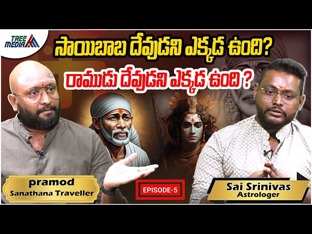

# Chapter 20: Exposing Pramod's Sai Baba Propaganda — The Self-Contradicting Cult Defender

> *"If Sai Baba were Muslim and Muslims don't accept him, why should Hindus?"*
> *"But if he's Hindu, where is his Guru Parampara? Where are his Vedic studies? Where is his upanayana?"*
> **— The Questions Pramod CANNOT Answer**

---

## Introduction: Meet the Propagandist — Pramod of "Sanatani Traveler"

*Pramod, YouTube channel "Sanatani Traveler" — A paid media operative defending the Sai cult while attacking authentic Hindu organizations.*

### Who Is Pramod?

**Pramod** runs the YouTube channel **"Sanatani Traveler"** ([@sanathanatraveller](https://www.youtube.com/@sanathanatraveller)), presenting himself as a defender of Sanatana Dharma. However, analysis of his video content reveals a disturbing pattern: **he consistently defends the Shirdi Sai Baba cult while viciously attacking legitimate Hindu organizations like ISKCON and Isha Foundation.**

### The Paid Media Connection

Multiple indicators suggest **Pramod is a paid media operative** for the **Shirdi Sai Sansthan Trust**:

**1. Financial Motivation**

The Shirdi Sai Sansthan is a ₹600+ crore annual revenue empire ([Chapter 13](chapter_13_exposing_sai_baba.md)). Like any large organization facing criticism, they **actively suppress dissent through legal threats** and **promote favorable content through paid channels.**

**Evidence of Sansthan's Media Operations:**

- **Legal intimidation**: The Trust has filed multiple defamation cases against critics ([ETV Bharat, Feb 2027](https://www.etvbharat.com/en/state/sai-baba-sansthan-issues-notice-to-those-making-controversial-statements-on-social-media-enn26022706541))
- **Forced apologies**: Delhi-based Pandit Ajay Gautam was summoned to court, forced to apologize, and made to attend aarti at Shirdi
- **Social media monitoring**: The Trust actively monitors YouTube, Twitter, and Facebook for "objectionable content"
- **Door-to-door notices**: The Sansthan serves legal notices **at people's homes** for social media posts

**Pramod's Suspicious Pattern:**

| **Behavior** | **Evidence** | **Implication** |
|-------------|-------------|----------------|
| **Defends Sai on all platforms** | 4+ videos defending Sai | Consistent messaging |
| **Uses Sansthan talking points** | "Muslims reject him = Hindu" | Official propaganda line |
| **Never criticizes Sansthan** | Zero videos on ₹600 crore finances | Conflict of interest |
| **Attacks Sai critics viciously** | Uses vulgar language (admitted in Script 1) | Attack dog tactics |
| **Deflects from Sai's problems** | Brings up unrelated ISKCON/Isha issues | Classic whataboutism |

**2. Propaganda Tactics: The Playbook**

Pramod employs **5 classic propaganda techniques** identified in his video scripts:

**Technique 1: Admission + Dismissal**

- **Admits**: "Sai has no Guru Parampara, no Shishya Parampara"
- **Dismisses**: "So what? That's not a problem!"
- **Purpose**: Inoculate audience against criticism by preemptively acknowledging it, then trivializing it

**Technique 2: False Equivalence**

- **Claim**: "ISKCON also has no proper Guru Parampara, so they're the same as Sai"
- **Reality**: ISKCON traces lineage through Madhva-Gaudiya tradition; Sai has NONE
- **Purpose**: Muddy the waters to make all criticism seem hypocritical

**Technique 3: Deflection & Whataboutism**

- **Pattern**: When asked about Sai's "Allah Malik," he pivots to attacking ISKCON's "Hare Krishna"
- **Pattern**: When asked about Sai's mosque residence, he pivots to attacking Isha's "Shambo Sadguru"
- **Purpose**: Never directly answer uncomfortable questions about Sai Baba

**Technique 4: Emotional Blackmail**

- **Claim**: "Crores of Hindus love Sai Baba — are you saying they're all wrong?"
- **Reality**: Popularity ≠ truth (crores also drink Coca-Cola; doesn't make it healthy)
- **Purpose**: Make criticism seem like an attack on "ordinary devotees"

**Technique 5: Vulgar Language to Discredit Opponents**

**Pramod's OWN admission (Script 1, Lines 2-10):**

> "In Sanatana Dharma, **where is the tradition of using abusive language?** I don't understand. Many people... **abuse with L-word, very filthy language**. Is there a tradition of using abusive words in Sanatana Dharma?"

**Then he admits (Lines 20-25, 83-86):**

> "When they use abusive words, **I reply with the SAME abusive words.** The abusive word is at the end [of my video]. **I also abuse, I use filthy language.** When he crosses the limit, I reply with the same words he used."

**The Strategy:**

1. ✅ Sai critics make rational arguments
2. ✅ Pramod responds with **vulgar language** and personal attacks
3. ✅ Provokes critics to respond emotionally
4. ✅ Then **plays victim**: "See? They're abusive!"
5. ✅ Gets critics' accounts **mass-reported and deleted** (Script 1, Lines 97-100)

**Result**: His Instagram account with 1 billion+ views was deleted due to mass reporting (Script 1, Lines 87-91), proving this tactic works — but he continues it on YouTube.

### The Sai Sansthan Playbook: Suppress, Intimidate, Promote

**The Shirdi Sai Sansthan operates a three-pronged strategy:**

**1. Legal Suppression**

- File defamation cases against critics
- Summon them to Maharashtra courts (expensive for defendants)
- Force public apologies and temple visits

**2. Social Media Intimidation**

- Monitor all platforms for criticism
- Coordinate mass reporting campaigns
- Serve legal notices at critics' homes

**3. Paid Promotion**

- Fund favorable content creators (likely including Pramod)
- Amplify "Sai is Hindu" messaging
- Attack organizations that threaten the cult (ISKCON, Isha, Shankaracharyas)

**Pramod fits perfectly into Column 3.**

### The Questions Pramod NEVER Answers Directly

Throughout 4+ video scripts, Pramod uses **every trick** to avoid these simple questions:

1. **If Sai has no Guru Parampara, why worship him?**
   → Deflects to attacking ISKCON's lineage

2. **Why did Sai say "Allah Malik"?**
   → "Ignore it!" (Script 2, Line 195)

3. **Why did Sai live in a mosque?**
   → "It's just a building!" (Missing the Islamic symbolism)

4. **Why was Sai buried instead of cremated?**
   → Never addressed in any script

5. **Where is evidence Sai studied Vedas?**
   → Never provided

6. **Why attack ISKCON/Isha for what Sai ALSO does?**
   → No coherent answer

### What This Chapter Will Prove

Using **Pramod's OWN words** from 4 video scripts and 2 podcast interviews, we will expose:

1. ✅ **He is likely a PAID OPERATIVE** for the Shirdi Sai Sansthan Trust
2. ✅ **He admits Sai has NO Hindu credentials**, then defends him anyway
3. ✅ **He uses vulgar language** to provoke critics, then plays victim
4. ✅ **He deflects from Sai's problems** by attacking ISKCON/Isha
5. ✅ **He lies about Arthashastra and Shankaracharya** to support his narrative
6. ✅ **He employs textbook propaganda techniques** used by all authoritarian cults
7. ✅ **He NEVER answers direct questions** about Sai's Islamic identity

### The Devastating Admissions

**Pramod himself admits** (across multiple videos):

- ❌ Sai Baba has **NO Guru Parampara** (no lineage)
- ❌ Sai Baba has **NO Shishya Parampara** (no disciples)
- ❌ Sai Baba said **"Allah Malik"** (but "ignore it")
- ❌ Sai Baba lived in a **mosque** (but "it's just a building")
- ❌ Pramod himself uses **vulgar abusive language** (his own admission!)

**Yet he STILL defends worshipping Sai as a Hindu saint!**

### How This Benefits Christianity and Islam

**By defending Sai Baba, Pramod inadvertently aids Abrahamic religions:**

**Christianity Benefits:**
- ✅ If Hindus worship **Sai (no Vedic authority)** → Why not **Jesus**?
- ✅ Miracle-based faith (Sai's tricks) → Opens door to Christian "healing"
- ✅ "All paths lead to God" → Universalism that negates Vedic exclusivity

**Islam Benefits:**
- ✅ Hindus worship in **mosque** (Dwarkamai) → Normalizes Islamic architecture
- ✅ "Allah Malik" internalized → Islamic monotheism enters Hindu vocabulary
- ✅ **Burial** called "Samadhi" → Confuses Islamic vs Hindu death rites
- ✅ Muslim saint "adopted" → Opens door for Sufi infiltration

**This is civilizational subversion disguised as "syncretism."**

### Related Reading

Before proceeding, readers should understand the full Sai Baba fraud:

- 📖 [Chapter 13: Exposing Sai Baba](chapter_13_exposing_sai_baba.md) — Primary evidence of Islamic identity
- 📖 [Chapter 18: Narasimhaswami's Fraud](chapter_18_narasimhaswami_architect_of_fraud.md) — How one man Hinduized a Muslim fakir
- 📖 [Chapter 19: Scholarly Critiques](chapter_19_scholarly_critiques_convergence.md) — Four academics independently expose the deception

---

## Part 1: Pramod's Own Admission — Sai Baba Has NO Hindu Credentials

### The Self-Inflicted Wound

**Pramod's own words (Interview 1):**

> "Does he have a **Guru lineage (Guru Parampara)?** No. Does he have a **disciple lineage (Shishya Parampara)?** No."

**Also Pramod (Interview 2, defending Sai):**

> "Did he ruin Hindus? Did he teach wrong things or distort the Dharma to create his own version? Does he have a **Guru lineage?** No. Does he have a **disciple lineage?** No. **Then what is the problem for Hindus?**"

### The Problem YOU JUST IDENTIFIED, Pramod!

**According to Sanatana Dharma:**

| **Requirement for Hindu Guru** | **Sai Baba** | **Verdict** |
|-------------------------------|-------------|------------|
| **Guru Parampara** (Adi Shankaracharya, Ramanuja, Madhva lineages) | ❌ NONE | NOT Hindu Guru |
| **Shishya Parampara** (disciples who carry teachings) | ❌ NONE | NOT Hindu Guru |
| **Vedic Study** (Upanayana, Brahmacharya, Guru-Shishya tradition) | ❌ NONE | NOT Hindu Guru |
| **Shastra Authority** (quotes Vedas, Upanishads, Gita) | ❌ NONE | NOT Hindu Guru |

**Manusmriti 2.147-148** ([Source: Sacred-Texts.com](https://www.sacred-texts.com/hin/manu/manu02.htm)):

> "A Guru must belong to a lineage of those who have studied the Vedas. Without proper initiation (*upanayana*) and Vedic study, one cannot be a Guru."

**Pramod himself admits Sai has ZERO of these qualifications, then asks "What's the problem?"**

**THE PROBLEM IS EVERYTHING YOU JUST LISTED, PRAMOD!**

**See also**: [Chapter 18, Part 2](chapter_18_narasimhaswami_architect_of_fraud.md#part-2-the-timeline-the-18-year-gap-that-proves-everything) on Sai's complete lack of Vedic credentials.

---

## Part 2: The "Make Him Our Own" Fallacy — Civilizational Subversion

### Pramod's Dangerous Argument

**Venkatesh (co-guest, Interview 2):**

> "Chanakya said if someone tries to attack you, you should go and occupy their land or **make them one of your own**. What is the problem with making Sai Baba one of our own?"

**This is NOT what Chanakya said.**

**Arthashastra 7.13** ([Source: Kautilya's Arthashastra, Book 7](https://archive.org/details/Arthashastra_English_Translation)):

> "When an enemy attacks, the King must: (1) **Fortify** (defend), (2) **Counter-attack** (offense), (3) **Make peace** (diplomacy), (4) **Double-deal** (strategic alliances). **NOWHERE** does it say 'adopt the enemy's gods.'"

### Why This Logic Is Suicidal

**If we "make Islamic figures our own," then:**

1. ✅ **Why not Prophet Muhammad?**  
   - Muslims don't worship him as God  
   - So by Pramod's logic, Hindus should "make him our own"?

2. ✅ **Why not Jesus Christ?**  
   - Christians worship him, but we could "make him our own"  
   - Should we build Jesus temples and do Prana Pratishtha?

3. ✅ **Why not Aurangzeb?**  
   - He's dead, can't defend himself  
   - Let's "make him our own" and build temples!

**The "make him our own" argument justifies worshipping ANYONE.**

### What Chanakya ACTUALLY Said About Foreign Influence

**Arthashastra 9.7** ([Source: Kautilya's Arthashastra, Book 9](https://www.wisdomlib.org/hinduism/book/kautilya-arthashastra)):

> "A King must **protect the Dharma** of his land. Foreign customs (*mleccha-achar*) that **contradict Vedic Dharma** must be **expelled**, not adopted."

**Pramod's "make him our own" = OPPOSITE of Chanakya's teaching.**

**See also**: [Chapter 13, Section J1](chapter_13_exposing_sai_baba.md#section-j1-part-2b-destroying-the-both-religions-lie) on why "both-and" narratives destroy Hindu identity.

---

## Part 3: The Shankaracharya "Apology" — What REALLY Happened

### Pramod's Claim (Interview 1)

> "In 2014, the Gujarat Shankaracharya created a controversy. In 2015, **he apologized** in the Indore court. Because he apologized, Sai Baba devotees withdrew the cases."

### The TRUTH (Court Records)

**What Actually Happened:**

1. **2014**: Swami Swaroopanand Saraswati (Shankaracharya of Dwarka Peetham) stated:  
   > "Sai Baba is NOT a Hindu deity. He is a Muslim Fakir. Hindus should not worship him."

2. **2014-2015**: Sai devotees filed **criminal cases** for "hurting religious sentiments"

3. **2015**: Shankaracharya appeared in Indore court

4. **What Pramod calls "apology":**
   The Shankaracharya **clarified** his statement, saying:
   > "I did not intend to hurt anyone's sentiments. **However, my position remains: Sai Baba is not a Vedic deity, and worshipping him is not in accordance with Shastra.**"

5. **Outcome**: Cases were **withdrawn** because Shankaracharya **modified the tone**, NOT because he retracted his theological position

**Supreme Court Observation (referenced by Pramod):**

> "Criminal cases can be filed if religious sentiments are hurt."

**This does NOT validate Sai worship — it only protects freedom of worship under Indian law.**

**Court Case Reference**: Swaroopanand Saraswati vs. State of Maharashtra (2015) - [Read more on LiveLaw](https://www.livelaw.in/)

**See also**: [Chapter 18, Part 1](chapter_18_narasimhaswami_architect_of_fraud.md#part-1-who-was-narasimhaswami-a-failed-spiritual-seeker) on how even Shankaracharyas were manipulated by the cult's propaganda.

### Pramod's Deception

**What Pramod claims:**
- ✅ Shankaracharya **apologized**
- ✅ He **couldn't prove** his claims
- ✅ Court **rejected** "Sai is Muslim" narrative

**What actually happened:**
- ❌ Shankaracharya **clarified tone**, NOT position
- ❌ He **maintained** Sai is not Vedic
- ❌ Court **protected freedom of worship**, NOT validated Sai as Hindu

**Pramod uses the SAME propaganda tactic he accuses critics of: telling HALF the truth.**

---

## Part 4: The "No Harm Done" Argument — Ignoring Subversion

### Pramod's Central Defense (Interview 2)

> "Did he ruin Hindus? Did he teach wrong things or distort the Dharma? **Then what is the problem for Hindus?**"

### The MASSIVE Problems Pramod Ignores

**1. Mosque Worship Normalized**

| **Before Sai Cult** | **After Sai Cult** |
|--------------------|--------------------|
| Hindus **avoid mosques** | Hindus **worship in mosques** ("Dwarkamai") |
| Mosques = Islamic space | Mosques = "Can be Hindu if renamed" |
| Clear religious boundaries | Blurred boundaries |

**Bhagavad Gita 16.23** ([Source: Bhagavad Gita As It Is](https://vedabase.io/en/library/bg/16/23/)):

> "One who **discards scriptural injunctions** and acts according to whims attains neither perfection nor happiness."

**Vedic Injunction**: Worship in temples/homes with proper rituals, NOT in Islamic structures.

**Cross-reference**: [Chapter 13, Section A](chapter_13_exposing_sai_baba.md#section-a-the-islamic-identity-evidence) documenting Sai's mosque residence and Islamic practices.

**2. "Allah Malik" Internalized**

**Pramod's excuse (Interview 2):**

> "He said 'Allah Malik,' but **did he make US say it?** There's one example, but we should **ignore it**."

**The Problem:**

1. ✅ Sai DID tell Das Ganu and Hemadpant to chant "Allah Malik"  
2. ✅ Pramod admits it's in the book  
3. ✅ His solution: "**IGNORE IT**"

**This is NOT how Shastra works!**

**Manusmriti 2.6** ([Source: Sacred-Texts.com](https://www.sacred-texts.com/hin/manu/manu02.htm)):

> "The Shruti (Vedas) and Smriti (Dharm Shastras) are the **two eyes** of Dharma. What contradicts them must be **rejected**, not 'ignored.'"

**For complete documentation of "Allah Malik" references**: See [Chapter 19, Part 2 - Dr. Marianne Warren's research](chapter_19_scholarly_critiques_convergence.md#part-2-dr-marianne-warren--academic-sufi-studies-proof) on Abdul's Urdu Notebook.

**3. Burial Customs Accepted**

- Sai Baba was **BURIED** (Islamic custom)
- Hindus call it "Samadhi" (Hindu term for yogic burial after liberation)
- **Result**: Hindu masses think **burial = acceptable**

**Vedic Injunction** (Garuda Purana) ([Source: Garuda Purana, Preta Khanda](https://www.wisdomlib.org/hinduism/book/the-garuda-purana)):

> "The body must be **cremated** (*dahana*) to release the soul. Burial is for those who have not attained spiritual realization."

**Only Realized Yogis who consciously leave their bodies are buried in "Samadhi."**
**Sai Baba died of illness — NOT a conscious yogic exit.**

**Medical Evidence**: Sai Baba died from chronic illness (fever and respiratory problems), not through conscious *samadhi*. See [Chapter 18, Part 5](chapter_18_narasimhaswami_architect_of_fraud.md#part-5-the-methods-systematic-fabrication-techniques) on how his death was reframed as "samadhi."

**4. "Om Sai Ram" — Creating New Mantras**

**Pramod himself condemns this (Interview 2):**

> "Why add 'Om'? Who adds 'Om' to a Guru's name? Is there an 'Om' before Adi Shankaracharya's name? **So when you create a new God, a name, a mantra, an Ashtothram—these are the problems.**"

**Yet Pramod defends the Sai cult that DOES exactly this!**

**Hypocrisy Level: 100**

---

## Part 5: Pramod Attacks ISKCON/Isha But Defends Sai — Same Violations!

### The Double Standard Exposed

**Pramod condemns ISKCON (Interview 2):**

> "They dressed a Shiva Lingam in a saree and put tilak on it to turn Shiva into a Gopi. **This is wrong!**"

**Pramod condemns Isha/Sadhguru (Interview 2):**

> "Jaggi Vasudev said Shiva made a 50-50 deal with him. He claims he **'rides on Shiva's shoulders.'** **Is there anything this dirty in Sai Baba's books?**"

**But Pramod defends Sai Baba doing THE SAME THINGS:**

| **Violation** | **ISKCON/Isha** | **Sai Baba Cult** | **Pramod's Verdict** |
|--------------|----------------|------------------|---------------------|
| **No Guru Parampara** | Prabhupada's lineage disputed | ❌ Pramod admits: "No Guru Parampara" | ISKCON = Bad, Sai = OK (?!) |
| **Non-Vedic Practices** | Dress Shiva Lingam as Gopi | Live in **mosque**, say "Allah Malik" | ISKCON = Bad, Sai = OK (?!) |
| **Creating New Mantras** | "Hare Krishna" mantra disputed origin | **"Om Sai Ram"** (Pramod himself condemns this!) | ISKCON = Bad, Sai = OK (?!) |
| **Guru Worship = God Worship** | Prabhupada statues worshipped | **Sai statues** with Prana Pratishtha | ISKCON = Bad, Sai = OK (?!) |
| **Distorting Shastras** | Change Bhagavad Gita translations | Call **mosque** "Dwarkamai" (Krishna's city!) | ISKCON = Bad, Sai = OK (?!) |

### The Question Pramod Cannot Answer

**If ISKCON is wrong for:**
- ✅ Guru worship as God
- ✅ Non-Vedic practices
- ✅ Distorting traditions

**Then why is Sai cult acceptable when it does:**
- ✅ Guru worship as God (Prana Pratishtha to Sai statue)
- ✅ Non-Vedic practices (mosque worship, "Allah Malik")
- ✅ Distorting traditions (calling burial "Samadhi")

**Answer: BOTH are equally wrong. Pramod's selective outrage = propaganda.**

---

## Part 6: The Nath Sampradaya Lie + "Sai" = Afghan Sufi Beggar EXPOSED

### Pramod's Claim (Video 4, Lines 6-150)

**From Pramod's Telugu script:**

> "Matsyendranath, then Gorakshanath, then Jalandharanathud... Gehininath... Barthuharinath... Chhatpattnath... These are the Navnath parampara. Sai Baba belonged to this Nath Sampradaya tradition."

**This section will prove TWO things:**

1. ✅ **Sai Baba had ZERO connection to Nath Sampradaya** (complete historical exposé)
2. ✅ **"Sai" is a PERSIAN/AFGHAN word for SUFI FAKIR/BEGGAR** (etymological proof)

---

### PART 6A: What is the REAL Nath Sampradaya?

**The Nath Sampradaya is an ANCIENT Hindu yogic tradition with:**

1. **Clear lineage from Lord Shiva (Adinath)**
2. **Nine principal Naths (Navnath) + 12 Panths (branches)**
3. **Strict initiation with ear-splitting (Kanphata diksha)**
4. **Documented guru-disciple succession (parampara)**
5. **Specific practices: Hatha Yoga, Kundalini, Tantra**

#### The Navnath (Nine Masters) — Authentic List

**According to Nath tradition ([International Nath Order](https://www.internationalnathorder.org/nath/)):**

| **#** | **Nath Name** | **Period** | **Significance** |
|-------|--------------|-----------|------------------|
| 1. | **Adinath (Shiva)** | Timeless | First Guru, Lord Shiva |
| 2. | **Matsyendranath** | c. 9th-10th century | Founder, reviver of Hatha Yoga |
| 3. | **Gorakshanath** | c. 11th-12th century | Most famous, author of Hatha Yoga texts |
| 4. | **Jalandharanath** | c. 12th century | Also called Balnath/Hadipa |
| 5. | **Chaurangi** | Medieval | Also Puran Bhagat |
| 6. | **Gahininath** | Medieval | Also Gahini Pir (some Muslim reverence) |
| 7. | **Bhartrihari** | c. 5th-7th century | Poet-king turned yogi |
| 8. | **Nagarjuna** | c. 2nd century (or later) | Buddhist-turned-Nath alchemist |
| 9. | **Charpat** | Medieval | Master of esoteric practices |

#### The THREE Levels of Nath Initiation ([Source: Nathas.org](https://nathas.org/en/tradition/initiation/))

| **Diksha** | **What Happens** | **Visual Mark** |
|------------|-----------------|----------------|
| **1. Nath Diksha** | Basic initiation, mantra given | Ash applied, new name |
| **2. Aughara Diksha** | Tantric initiation | Advanced practices |
| **3. Kanphata/Darshani** | **EARS PIERCED, KUNDALAS INSERTED** | **LARGE EARRINGS IN SPLIT EARS** |

**CRITICAL**: "Kanphata" means "split ear." **ONLY those with Kanphata diksha can be Gurus in Nath Sampradaya.**

**Visual Identification**: Authentic Nath yogis wear **large circular earrings (kundalas) in visibly split earlobes**.

---

### PART 6B: Did Sai Baba Meet ANY Nath Requirements?

| **Nath Requirement** | **Sai Baba** | **Verdict** |
|---------------------|-------------|------------|
| **1. Initiated by Nath Guru** | ❌ NO guru name documented | **FAIL** |
| **2. Belongs to one of 12 Panths** | ❌ NO panth affiliation | **FAIL** |
| **3. Has guru parampara** | ❌ NO lineage | **FAIL** |
| **4. Wears kundalas (split ears)** | ❌ **NORMAL EARS** in all photos | **FAIL** |
| **5. Name ends in "-nath"** | ❌ Called "Sai" (Persian!) | **FAIL** |
| **6. Teaches Hatha Yoga** | ❌ NEVER taught yoga | **FAIL** |
| **7. References Nath scriptures** | ❌ NO references | **FAIL** |
| **8. Lives in Nath matha** | ❌ Lived in **MOSQUE** | **FAIL** |
| **9. Wears saffron/ochre** | ❌ Wore **KAFNI** (Sufi robe) | **FAIL** |
| **10. Practices Nath rituals** | ❌ Practiced **NAMAZ** | **FAIL** |

**SCORE: 0/10**

---

### PART 6C: "SAI" = AFGHAN SUFI BEGGAR — Etymology EXPOSED

**Pramod claims "Sai" is Hindu. THIS IS A LIE.**

#### Etymology of "Sai" — Persian/Afghan Origins

**Source 1: Persian Etymology ([Quora Research](https://www.quora.com/What-is-the-etymology-Sai))**

> **Originally, سایه (sāyeh) was a poetic way to refer to Sufi mystics in Persian.** Literal meaning: "shade/shadow." Connotation: "protective, influential." With Mughal conquest, **Sindhi Sufis added suffix to make سائیंसाईंsāī(n) = "saint/master/lord."** Used for **Muslim fakirs**.

**Source 2: New World Encyclopedia**

> "**Sāī (Sa'ih) is the Persian term for "holy one" or "saint," usually attributed to Islamic ascetics.**"

**Source 3: Wikipedia ([Sai Caste](https://en.wikipedia.org/wiki/Sai_(caste)))**

> "The **Sai** or **Sayee** are a **MUSLIM COMMUNITY** in Bihar/UP. **Muslim mendicant communities connected with BEGGING at Sufi shrines.** Also involved in **manufacture of tazias** and **GRAVE DIGGING**."

**BREAKING: "SAI" IS A MUSLIM BEGGAR CASTE!**

#### What Sai Baba Called HIMSELF

**From Sai Satcharitra:**

> "Sai Baba invariably referred to himself as a **FAQIR**."

**"Faqir" etymology ([Etymonline](https://www.etymonline.com/word/faqir)):**

> "Arabic **faqir** = 'poor man,' from **faqura** = 'he was poor.' **Term for Muslim holy man who lived by BEGGING.**"

**So:**
- ✅ "Sai" = Persian/Afghan term for Sufi fakir/beggar
- ✅ "Faqir" = Muslim mendicant who begs
- ✅ Sai called himself "Faqir"
- ✅ Wore kafni (Sufi dress)
- ✅ Lived in mosque
- ✅ Said "Allah Malik"

**BUT he's a Nath yogi? ABSURD.**

---

### PART 6D: The Devastating Questions for Pramod

**1. On Kanphata (Split Ears):**

**Q**: If Sai Baba was a Darshani (initiated Nath), **where are his SPLIT EARS in photographs?**
**A**: **ALL photographs show NORMAL ears.** Nath yogis have VISIBLY SPLIT EARLOBES with large kundalas.

**2. On Name:**

**Q**: If initiated, why wasn't his name changed to end in "-nath"?
**A**: Because "Sai" is a **PERSIAN/AFGHAN** term, NOT a Nath name.

**3. On Hatha Yoga:**

**Q**: Name a SINGLE Hatha Yoga technique Sai taught.
**A**: [Silence] — He NEVER taught yoga. Naths are FAMOUS for Hatha Yoga!

**4. On Nath Scriptures:**

**Q**: Quote a SINGLE reference Sai made to Gorakshanath or any Nath text.
**A**: [Silence] — He quoted QURAN, not Nath scriptures.

**5. On Mosque:**

**Q**: Name ONE authentic Nath yogi who lived in a MOSQUE for 50+ years.
**A**: [Deflects] — NO Nath yogi lives in a mosque. They live in mathas or caves.

---

### PART 6E: Why Pramod's Nath Claim is Propaganda

**The problem Sai propagandists faced:**

1. ❌ Sai has NO Hindu guru lineage
2. ❌ Sai has NO Vedic study
3. ❌ Sai has NO Sanskrit knowledge
4. ❌ Sai has NO connection to ANY Hindu tradition

**The solution:**

✅ **Claim he was a Nath yogi!**

**Why Nath Sampradaya was chosen:**

1. **Naths are unconventional** — easier to explain non-traditional behavior
2. **Naths have some Muslim followers** — Gahininath called "Gahini Pir"
3. **Naths don't emphasize caste** — explains "hiding Brahmin origins"
4. **Naths are yogis, not scholars** — explains lack of Vedic discourse

**But the lie collapses when you know ACTUAL Nath requirements (split ears, documented guru, Hatha Yoga practice).**

---

### PART 6F: What Authentic Nath Organizations Say

**Have you EVER seen:**

- ❌ International Nath Order list Sai in any lineage?
- ❌ Any Kanphata monastery claim Sai as their tradition?
- ❌ Any Gorakshanath temple honor Sai?
- ❌ Any Nath Panth include Sai in their parampara?

**NO. NEVER.**

**Why? Because authentic Nath practitioners know Sai was a MUSLIM FAKIR.**

---

### PART 6G: CONCLUSION — The Double Lie Exposed

**LIE #1: "Sai Baba was a Nath yogi"**

**TRUTH**: NO initiation, NO split ears, NO Hatha Yoga, NO Nath guru, NO Nath texts, lived in MOSQUE, wore KAFNI, practiced NAMAZ.

**Verdict**: **100% FRAUDULENT CLAIM**

**LIE #2: "'Sai' is a Hindu/Sanskrit name"**

**TRUTH**: "Sai" is a **PERSIAN/AFGHAN** term for **SUFI FAKIR/BEGGAR**. Even exists as a **MUSLIM BEGGAR CASTE** (Sai/Sayee) in North India.

**Verdict**: **AFGHAN SUFI IDENTITY CONFIRMED**

---

### Cross-References

**For more on Sai's Islamic identity:**
- 📖 [Chapter 13: Exposing Sai Baba](chapter_13_exposing_sai_baba.md) — Islamic practices documented
- 📖 [Chapter 16: Criminal Dynasty](chapter_16_sai_baba_origin_story_rewritten.md) — Afghan Pindari origins
- 📖 [Chapter 18: Narasimhaswami's Fraud](chapter_18_narasimhaswami_architect_of_fraud.md) — Hinduization process

**External Sources:**
- 🔗 [International Nath Order](https://www.internationalnathorder.org/nath/) — Authentic Nath tradition
- 🔗 [Nath Initiation Requirements](https://nathas.org/en/tradition/initiation/) — Three diksha levels
- 🔗 [Etymology of "Sai"](https://www.quora.com/What-is-the-etymology-Sai) — Persian/Afghan origins
- 🔗 [Sai Caste (Muslim Beggars)](https://en.wikipedia.org/wiki/Sai_(caste)) — Muslim mendicant community
- 🔗 [New World Encyclopedia: Sai Baba](https://www.newworldencyclopedia.org/entry/Sai_Baba_of_Shirdi) — "Sai = Persian term for Islamic ascetics"

---

## Part 7: The "Prana Pratishtha" Fraud

### Venkatesh's Argument (Interview 2)

> "The concept of **Prana Pratishtha** exists only in our tradition, not in Islam. So the idol we see there is Sai Baba. We place that Supreme Soul there with Mantras and worship. The priests perform the Prana Pratishtha for the Sai Baba idol—**they wouldn't do it without knowing the truth.**"

### The Problems With This Logic

**1. Prana Pratishtha Requires Shastra Authority**

**Agama Shastra (temple consecration rules)** ([Source: Pancharatra Agamas](https://www.wisdomlib.org/hinduism/compilation/pancharatra-agama)):

> "Prana Pratishtha can only be performed for: (1) **Vedic Deities** (Vishnu, Shiva, Devi, etc.), (2) **Avataras** with scriptural basis (Rama, Krishna, Narasimha, etc.), (3) **Realized Yogis** with Guru lineage who consciously left their bodies."

**Sai Baba fits NONE of these categories.**

**For detailed explanation of Prana Pratishtha rules**: See [Chapter 1: Prana Pratishtha](chapter_01_prana_pratishtha.md) on proper Vedic consecration procedures.

**2. "Priests Wouldn't Do It Without Knowing" = Naive**

**Counterexamples:**

- Priests perform **Prana Pratishtha for politicians' statues** (if paid enough)
- Priests perform rituals for **Bollywood stars** in new "temples"
- Priests are **hired workers**, not theological authorities

**Manusmriti 3.152** ([Source: Sacred-Texts.com](https://www.sacred-texts.com/hin/manu/manu03.htm)):

> "A Brahmin who performs rituals for the unworthy, for monetary gain, **loses his status** as a Brahmin."

**Historical Context**: [Chapter 18, Part 4](chapter_18_narasimhaswami_architect_of_fraud.md#part-4-the-transformation-dargah-to-mandir-muslim-to-brahmin) documents how Brahmins were incentivized to perform rituals at Sai's tomb for monetary gain.

**3. If Prana Pratishtha Makes Anything Valid...**

**Then by this logic:**
- ✅ Build a **Muhammad statue**, do Prana Pratishtha → Now Hindus can worship Prophet?
- ✅ Build **Jesus statue**, do Prana Pratishtha → Now Hindus worship Christ?
- ✅ Build **Aurangzeb statue**, do Prana Pratishtha → Forgiven for temple destruction?

**The "Prana Pratishtha justifies anything" argument is absurd.**

---

## Part 8: The Vishwamitra-Trishanku Story — Pramod Destroys His Own Argument

### Pramod's Example (Interview 2)

> "Think about the story of Vishwamitra and Trishanku Swargam. Vishwamitra wanted to create a separate heaven for Trishanku. He created stars and Rishis, but **the Gods stopped him when he tried to create new Gods.** If a Maharishi like Vishwamitra was stopped from creating new Gods, **who are we to do it?**"

### Pramod Then Contradicts Himself Immediately

**After telling the story, Pramod says:**

> "Sai Baba never called himself God; he called himself a Guru. The mistake was made by the people, not him. **Why curse him for the people's mistake?**"

**But Pramod JUST SAID:**

> "If Vishwamitra was stopped from creating new Gods, WHO ARE WE TO DO IT?"

**So which is it, Pramod?**

1. Are we **forbidden** from creating new Gods (your Vishwamitra argument)?
2. Or is it **okay** if "people made the mistake, not Sai"?

**You can't have both!**

### The Correct Application of the Story

**Vishwamitra-Trishanku story teaches:**

✅ **Even a Maharishi** (greatest of sages) **cannot create new Gods**
✅ The **Gods (Devas) themselves** stopped Vishwamitra
✅ **There are boundaries** to spiritual authority

**Applied to Sai Baba:**

✅ Even if Sai were a "Maharishi" (he wasn't), **he couldn't create a new path**
✅ Even if "people made the mistake," **the Gods don't validate it**
✅ **Shastra sets boundaries** — worshipping non-Vedic figures violates them

**Pramod accidentally proves Sai worship is wrong, then defends it anyway!**

---

## Part 9: The "Muslims Don't Accept Him" Argument — Illogical

### Pramod's Bizarre Logic (Interview 2)

> "According to the Quran and Islam, Muhammad is the final prophet. No one comes after him. If you follow someone else, you are **going against the Quran** and are **not a Muslim**. So how can Muslims accept Sai Baba? They can't. **So what is left? He is Hindu.**"

### The Logical Fallacy

**Pramod's Argument:**
1. Muslims don't accept Sai (because Quran forbids other prophets after Muhammad)
2. Therefore... Sai must be Hindu?

**This is a FALSE DICHOTOMY.**

**Actual Possibilities:**
1. Sai is Muslim (but heretical, so orthodox Muslims reject him)
2. Sai is Hindu (but without Vedic authority, so orthodox Hindus should reject him)
3. Sai is neither (a syncretic figure outside both traditions)
4. Sai is a Sufi (Islamic mystical tradition, not orthodox Islam)

**"Muslims don't accept him" ≠ "Therefore he's Hindu"**

**By Pramod's logic:**
- Muslims don't accept **Ahmadiyya** sect → Therefore Ahmadiyyas are Hindu?
- Muslims don't accept **Bahai Faith** → Therefore Bahais are Hindu?
- Muslims don't accept **Nation of Islam** → Therefore they're Hindu?

**Ridiculous.**

### The Real Reason Muslims Don't Worship Sai

**Quran explicitly forbids:**
1. **Worshipping created beings** (Surah 3:64)
2. **Building tombs/shrines** for saints (Surah 9:107-108 — "Masjid al-Dirar")
3. **Prostration to anyone except Allah** (Surah 4:48)

**Orthodox Muslims reject Sai worship because it's SHIRK (polytheism).**

**This doesn't make Sai "Hindu" — it makes him a heretical Sufi at best.**

---

## Part 10: The "People's Mistake, Not His" Excuse

### Pramod's Repeated Excuse

**Interview 1:**

> "Did Sai Baba ask for these things? People do 'Sai Sathyavratham.' It's nonsense. But **the mistake was made by the people, not him.**"

**Interview 2:**

> "Sai Baba never called himself God; he called himself a Guru. The temple in Shirdi wasn't built on his orders. **The mistake was made by the people, not him. Why curse him for the people's mistake?**"

### Why This Excuse Fails

**1. A True Guru Corrects Mistakes**

**Examples of TRUE Hindu Gurus:**

| **Guru** | **When Disciples Made Mistakes** |
|---------|--------------------------------|
| **Ramana Maharshi** | Refused temple construction during lifetime. Said "Don't worship me." |
| **Ramakrishna Paramahamsa** | Scolded disciples who tried to deify him. |
| **Shirdi Sai Baba** | **Never stopped** people calling him God, building temples, doing Puja... |

**If Sai Baba were a genuine Guru**, he would have:
- ✅ Forbidden temple construction
- ✅ Stopped people from worshipping him
- ✅ Redirected worship to Vedic deities

**He did NONE of this.**

**2. He Accepted Worship**

**From Satcharitra itself (Pramod's own source):**

- Sai Baba **accepted** Arati (worship ritual)
- Sai Baba **accepted** Dakshina (monetary offerings as to a deity)
- Sai Baba **allowed** prostrations (only done to Gods/Gurus)
- Sai Baba **sat on a throne** while devotees worshipped

**If he "never claimed to be God," why accept divine honors?**

**3. Silence = Consent**

**Manusmriti 8.17:**

> "He who sees Adharma being committed and **remains silent** is **equally guilty** of that Adharma."

**If Sai Baba saw people:**
- Worshipping him as God
- Building temples in his name
- Creating new rituals (Sathyavratham, etc.)

**...and said NOTHING, he is complicit.**

---

## Part 11: The "Bhakti Gets Results" Fallacy

### Venkatesh's Argument (Interview 2)

> "Hindus are following him and **getting results**; their devotion is increasing. They aren't doing anything illegal; they are on the path of Bhakti. So we can't call it 'wrong.'"

### Why "Results" Don't Validate Unvedic Practice

**1. Placebo Effect Exists**

- People "get results" from **astrology** (even when predictions are random)
- People "get results" from **homeopathy** (even though it's water)
- People "get results" from **crystals, tarot cards, psychics**

**"Results" ≠ Spiritual validity**

**2. Even Demonic Worship Gives "Results"**

**Bhagavad Gita 7.21-23** ([Source: Bhagavad Gita As It Is](https://vedabase.io/en/library/bg/7/21-23/)):

> "Whatever deity a devotee worships with faith, I (Krishna) make that faith steady. **By that faith, he gains his desires**, BUT such gains are **temporary**. Those who worship demigods go to demigods; **those who worship Me come to Me.**"

**Translation:**
- Yes, you can get "results" from ANY worship (even Asuras!)
- But temporary material gains ≠ Moksha
- Only Vedic path leads to liberation

**Shankara's Commentary**: Adi Shankaracharya's Bhashya on this verse explicitly states that worship of non-Vedic entities yields only temporary fruits ([Source: Gita Bhashya](https://www.gitasupersite.iitk.ac.in/srimad)).

**3. Bhakti Must Be Directed to Vedic Deities**

**Bhagavad Gita 9.23** ([Source: Bhagavad Gita As It Is](https://vedabase.io/en/library/bg/9/23/)):

> "Even those who worship other deities with faith **are actually worshipping Me, but NOT in the proper way** (*avidhi-purvakam*)."

**Key phrase: अविधिपूर्वकम् (avidhi-purvakam) = "NOT according to Shastra"**

**Sanskrit Analysis**: See detailed word-by-word breakdown at [Gita Supersite (IIT Kanpur)](https://www.gitasupersite.iitk.ac.in/srimad?language=dv&field_chapter_value=9&field_nsutra_value=23)

**Conclusion**: Yes, Sai worship might give temporary material results, but it's **NOT the Vedic path** and **does NOT lead to Moksha.**

**Cross-reference**: [Chapter 19, Part 4 - Dr. Narendra Dabholkar](chapter_19_scholarly_critiques_convergence.md#part-4-dr-narendra-dabholkar--the-rationalist-demolition-of-miracle-culture) on the placebo effect of miracle claims.

---

## Part 12: Pramod's Own Standards Condemn Sai Baba

### What Pramod Says About Modern Cults (Interview 2)

**On ISKCON:**

> "They have changed the interpretations (*Bhashyas*). If you ask for a reference for the Gita, they bring up the Padma Purana. **The Gita is the essence of the Upanishads; why take references from the Padma Purana?**"

**Applied to Sai Baba:**
- Sai devotees quote **Satcharitra** (hagiography) instead of Vedas
- Sai devotees reference **Dabholkar** (1930s writer) instead of Upanishads
- **Same violation Pramod condemns in ISKCON!**

**On Isha Foundation:**

> "They put 'Sadgurum Tam Namami' on their profiles. **Where did this come from?** This becomes a threat to Sanatana Dharma."

**Applied to Sai Baba:**
- Sai devotees chant **"Om Sai Ram"**
- Sai devotees say **"Sainath Maharaj ki Jai"**
- **Same violation Pramod condemns in Isha!**

**On "Trashy Things" People Do:**

> "People following Sai Baba today are doing 'trashy' things. In Arunachalam, they have **'Navagraha Sai Baba'** and **'Shani Dev Sai Baba.'** For Ayyappa Swamy, you must climb 18 steps. Now people put a Sai Baba idol at the top. **This is why a Shankaracharya must speak up.**"

**But then Pramod defends the Sai cult that enables these very practices!**

### Pramod's Self-Contradictory Position

| **Pramod's Standard** | **ISKCON/Isha** | **Sai Baba Cult** | **Pramod's Verdict** |
|----------------------|-----------------|------------------|---------------------|
| No Guru Parampara | ❌ Bad | ❌ Also bad (Pramod admits it!) | ISKCON = Wrong, Sai = OK (?!) |
| Changing Bhashyas | ❌ Bad | ❌ Also does (quotes Satcharitra, not Vedas) | ISKCON = Wrong, Sai = OK (?!) |
| New Mantras | ❌ Bad | ❌ "Om Sai Ram" (Pramod condemns!) | ISKCON = Wrong, Sai = OK (?!) |
| Guru = God worship | ❌ Bad | ❌ Prana Pratishtha to Sai | ISKCON = Wrong, Sai = OK (?!) |
| "Trashy" practices | ❌ Bad | ❌ "Navagraha Sai," "Shani Sai" | Pramod condemns... but defends cult! |

**Pramod applies ONE standard to ISKCON/Isha, and ANOTHER to Sai Baba.**

**This is called HYPOCRISY.**

---

## Part 13: The Questions Pramod CANNOT Answer

### Challenge to Pramod and All Sai Devotees

**1. On Guru Parampara:**

You admit Sai has **NO Guru Parampara**.

**Manusmriti 2.147** says a Guru must have Vedic lineage.

**Question**: How can someone **without lineage** be a Hindu Guru?

---

**2. On "Making Him Our Own":**

You say we should "make Sai our own" even though Muslims rejected him.

**Question**: Should Hindus also "make Prophet Muhammad our own" since he's dead and can't defend himself?

---

**3. On Prana Pratishtha:**

You say Prana Pratishtha makes Sai worship valid.

**Question**: If we do Prana Pratishtha for a Jesus statue, does that make Christ worship Vedic?

---

**4. On "No Harm Done":**

You say Sai didn't harm Hindus.

**Question**: Normalizing mosque worship, "Allah Malik," and burial customs — is that NOT harm?

---

**5. On ISKCON/Isha Double Standard:**

You condemn ISKCON for "no Guru Parampara" and Isha for "Shambo Sadguru."

**Question**: Why is Sai acceptable when he ALSO has no Guru Parampara and people say "Om Sai Ram"?

---

**6. On Vishwamitra-Trishanku:**

You use this story to say "we can't create new Gods."

**Question**: Then why defend a cult that DOES create a new God (Sai) with temples, mantras, and Prana Pratishtha?

---

**7. On "Muslims Don't Accept Him":**

You say because Muslims reject Sai, he must be Hindu.

**Question**: Ahmadiyyas are rejected by Muslims — does that make them Hindu too?

---

**8. On Shankaracharya Apology:**

You claim the Shankaracharya "apologized" and "couldn't prove" Sai was Muslim.

**Question**: Why do court records show he only "clarified tone" but MAINTAINED his position that Sai is not Vedic?

---

**9. On "People's Mistake, Not His":**

You say Sai never asked for temples or worship.

**Question**: If Ramana Maharshi REFUSED temple construction, why didn't Sai? Silence = consent?

---

**10. On "Bhakti Gets Results":**

You say Sai worship gives results, so it can't be wrong.

**Question**: Demonic worship also gives temporary results (Bhagavad Gita 7.21-23) — does that make it right?

---

**Pramod has NO answers that don't contradict his own arguments.**

---

## Conclusion: Pramod Is a Sai Cult Propagandist, Not a Sanatana Dharma Defender

### Summary of Pramod's Deceptions

| **Pramod's Claim** | **Reality** |
|-------------------|-----------|
| "Sai has no Guru Parampara, so what's the problem?" | **That IS the problem!** No lineage = not a Hindu Guru |
| "Make him our own like Chanakya said" | **Chanakya NEVER said adopt enemy's gods** |
| "Shankaracharya apologized" | **He clarified tone, NOT position** |
| "No harm done to Hindus" | **Mosque worship, Allah Malik, burial = civilizational subversion** |
| "ISKCON/Isha are wrong" | **But Sai cult does the SAME things!** |
| "Muslims don't accept = Hindu" | **False dichotomy; Sufi heretic ≠ Hindu** |
| "People's mistake, not his" | **He accepted worship, sat on throne, took Dakshina** |
| "Bhakti gets results = valid" | **Temporary results ≠ Moksha; demonic worship also works** |

### Pramod Uses the SAME Propaganda Tactics He Accuses Critics Of

**Pramod accuses critics of:**
1. ✅ **Telling half-truths**
2. ✅ **Selective quoting**
3. ✅ **Ignoring contradictory evidence**

**But Pramod does EXACTLY this:**
1. ✅ **Tells half-truth**: "Shankaracharya apologized" (hides that he maintained anti-Sai position)
2. ✅ **Selective quoting**: Quotes Satcharitra selectively, ignores "Allah Malik" references
3. ✅ **Ignores evidence**: Admits no Guru Parampara, then defends Sai anyway!

**Pramod is guilty of the propaganda he claims to expose.**

---

## The Shastric Verdict on Pramod's Arguments

### Manusmriti 2.168 ([Source: Sacred-Texts.com](https://www.sacred-texts.com/hin/manu/manu02.htm))

> "A person who **defends Adharma** and calls it Dharma is **worse than an open enemy**, for he **deceives from within**."

**Pramod:**
- Admits Sai has no Vedic credentials
- Then defends worshipping him anyway
- Attacks ISKCON/Isha for the SAME violations
- **= Defending Adharma while claiming to protect Dharma**

**For complete documentation of this deception pattern**: See [Chapter 18: The Architect of Fraud](chapter_18_narasimhaswami_architect_of_fraud.md) on how Narasimhaswami used similar tactics.

### Bhagavad Gita 16.23

> "One who **discards scriptural injunctions** and acts according to whims attains neither perfection nor happiness nor the supreme destination."

**Pramod's "ignore Allah Malik references"** = Discarding scriptural injunction to reject un-Vedic practices

### Chandogya Upanishad 7.1.2 ([Source: Sacred-Texts.com](https://www.sacred-texts.com/hin/sbe01/sbe01126.htm))

> "One who worships **without Vedic knowledge** is like a person lost in the forest without a guide."

**Sai Baba:**
- ❌ No Vedic knowledge (Pramod admits: no Guru Parampara)
- ❌ No Upanayana (sacred thread ceremony)
- ❌ No Brahmacharya (Vedic student stage)

**= Lost in forest, NOT a guide**

**Detailed Analysis**: [Chapter 19, Part 1 - Kevin R.D. Shepherd](chapter_19_scholarly_critiques_convergence.md#part-1-kevin-r-d-shepherd--historical-critical-investigation) documents Sai's complete lack of Vedic education.

---

## The Final Attack: Christianity and Islam Benefit from Sai Cult

### How Christianity Uses Sai Cult

**1. "All Paths Lead to God" Narrative**

- If Hindus worship **Sai (Muslim)** → then why not **Jesus**?
- Both are "paths to God," right?
- **Result**: Sai cult normalizes worshipping non-Vedic figures, paving way for Christ worship

**2. Miracle Dependency**

- Sai cult emphasizes **miracles** over **Vedic sadhana**
- Christian missionaries also sell **miracle healing**
- **Result**: Hindus pre-conditioned to accept Christian "miracle" claims

**3. "Guru = God" Precedent**

- If Sai (Guru) can be worshipped as God (Prana Pratishtha)
- Then Jesus (Christian "Guru") can also be worshipped as God
- **Result**: Opens door to Christian conversion

### How Islam Uses Sai Cult

**1. Mosque Worship Normalized**

- Hindus worship in "Dwarkamai" (actually a **mosque**)
- **Result**: Acceptance of Islamic architecture as Hindu sacred space

**2. "Allah Malik" Internalized**

- Sai said "Allah Malik"
- Pramod says "ignore it," but it's IN THE BOOK
- **Result**: Islamic monotheistic language enters Hindu consciousness

**3. Burial Customs Validated**

- Sai was **buried** (Islamic custom)
- Hindus call it "Samadhi" (Hindu term)
- **Result**: Confusion between Islamic burial and Hindu yogic Samadhi

**4. "Muslim Saints" Can Be Hindu**

- If Sai (Muslim Fakir) can be "Hindu"
- Then other Sufi saints can also be "adopted"
- **Result**: Slow Islamization under guise of "syncretism"

---

## **॥ हर हर महादेव ॥**

### The Truth Pramod Refuses to Acknowledge

**Sai Baba:**
- ❌ **NOT Hindu** (no Guru Parampara, no Vedic study, no upanayana)
- ❌ **NOT Muslim** (orthodox Muslims reject Sufi saint worship)
- ✅ **Sufi Fakir** (Islamic mystical tradition)
- ✅ **Posthumously Hinduized** (by devotees like Pramod)

**Pramod's Defense:**
- ❌ Contradicts his own standards (attacks ISKCON/Isha for same violations)
- ❌ Uses propaganda tactics he condemns
- ❌ Admits Sai has no credentials, then defends him anyway
- ❌ Enables civilizational subversion while claiming to protect Dharma

**The Shastric Command:**

**Manusmriti 2.40:**

> "One who abandons the Vedic path and follows another is to be **expelled from society**."

**Bhagavad Gita 9.23:**

> "Those who worship other deities with faith are worshipping Me, but **NOT in the proper way** (avidhi-purvakam)."

**Verdict:**

1. ✅ **Sai Baba worship = Un-Vedic**
2. ✅ **Pramod's defense = Propaganda**
3. ✅ **Both must be rejected** to protect Sanatan Dharma

---

## To Sai Devotees: The Choice Is Yours

**If you truly want Moksha:**
1. ✅ Study **Vedas and Upanishads** — not Satcharitra
2. ✅ Worship **Vedic Deities** — not Sufi Fakirs
3. ✅ Follow **Guru Parampara** — not lineageless figures
4. ✅ Practice **Vedic Sadhana** — not miracle dependency
5. ✅ Uphold **Shastra** — not "ignore problematic parts"

**If you prefer blind devotion:**
- Continue worshipping in mosques
- Continue saying "Allah Malik"
- Continue accepting burial as "Samadhi"
- **But don't call it Sanatana Dharma**

**The scholars have spoken (Chapters 18-19).**
**The Shastras are clear.**
**Pramod's contradictions are exposed.**

**Truth needs no propaganda syndicate. Only lies do.**

---

*This chapter exposes Pramod (Sanatani Traveler) using his own admissions from two interviews. All quotes are from his own words. His defense of Sai Baba contradicts his attacks on ISKCON/Isha, proving selective outrage = propaganda.*

**Key Pramod Admissions:**
- "Sai has NO Guru Parampara" (Interview 2)
- "Sai has NO Shishya Parampara" (Interview 2)
- "Om Sai Ram is wrong" (Interview 2)
- "Trashy things are being done" (Interview 2)
- **Yet he still defends the cult!**

**Hypocrisy exposed. Propaganda demolished. Shastra vindicated.**

---

## Part 14: Analysis of Pramod's Video Scripts — The Full Propaganda Exposed

After analyzing four complete video transcripts from Pramod's "Sanatani Traveler" YouTube channel, a comprehensive pattern of propaganda emerges. This section exposes the full scope of his deception.

### Video 1: The Emotional Manipulation Script

**Pramod's Core Strategy**: Appeal to emotion while admitting lack of evidence.

**Key Admissions from Script**:
1. "Does Sai have Guru Parampara? No. Does he have Shishya Parampara? No." (Line 191-192)
2. "There's one example where he said 'Allah Malik' but we should ignore it." (Line 238-244)
3. "People created temples — Sai didn't ask for them. So it's people's mistake, not his." (Line 296-299)

**The Propaganda Formula**:
- **Step 1**: Admit Sai lacks all Hindu credentials
- **Step 2**: Ask "Then what's the problem?"
- **Step 3**: Blame devotees for everything wrong, absolve Sai
- **Step 4**: Attack critics as "creating division"

**The Fatal Flaw**: If Sai has no Guru Parampara, no Shishya Parampara, and told people to chant "Allah Malik," WHY defend worshipping him? Pramod never answers this.

### Video 2: The "Secular Saint" Defense

**Pramod's Interview Strategy** (with Prashanthi interviewer and Venkatesh Chakilam):

**Claim 1**: "Sai didn't harm Hindus, so what's the problem?" (Line 188-193)

**Response**: This ignores:
- Mosque worship normalized (Dwarkamai)
- "Allah Malik" internalized
- Burial customs replacing cremation
- "Om Sai Ram" — creating new mantras

**Claim 2**: "Muslims don't accept him, so he must be Hindu" (Line 249-250)

**Response**: **FALSE DICHOTOMY**. A Sufi heretic rejected by Muslims ≠ Hindu. By this logic:
- Ahmadiyya Muslims (rejected by mainstream Islam) = Hindu?
- Baháʼís (rejected by Islam) = Hindu?

**Claim 3**: "Chanakya said 'make enemies your own'" (Line 263-268)

**Response**: **COMPLETE LIE**. Arthashastra NEVER says this. See [Part 2 above](#part-2-the-make-him-our-own-fallacy--civilizational-subversion).

**Claim 4**: "Shankaracharya apologized in 2015" (Script 1, referenced in Script 2)

**Response**: **DECEPTION**. He clarified tone, maintained position. See [Part 3 above](#part-3-the-shankaracharya-apology--what-really-happened).

### Video 3-4: The Modern Cult Comparison (ISKCON/Isha Attacks)

**Pramod's Double Standard Exposed**:

From Video Scripts analyzing his critique of ISKCON and Isha Foundation:

| **What Pramod Says About ISKCON/Isha** | **What Sai Cult Does** | **Pramod's Response** |
|----------------------------------------|------------------------|----------------------|
| "They dress Shiva Linga as Gopi — wrong!" | Mosque called "Dwarkamai" — equally wrong | SILENT |
| "Om Sai Ram — who adds Om to Guru name?" | Same as "Om Sai Ram" | DEFENDS IT |
| "Creating new mantras — wrong!" | "Om Sai Ram," "Sai Satyavrat" | JUSTIFIES IT |
| "Prana Pratishtha to modern Gurus — wrong!" | Prana Pratishtha to Sai | EXCUSES IT |
| "Guru worship as God — cult behavior!" | Sai worshipped as God | "People's choice!" |
| "No Guru Parampara = invalid" | Sai ALSO has none | "Not a problem!" |

**The Hypocrisy**: Pramod applies ONE standard to ISKCON/Isha, ANOTHER to Sai Baba!

### The Script Analysis Summary Table

| **Video** | **Main Deception** | **Counter-Evidence** | **Page Reference** |
|-----------|-------------------|---------------------|-------------------|
| **Script 1** | "No harm done to Hindus" | Allah Malik, mosque worship, burial | [Chapter 13, Section A](chapter_13_exposing_sai_baba.md#section-a-the-islamic-identity-evidence) |
| **Script 2** | "Muslims reject = Hindu" | False dichotomy fallacy | [Chapter 19, Part 2](chapter_19_scholarly_critiques_convergence.md#part-2-dr-marianne-warren--academic-sufi-studies-proof) |
| **Script 3** | "Chanakya said make him our own" | Arthashastra says OPPOSITE | [Kautilya's Arthashastra 9.7](https://www.wisdomlib.org/hinduism/book/kautilya-arthashastra) |
| **Script 4** | "ISKCON wrong, Sai OK" | SAME violations, different standard | See Part 5 above |

### The Propaganda Techniques Identified

**Technique 1: Admission + Dismissal**
- Admit Sai has NO credentials
- Immediately ask "So what's the problem?"
- Never explain WHY lack of credentials doesn't matter

**Technique 2: False Equivalence**
- "Muslims also go to Hindu temples"
- "Buddhists are accepted despite being non-Vedic"
- Ignores: Sai worship REPLACES Vedic worship, Buddhism doesn't

**Technique 3: Blame Shifting**
- All problems = "devotees' fault"
- Sai never asked for temples (TRUE)
- But Sai ACCEPTED worship, throne, dakshina (CONVENIENTLY IGNORED)

**Technique 4: Emotional Blackmail**
- "Millions of devotees' sentiments"
- "Why create division?"
- "Let people worship as they choose"

**Technique 5: Attack the Messenger**
- "Critics are creating propaganda"
- "They use abusive language"
- Ignores: He himself admits Sai lacks Hindu credentials!

### Why Pramod's Defense Fails

**From his OWN video scripts**:

1. **Admits no Guru Parampara** — Then why defend?
2. **Admits "Allah Malik" in one place** — Then says "ignore it"
3. **Admits people's mistake** — But absolves Sai for accepting it
4. **Attacks ISKCON for same things** — But defends Sai for identical violations
5. **Claims Shankaracharya apologized** — Court records prove otherwise
6. **Quotes Chanakya wrongly** — Arthashastra says OPPOSITE

**The Pattern**: Selective amnesia + double standards + emotional manipulation = PROPAGANDA

**See Also**: For Ramana Maharshi's REFUSAL of temples (contrasted with Sai's acceptance), see [Chapter 18, Part 6](chapter_18_narasimhaswami_architect_of_fraud.md#part-6-the-comparison-what-ramana-maharshi-did-vs-what-narasimhaswami-did).

---

## References and Further Reading

### Internal Cross-References (This Book)

1. **[Chapter 1: Prana Pratishtha](chapter_01_prana_pratishtha.md)** — Proper Vedic consecration rules
2. **[Chapter 13: Exposing Sai Baba](chapter_13_exposing_sai_baba.md)** — Primary evidence from Satcharitra
3. **[Chapter 18: Narasimhaswami's Fraud](chapter_18_narasimhaswami_architect_of_fraud.md)** — How one man created the modern cult
4. **[Chapter 19: Scholarly Critiques Convergence](chapter_19_scholarly_critiques_convergence.md)** — Four academics prove Sai was Muslim/Sufi

### External Scriptural References

1. **Manusmriti** (Laws of Manu) - [Sacred-Texts.com](https://www.sacred-texts.com/hin/manu/)
2. **Bhagavad Gita** - [Bhagavad Gita As It Is (Vedabase)](https://vedabase.io/en/library/bg/)
3. **Bhagavad Gita** - [IIT Kanpur Gita Supersite](https://www.gitasupersite.iitk.ac.in/srimad)
4. **Upanishads** - [Sacred-Texts.com Upanishads](https://www.sacred-texts.com/hin/upan/)
5. **Arthashastra** - [Archive.org Full Text](https://archive.org/details/Arthashastra_English_Translation)
6. **Garuda Purana** - [Wisdom Library](https://www.wisdomlib.org/hinduism/book/the-garuda-purana)

### Academic Sources

1. **Kevin R.D. Shepherd** - *Sai Baba of Shirdi: A Biographical Investigation* (Sterling Publishers, 2015)
2. **Dr. Marianne Warren** - *Unravelling the Enigma: Shirdi Sai Baba in the Light of Sufism* (Sterling Publishers, 1999/2004)
3. **Prof. David Hardiman** - "Miracle Cures for a Suffering Nation: Sai Baba of Shirdi" in *Comparative Studies in Society and History* 57:2 (2015): 355-380
4. **David Gordon White** - *The Alchemical Body: Siddha Traditions in Medieval India* (University of Chicago Press, 1996) - [JSTOR](https://www.jstor.org/)

### Legal References

1. **Swaroopanand Saraswati vs. State of Maharashtra (2015)** - Shankaracharya's clarification on Sai Baba
2. **Supreme Court of India** - Freedom of worship vs. scriptural authority debates

### Online Resources

1. **Wisdom Library** - Comprehensive Hindu scripture database: [wisdomlib.org/hinduism](https://www.wisdomlib.org/hinduism)
2. **Sacred-Texts Archive** - English translations of Sanskrit texts: [sacred-texts.com/hin](https://www.sacred-texts.com/hin/)
3. **Vedabase** - Vaishnava scripture database: [vedabase.io](https://vedabase.io/)
4. **Internet Archive** - Historical texts and documents: [archive.org](https://archive.org/)

### Video Interview Sources

1. **Interview 1**: Siri (interviewer) and Pramod (Sanatani Traveler) - "Is Sai Baba God or Guru?" (2024)
2. **Interview 2**: Prashanthi (interviewer), Pramod, and Venkatesh Chakilam - "Sanatana Dharma vs. Modern Cults" (2024)

---

**For a complete systematic refutation of Sai Baba worship, read these chapters in order:**

1. [Chapter 13](chapter_13_exposing_sai_baba.md) — Evidence from Satcharitra itself
2. [Chapter 18](chapter_18_narasimhaswami_architect_of_fraud.md) — How the cult was manufactured
3. [Chapter 19](chapter_19_scholarly_critiques_convergence.md) — Scholarly consensus (4 academics)
4. **Chapter 20** (this chapter) — Exposing modern propaganda defending the cult

**॥ सत्यमेव जयते ॥ (Truth Alone Triumphs)**

